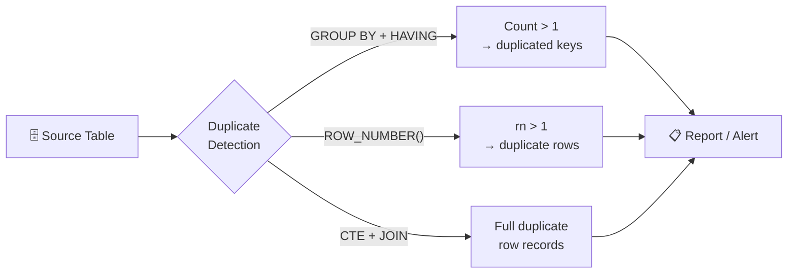

# :material-magnify: Finding Duplicates

Identify duplicate rows in Spark SQL / Databricks SQL using `GROUP BY HAVING`,
window functions, and subquery patterns. All techniques work on Delta and Parquet tables.

---

## :material-sitemap: Overview



---

## 📌 Approach Comparison

| Approach | Returns | Best For |
|----------|---------|----------|
| `GROUP BY HAVING COUNT(*) > 1` | Key values only | Quick frequency audit |
| `ROW_NUMBER() WHERE rn > 1` | Full duplicate rows | Exact row inspection |
| `CTE + INNER JOIN` | Full rows joined back | Retrieving all columns |
| `IN (subquery)` | Full rows | Simple single-key duplication |
| `COUNT(DISTINCT) = COUNT(*)` | Boolean | Candidate primary key check |

---

## 🔍 Approach 1 — GROUP BY + HAVING (key frequency)

Find which key values appear more than once.

```sql
SELECT
    name,
    age,
    COUNT(*) AS duplicate_count
FROM students
GROUP BY name, age
HAVING COUNT(*) > 1
ORDER BY duplicate_count DESC;
```

!!! note
    Returns only the key columns, not the full rows. Use this to audit which
    values are duplicated and how many times.

---

## 🔍 Approach 2 — CTE + INNER JOIN (full rows)

Retrieve every column for all duplicated records.

```sql
WITH duplicated_keys AS (
    SELECT
        name,
        age
    FROM students
    GROUP BY name, age
    HAVING COUNT(*) > 1
)
SELECT s.*
FROM students AS s
INNER JOIN duplicated_keys AS d
    ON s.name = d.name
    AND s.age = d.age;
```

---

## 🔍 Approach 3 — ROW_NUMBER() (identify specific duplicate rows)

Label every occurrence with a row number; rows with `rn > 1` are duplicates.

```sql
SELECT *
FROM (
    SELECT
        *,
        ROW_NUMBER() OVER (
            PARTITION BY id           -- (1)!
            ORDER BY created_at DESC  -- (2)!
        ) AS rn
    FROM source_table
)
WHERE rn > 1; -- (3)!
```

1. Partition by the key that defines a duplicate.
2. The first row (`rn = 1`) is the one you want to **keep**; all others are duplicates.
3. Return only the duplicate rows — invert to `rn = 1` to get de-duplicated output.

---

## 🔍 Approach 4 — IN subquery (single-column key)

Convenient for a single key column.

```sql
SELECT *
FROM users
WHERE email IN (
    SELECT email
    FROM users
    GROUP BY email
    HAVING COUNT(*) > 1
);
```

!!! warning
    Avoid `IN` with multi-column composite keys — concatenation can cause false
    positives. Use the CTE + JOIN approach instead.

---

## 🔍 Approach 5 — Candidate Primary Key check

Verify whether a column (or combination) could serve as a primary key.

```sql
SELECT
    COUNT(DISTINCT id) = COUNT(*) AS is_candidate_pk -- (1)!
FROM your_table;
```

1. Returns `true` if every `id` is unique; `false` if duplicates exist.

---

## 🧪 Full Example with Sample Data

```sql
--8<-- "src/application/duplicate/finding/find-duplicate.sql"
```

---

## 🧠 When to Use

| Scenario | Recommended Approach |
|----------|---------------------|
| Quick audit — how many duplicates? | `GROUP BY HAVING COUNT(*) > 1` |
| Need all columns of duplicate rows | `CTE + INNER JOIN` |
| Need to tag and review specific rows | `ROW_NUMBER() WHERE rn > 1` |
| Single-column key, small table | `IN (subquery)` |
| Validate uniqueness of a column | `COUNT(DISTINCT) = COUNT(*)` |

!!! tip "Performance"
    `GROUP BY HAVING` is the fastest — it scans the table once.
    `ROW_NUMBER()` is preferred when you also need to de-duplicate in the same query.
