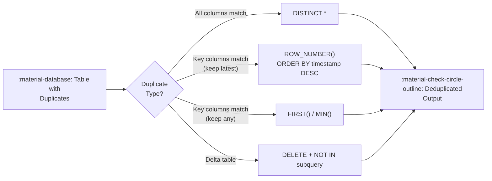

# :material-content-duplicate: Deduplication

Remove duplicate rows in Spark SQL / Databricks SQL. Choose your strategy based
on whether you need exact-match deduplication or key-based deduplication with a
tie-breaking rule.

---

## :material-sitemap: Overview



---

## :material-pin: Strategy Comparison

| Strategy | Keeps | Requires Order? | Best For |
|----------|-------|-----------------|----------|
| `SELECT DISTINCT *` | Any row (all cols must match) | No | Exact duplicates only |
| `ROW_NUMBER() WHERE rn = 1` | First or last by ORDER BY | Yes | Key-based, tie-break needed |
| `FIRST(col) GROUP BY key` | Any one row per key | No | Simple key dedup, fast |
| `RANK() / DENSE_RANK()` | Top-ranked row | Yes | Complex tie-break rules |
| `CTE + MIN() + JOIN` | Deterministic first row | Yes | Self-join on min key |
| `Delta DELETE` | Keep selected row in-place | Yes | Modify Delta table directly |

---

## :material-check-circle-outline: Strategy 1 — DISTINCT (exact duplicates)

Remove rows where **every column** is identical.

```sql
SELECT DISTINCT *
FROM students;
```

!!! note
    Only removes rows that are completely identical across all columns.
    If even one column differs (e.g., an auto-generated timestamp), rows
    are **not** considered duplicates.

---

## :material-check-circle-outline: Strategy 2 — ROW_NUMBER() (keep latest row per key)

The most flexible approach — pick which row to keep using any `ORDER BY`.

```sql
SELECT *
FROM (
    SELECT
        *,
        ROW_NUMBER() OVER (
            PARTITION BY id                -- (1)!
            ORDER BY created_at DESC       -- (2)!
        ) AS rn
    FROM students
)
WHERE rn = 1; -- (3)!
```

1. Group rows by the key that defines a duplicate.
2. Order within each group — `DESC` keeps the most recent record.
3. Keep only the first-ranked row per group.

---

## :material-check-circle-outline: Strategy 3 — FIRST() / GROUP BY (keep any row per key)

When order does not matter — fastest deduplication approach.

```sql
SELECT
    id,
    FIRST(name) AS name, -- (1)!
    FIRST(age)  AS age
FROM students
GROUP BY id;
```

1. `FIRST()` returns an arbitrary row for each key — no ordering guarantee.

---

## :material-check-circle-outline: Strategy 4 — ROW_NUMBER() (keep latest by timestamp)

Production pattern for CDC (Change Data Capture) pipelines.

```sql
SELECT *
FROM (
    SELECT
        *,
        ROW_NUMBER() OVER (
            PARTITION BY id
            ORDER BY create_datetime DESC -- (1)!
        ) AS rn
    FROM students
)
WHERE rn = 1;
```

1. Keeps the most recently ingested record per `id`.

---

## :material-check-circle-outline: Strategy 5 — RANK() with conditional tie-break

Use when you need a priority-based rule (e.g., prefer `status = 'active'`).

```sql
SELECT *
FROM (
    SELECT
        *,
        ROW_NUMBER() OVER (
            PARTITION BY id
            ORDER BY
                CASE status             -- (1)!
                    WHEN 'active'   THEN 1
                    WHEN 'pending'  THEN 2
                    ELSE 3
                END
        ) AS rn
    FROM my_table
)
WHERE rn = 1;
```

1. Prefer `active` rows first; fall back to `pending`, then any other status.

---

## :material-check-circle-outline: Strategy 6 — CTE + MIN() + INNER JOIN

Deterministic dedup using the minimum key value as the canonical row.

```sql
WITH dedup_keys AS (
    SELECT
        name,
        age,
        MIN(id) AS canonical_id -- (1)!
    FROM your_table
    GROUP BY name, age
)
SELECT t.*
FROM your_table AS t
INNER JOIN dedup_keys AS d
    ON t.id = d.canonical_id;
```

1. Keeps the row with the lowest `id` per `(name, age)` combination.

---

## :material-check-circle-outline: Strategy 7 — Delta table in-place DELETE

Remove duplicates directly from a Delta table without rewriting it.

```sql
DELETE FROM your_table
WHERE id NOT IN (
    SELECT id
    FROM (
        SELECT
            *,
            ROW_NUMBER() OVER (
                PARTITION BY name, age
                ORDER BY id
            ) AS rn
        FROM your_table
    )
    WHERE rn = 1
);
```

!!! warning "Delta tables only"
    `DELETE` with a subquery requires Delta Lake. It is not supported on plain
    Parquet or CSV tables.

---

## :material-flask-outline: Full Example with Sample Data

```sql
--8<-- "src/application/duplicate/removal/deduplication.sql"
```

---

## :material-brain: When to Use

| Scenario | Recommended Strategy |
|----------|---------------------|
| All columns are identical | `SELECT DISTINCT *` |
| Keep most recent by timestamp | `ROW_NUMBER()` ORDER BY timestamp DESC |
| Keep any one row, order irrelevant | `FIRST()` + `GROUP BY` |
| Complex priority rule | `ROW_NUMBER()` with `CASE` ORDER BY |
| Modify Delta table in place | Delta `DELETE` + subquery |
| Deterministic lowest-key row | CTE + `MIN(id)` + `INNER JOIN` |

!!! tip "Spark + Delta performance"
    For large Delta tables, prefer `MERGE INTO` with a deduplicated source CTE
    rather than `DELETE` — it reduces the number of files rewritten.
