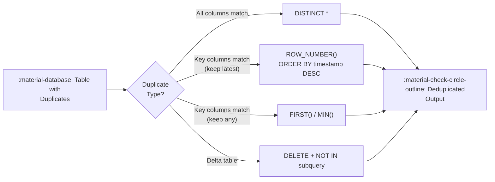

# :material-content-duplicate: Deduplication

Remove duplicate rows in Spark SQL / Databricks SQL. Choose your strategy based
on whether you need exact-match deduplication or key-based deduplication with a
tie-breaking rule.

---

## :material-sitemap: Overview



---

## :material-database: Sample Data

```sql
-- Students table with duplicate enrollments (same name+age, different timestamps)
CREATE OR REPLACE TEMP VIEW students AS
SELECT * FROM VALUES
  (1,  'Alice',   20, 'CS',      TIMESTAMP('2024-01-10 09:00:00')),
  (2,  'Bob',     22, 'Math',    TIMESTAMP('2024-01-12 10:30:00')),
  (3,  'Alice',   20, 'CS',      TIMESTAMP('2024-02-15 14:00:00')),
  (4,  'Charlie', 21, 'Physics', TIMESTAMP('2024-01-20 08:00:00')),
  (5,  'Bob',     22, 'Math',    TIMESTAMP('2024-03-01 11:00:00')),
  (6,  'Alice',   20, 'CS',      TIMESTAMP('2024-03-10 16:00:00')),
  (7,  'Diana',   23, 'CS',      TIMESTAMP('2024-01-18 12:00:00')),
  (8,  'Charlie', 21, 'Physics', TIMESTAMP('2024-02-28 15:30:00'))
AS students(id, name, age, department, created_at);
```

```sql
-- Orders with status-based priority for deduplication
CREATE OR REPLACE TEMP VIEW orders AS
SELECT * FROM VALUES
  (1001, 'ORD-100', 'shipped',   250.00, TIMESTAMP('2024-03-01 10:00:00')),
  (1002, 'ORD-100', 'pending',   250.00, TIMESTAMP('2024-02-28 09:00:00')),
  (1003, 'ORD-101', 'delivered', 180.00, TIMESTAMP('2024-03-05 14:00:00')),
  (1004, 'ORD-101', 'shipped',   180.00, TIMESTAMP('2024-03-03 11:00:00')),
  (1005, 'ORD-101', 'pending',   180.00, TIMESTAMP('2024-03-01 08:00:00')),
  (1006, 'ORD-102', 'active',    320.00, TIMESTAMP('2024-03-10 16:00:00')),
  (1007, 'ORD-103', 'cancelled',  95.00, TIMESTAMP('2024-03-12 09:00:00')),
  (1008, 'ORD-103', 'active',     95.00, TIMESTAMP('2024-03-11 10:00:00'))
AS orders(id, order_num, status, amount, created_at);
```

---

## :material-pin: Strategy Comparison

| Strategy | Keeps | Requires Order? | Best For |
|----------|-------|-----------------|----------|
| `SELECT DISTINCT *` | Any row (all cols must match) | No | Exact duplicates only |
| `ROW_NUMBER() WHERE rn = 1` | First or last by ORDER BY | Yes | Key-based, tie-break needed |
| `FIRST(col) GROUP BY key` | Any one row per key | No | Simple key dedup, fast |
| `RANK() / DENSE_RANK()` | Top-ranked row | Yes | Complex tie-break rules |
| `CTE + MIN() + JOIN` | Deterministic first row | Yes | Self-join on min key |
| `Delta DELETE` | Keep selected row in-place | Yes | Modify Delta table directly |

---

## :material-check-circle-outline: Strategy 1 — DISTINCT (exact duplicates)

Remove rows where **every column** is identical.

```sql
SELECT DISTINCT *
FROM students;
```

??? success "Expected output (8 rows — no exact duplicates exist here)"

    All 8 rows are returned because even though Alice appears 3 times, the `id` and `created_at` differ.
    `DISTINCT` only removes rows where **every** column is identical.

```sql
-- Example where DISTINCT actually removes rows:
CREATE OR REPLACE TEMP VIEW exact_dupes AS
SELECT * FROM VALUES
  ('Alice', 20, 'CS'),
  ('Bob',   22, 'Math'),
  ('Alice', 20, 'CS'),
  ('Bob',   22, 'Math'),
  ('Carol', 21, 'Physics')
AS exact_dupes(name, age, department);

SELECT DISTINCT * FROM exact_dupes;
```

??? success "Expected output"

    | name  | age | department |
    |-------|-----|------------|
    | Alice | 20  | CS         |
    | Bob   | 22  | Math       |
    | Carol | 21  | Physics    |

!!! note
    Only removes rows that are completely identical across all columns.
    If even one column differs (e.g., an auto-generated timestamp), rows
    are **not** considered duplicates.

---

## :material-check-circle-outline: Strategy 2 — ROW_NUMBER() (keep latest row per key)

The most flexible approach — pick which row to keep using any `ORDER BY`.

```sql
SELECT id, name, age, department, created_at
FROM (
    SELECT
        *,
        ROW_NUMBER() OVER (
            PARTITION BY name, age         -- (1)!
            ORDER BY created_at DESC       -- (2)!
        ) AS rn
    FROM students
)
WHERE rn = 1 -- (3)!
ORDER BY id;
```

1. Group rows by the key that defines a duplicate.
2. Order within each group — `DESC` keeps the most recent record.
3. Keep only the first-ranked row per group.

??? success "Expected output"

    | id | name    | age | department | created_at          |
    |----|---------|-----|------------|---------------------|
    | 5  | Bob     | 22  | Math       | 2024-03-01 11:00:00 |
    | 6  | Alice   | 20  | CS         | 2024-03-10 16:00:00 |
    | 7  | Diana   | 23  | CS         | 2024-01-18 12:00:00 |
    | 8  | Charlie | 21  | Physics    | 2024-02-28 15:30:00 |

---

## :material-check-circle-outline: Strategy 3 — FIRST() / GROUP BY (keep any row per key)

When order does not matter — fastest deduplication approach.

```sql
SELECT
    FIRST(id)         AS id,
    name,
    age,
    FIRST(department) AS department,
    FIRST(created_at) AS created_at
FROM students
GROUP BY name, age
ORDER BY id;
```

??? success "Expected output (order of FIRST() is non-deterministic)"

    | id | name    | age | department | created_at          |
    |----|---------|-----|------------|---------------------|
    | 1  | Alice   | 20  | CS         | 2024-01-10 09:00:00 |
    | 2  | Bob     | 22  | Math       | 2024-01-12 10:30:00 |
    | 4  | Charlie | 21  | Physics    | 2024-01-20 08:00:00 |
    | 7  | Diana   | 23  | CS         | 2024-01-18 12:00:00 |

!!! note
    `FIRST()` returns an arbitrary row for each key — no ordering guarantee.
    Use `ROW_NUMBER()` if deterministic selection is required.

---

## :material-check-circle-outline: Strategy 4 — ROW_NUMBER() (keep earliest by timestamp)

Production pattern for CDC (Change Data Capture) pipelines — keep the original record.

```sql
SELECT id, name, age, department, created_at
FROM (
    SELECT
        *,
        ROW_NUMBER() OVER (
            PARTITION BY name, age
            ORDER BY created_at ASC -- (1)!
        ) AS rn
    FROM students
)
WHERE rn = 1
ORDER BY id;
```

1. Keeps the earliest ingested record per `(name, age)`.

??? success "Expected output"

    | id | name    | age | department | created_at          |
    |----|---------|-----|------------|---------------------|
    | 1  | Alice   | 20  | CS         | 2024-01-10 09:00:00 |
    | 2  | Bob     | 22  | Math       | 2024-01-12 10:30:00 |
    | 4  | Charlie | 21  | Physics    | 2024-01-20 08:00:00 |
    | 7  | Diana   | 23  | CS         | 2024-01-18 12:00:00 |

---

## :material-check-circle-outline: Strategy 5 — RANK() with conditional tie-break

Use when you need a priority-based rule (e.g., prefer `status = 'delivered'` over `'shipped'`).

```sql
SELECT id, order_num, status, amount, created_at
FROM (
    SELECT
        *,
        ROW_NUMBER() OVER (
            PARTITION BY order_num
            ORDER BY
                CASE status                 -- (1)!
                    WHEN 'delivered' THEN 1
                    WHEN 'shipped'   THEN 2
                    WHEN 'active'    THEN 3
                    WHEN 'pending'   THEN 4
                    WHEN 'cancelled' THEN 5
                    ELSE 6
                END,
                created_at DESC             -- (2)!
        ) AS rn
    FROM orders
)
WHERE rn = 1
ORDER BY order_num;
```

1. Prefer the most advanced status first.
2. Break ties by most recent timestamp.

??? success "Expected output"

    | id   | order_num | status    | amount | created_at          |
    |------|-----------|-----------|--------|---------------------|
    | 1001 | ORD-100   | shipped   | 250.00 | 2024-03-01 10:00:00 |
    | 1003 | ORD-101   | delivered | 180.00 | 2024-03-05 14:00:00 |
    | 1006 | ORD-102   | active    | 320.00 | 2024-03-10 16:00:00 |
    | 1008 | ORD-103   | active    |  95.00 | 2024-03-11 10:00:00 |

---

## :material-check-circle-outline: Strategy 6 — CTE + MIN() + INNER JOIN

Deterministic dedup using the minimum key value as the canonical row.

```sql
WITH dedup_keys AS (
    SELECT
        name,
        age,
        MIN(id) AS canonical_id -- (1)!
    FROM students
    GROUP BY name, age
)
SELECT s.*
FROM students AS s
INNER JOIN dedup_keys AS d
    ON s.id = d.canonical_id
ORDER BY s.id;
```

1. Keeps the row with the lowest `id` per `(name, age)` combination.

??? success "Expected output"

    | id | name    | age | department | created_at          |
    |----|---------|-----|------------|---------------------|
    | 1  | Alice   | 20  | CS         | 2024-01-10 09:00:00 |
    | 2  | Bob     | 22  | Math       | 2024-01-12 10:30:00 |
    | 4  | Charlie | 21  | Physics    | 2024-01-20 08:00:00 |
    | 7  | Diana   | 23  | CS         | 2024-01-18 12:00:00 |

---

## :material-check-circle-outline: Strategy 7 — Delta table in-place DELETE

!!! info "[Databricks]"
    This strategy requires Delta Lake. Not supported on plain Parquet or CSV tables.

Remove duplicates directly from a Delta table without rewriting it.

```sql
DELETE FROM your_table
WHERE id NOT IN (
    SELECT id
    FROM (
        SELECT
            *,
            ROW_NUMBER() OVER (
                PARTITION BY name, age
                ORDER BY id
            ) AS rn
        FROM your_table
    )
    WHERE rn = 1
);
```

??? success "Effect"

    For the `students` data, this would delete rows with `id` IN (3, 5, 6, 8) — keeping
    only the first occurrence (lowest `id`) per `(name, age)`:

    | Deleted id | name    | Reason |
    |------------|---------|--------|
    | 3          | Alice   | 2nd occurrence |
    | 5          | Bob     | 2nd occurrence |
    | 6          | Alice   | 3rd occurrence |
    | 8          | Charlie | 2nd occurrence |

---

## :material-check-circle-outline: Strategy 8 — MERGE for idempotent dedup

!!! info "[Databricks]"
    Requires Delta Lake tables.

Use `MERGE` to deduplicate into a clean target table:

```sql
-- Deduplicate into a clean target by merging only the latest per key
MERGE INTO students_clean AS target
USING (
    SELECT *
    FROM (
        SELECT *, ROW_NUMBER() OVER (
            PARTITION BY name, age ORDER BY created_at DESC
        ) AS rn
        FROM students
    )
    WHERE rn = 1
) AS source
ON target.name = source.name AND target.age = source.age
WHEN MATCHED THEN UPDATE SET *
WHEN NOT MATCHED THEN INSERT *;
```

---

## :material-flask-outline: Full Example with Sample Data

```sql
--8<-- "src/application/duplicate/removal/deduplication.sql"
```

---

## :material-brain: When to Use

| Scenario | Recommended Strategy |
|----------|---------------------|
| All columns are identical | `SELECT DISTINCT *` |
| Keep most recent by timestamp | `ROW_NUMBER()` ORDER BY timestamp DESC |
| Keep earliest (original) record | `ROW_NUMBER()` ORDER BY timestamp ASC |
| Keep any one row, order irrelevant | `FIRST()` + `GROUP BY` |
| Complex priority rule (status) | `ROW_NUMBER()` with `CASE` ORDER BY |
| Deterministic lowest-key row | CTE + `MIN(id)` + `INNER JOIN` |
| Modify Delta table in place | Delta `DELETE` + subquery |
| Idempotent pipeline output | `MERGE INTO` with deduplicated source |

!!! tip "Spark + Delta performance"
    For large Delta tables, prefer `MERGE INTO` with a deduplicated source CTE
    rather than `DELETE` — it reduces the number of files rewritten.
