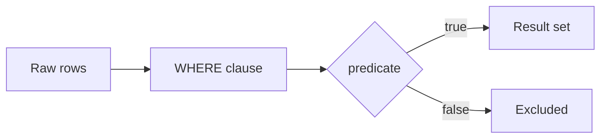

# :material-filter: Filter

Apply boolean logic, text patterns, NULL handling, and regex predicates in WHERE clauses.

---

## :material-sitemap: Overview



---

## :material-pin: Quick Reference

| Technique | Use Case | Key Function |
|-----------|----------|-------------|
| AND / OR / NOT / IN | Combine multiple boolean conditions | `AND`, `OR`, `NOT`, `IN (...)` |
| Text + numeric | Mixed predicate on string and number cols | `=`, `>`, `<`, `LIKE` |
| LIKE / wildcards | Pattern matching on string columns | `LIKE '%pattern%'` |
| IS NULL / COALESCE | NULL-safe filtering | `IS NULL`, `COALESCE(col, default)` |
| RLIKE / REGEXP | Regex pattern matching | `RLIKE 'pattern'` |

---

## :material-magnify: Examples

### AND / OR Filters

Combine multiple conditions using boolean operators.

```sql
--8<-- "src/application/filter/and_or_filters.sql"
```

---

### Text and Number Filters

Mix string and numeric predicates in a single WHERE clause.

```sql
--8<-- "src/application/filter/text_number_filters.sql"
```

---

### Wildcard Searches

Use LIKE with `%` and `_` wildcards for partial string matching.

```sql
--8<-- "src/application/filter/wildcard_searches.sql"
```

---

### NULL Filters

Handle NULL values safely in filter predicates.

```sql
--8<-- "src/application/filter/null_filters.sql"
```

---

### Regex Filters

Apply regular expression patterns with RLIKE for advanced text filtering.

```sql
--8<-- "src/application/filter/regex_filters.sql"
```

---

## :material-brain: When to Use

| Scenario | Recommended Approach |
|----------|---------------------|
| Multiple conditions | `AND` / `OR` combinations |
| Partial string match | `LIKE` with wildcards |
| Regex needed | `RLIKE` |
| NULL-safe filter | `IS NULL` / `IS NOT NULL` |
| Exclude a set of values | `NOT IN (...)` |

!!! warning
    NOT IN with a subquery that can return NULL will exclude all rows. Use NOT EXISTS instead.
