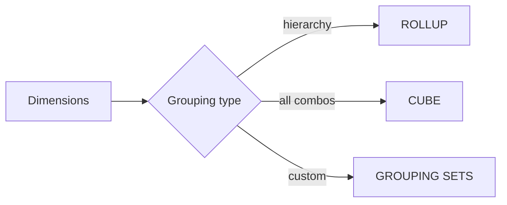

# :material-set-all: Grouping

Generate hierarchical subtotals, cross-dimensional aggregations, and custom grouping combinations.

---

## :material-sitemap: Overview



---

## :material-pin: Quick Reference

| Technique | Use Case | Key Function |
|-----------|----------|-------------|
| ROLLUP | Hierarchical subtotals (Year → Month) | `GROUP BY ROLLUP(col1, col2)` |
| CUBE | All dimension combinations | `GROUP BY CUBE(col1, col2)` |
| GROUPING SETS | Custom combination selection | `GROUP BY GROUPING SETS(...)` |
| GROUPING() | Label subtotal rows | `GROUPING(col)` |

| Need | Use |
|------|-----|
| Hierarchy (Year → Month) | ROLLUP |
| All combinations | CUBE |
| Selected combinations | GROUPING SETS |
| Performance-sensitive | GROUPING SETS |

---

## :material-magnify: Examples

### ROLLUP — Hierarchical Totals

Drill-down subtotals from year down to month with grand total.

```sql
--8<-- "src/application/grouping/rollup_hierarchical_totals.sql"
```

---

### CUBE — Cross-Dimensional Aggregation

Produce totals for every combination of dimensions.

```sql
--8<-- "src/application/grouping/cube_cross_dimensional.sql"
```

---

### GROUPING SETS — Custom Combinations

Select only the specific grouping combinations you need.

```sql
--8<-- "src/application/grouping/grouping_sets_custom.sql"
```

---

## :material-brain: When to Use

| Scenario | Recommended Approach |
|----------|---------------------|
| Drill-down report | `ROLLUP` |
| Cross-tab report | `CUBE` |
| Only some combinations needed | `GROUPING SETS` |
| Flag subtotal rows in output | `GROUPING()` |

!!! tip
    GROUPING SETS is the most flexible and most performant — ROLLUP and CUBE are syntactic sugar that expands to GROUPING SETS internally.
