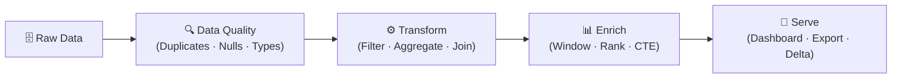

# :material-application: Application Patterns

Practical Spark SQL and Databricks SQL recipes for real-world data engineering
pipelines. Each section solves a specific problem with production-ready queries,
inline sample data, and expected output.

---

## :material-sitemap: Architecture



---

## 📌 Pattern Catalogue

| Category | Description | Key Techniques |
|----------|-------------|----------------|
| **Duplicate Handling** | Find and remove repeated rows | `GROUP BY HAVING`, `ROW_NUMBER()`, `DISTINCT` |
| **Key Replacement** | Remap or substitute map keys | `MAP_ENTRIES`, `TRANSFORM`, `AGGREGATE` |
| **Aggregation** | Totals, averages, counts, booleans | `GROUP BY`, `HAVING`, `FILTER()` |
| **Filtering** | AND/OR logic, wildcards, NULLs, regex | `WHERE`, `LIKE`, `RLIKE`, `IS NULL` |
| **Rolling Analysis** | Running totals, averages, comparisons | `OVER()`, `ROWS BETWEEN`, `LAG`/`LEAD` |
| **Ranking** | Dense rank, percentile, NTILE bins | `RANK()`, `DENSE_RANK()`, `NTILE()`, `PERCENT_RANK()` |
| **Grouping Sets** | Hierarchical and cross-dimensional totals | `ROLLUP`, `CUBE`, `GROUPING SETS` |
| **Pivot / Unpivot** | Rotate rows to columns and back | `PIVOT`, `UNPIVOT`, `COALESCE` |
| **CTEs** | Reusable named query blocks | `WITH`, chained CTEs, nested CTEs |
| **Subqueries** | Correlated lookups and filters | Correlated, `EXISTS`, scalar subqueries |
| **Derived Tables** | Intermediate aggregation layers | Inline views, multi-level aggregation |
| **Numeric** | Rounding, modulo, random sampling | `ROUND`, `MOD`, `TABLESAMPLE`, `SEQUENCE` |
| **Time Series** | Date hierarchies and time patterns | `YEAR`, `QUARTER`, `WEEKDAY`, `LAST_DAY` |
| **Date Strings** | Parse and format date text | `TO_DATE`, `TO_TIMESTAMP`, `DATE_FORMAT` |
| **Analytics** | KPIs, alerts, classification | `CASE`, `GROUPING()`, NULLS FIRST/LAST |
| **String Ops** | Replace acronyms, text truncation | `REPLACE`, `REGEXP_REPLACE`, `LEFT` |
| **Joins** | All join types plus self and range joins | `INNER/LEFT/RIGHT/FULL/CROSS JOIN` |
| **Sampling** | Random subsets for exploration | `TABLESAMPLE`, `RAND()`, `ORDER BY RAND()` |

---

## 🧪 Quick-Start Examples

### De-duplicate with Window Function

```sql
WITH ranked AS (
    SELECT
        *,
        ROW_NUMBER() OVER (PARTITION BY id ORDER BY updated_at DESC) AS rn -- (1)!
    FROM source_table
)
SELECT * FROM ranked WHERE rn = 1; -- (2)!
```

1. Assign row 1 to the most recent record per `id`.
2. Keep only the latest row per key — all others are filtered out.

---

### Hierarchical Totals with ROLLUP

```sql
SELECT
    YEAR(saledate) AS sale_year,
    QUARTER(saledate) AS sale_quarter,
    ROUND(SUM(saleprice), 2) AS total_revenue
FROM allsales
GROUP BY ROLLUP (YEAR(saledate), QUARTER(saledate)); -- (1)!
```

1. Produces detail rows + year subtotals + a grand total; `NULL` marks rolled-up levels.

---

### Running Total with Window

```sql
SELECT
    saledate,
    saleprice,
    SUM(saleprice) OVER ( -- (1)!
        ORDER BY saledate
        ROWS BETWEEN UNBOUNDED PRECEDING AND CURRENT ROW
    ) AS running_total
FROM allsales;
```

1. Cumulative sum from the first row up to and including the current row.

---

## 🧠 Decision Guide

| Need | Use |
|------|-----|
| Remove duplicate rows | `ROW_NUMBER()` + `WHERE rn = 1` |
| Summarise at multiple levels | `ROLLUP` or `GROUPING SETS` |
| Cumulative / running metric | Window with `ROWS BETWEEN UNBOUNDED PRECEDING` |
| Top-N per group | `RANK()` or `DENSE_RANK()` + filter |
| Random exploration sample | `TABLESAMPLE (5 PERCENT)` |
| Reuse intermediate results | CTE (`WITH` clause) |
| Rotate rows to columns | `PIVOT` |

!!! tip "Performance first"
    Prefer `GROUPING SETS` over `CUBE` when you only need specific combinations.
    Use CTEs to avoid repeating expensive subqueries. Push filters as early as
    possible — before joins and aggregations.
