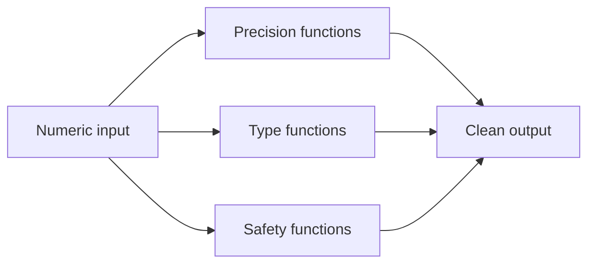

# :material-numeric: Numeric

Precision rounding, type handling, divide-by-zero guards, modulo, number sequences, and string-to-number conversion.

---

## :material-sitemap: Overview



---

## :material-pin: Quick Reference

| Technique | Use Case | Key Function |
|-----------|----------|-------------|
| ROUND / FLOOR / CEIL / TRUNCATE | Decimal precision control | `ROUND(col, n)`, `FLOOR()`, `CEIL()` |
| INT / BIGINT / DECIMAL / DOUBLE | Numeric type reference | `CAST(col AS DECIMAL(p,s))` |
| NULLIF / CASE | Divide-by-zero guard | `NULLIF(denominator, 0)` |
| MOD / REMAINDER | Modulo operations | `MOD(col, n)` |
| SEQUENCE | Generate a number series | `SEQUENCE(start, stop, step)` |
| RAND / TABLESAMPLE | Random row sampling | `RAND()`, `TABLESAMPLE(n PERCENT)` |
| CAST / TRY_CAST | Convert string to number | `TRY_CAST(col AS INT)` |

---

## :material-magnify: Examples

### Decimal Operations

ROUND, FLOOR, CEIL, and TRUNCATE for financial precision.

```sql
--8<-- "src/application/numeric/decimal_operations.sql"
```

---

### Numeric Datatypes

Reference for INT, BIGINT, DECIMAL, FLOAT, and DOUBLE behaviour.

```sql
--8<-- "src/application/numeric/numeric_datatypes.sql"
```

---

### Divide-by-Zero Errors

Guard against division by zero using NULLIF and CASE.

```sql
--8<-- "src/application/numeric/divide_zero_errors.sql"
```

---

### Modulo Financial

Apply modulo arithmetic for financial bucketing.

```sql
--8<-- "src/application/numeric/modulo_financial.sql"
```

---

### Tally Table Sequence

Generate a number series with SEQUENCE for gap-filling and tally tables.

```sql
--8<-- "src/application/numeric/tally_table_sequence.sql"
```

---

### Random Sampling

Sample rows randomly using RAND and TABLESAMPLE.

```sql
--8<-- "src/application/numeric/random_sampling.sql"
```

---

### Numbers as Text

Cast and validate string columns that contain numeric values.

```sql
--8<-- "src/application/numeric/numbers_as_text.sql"
```

---

## :material-brain: When to Use

| Scenario | Recommended Approach |
|----------|---------------------|
| Financial rounding | `ROUND` / `TRUNCATE` |
| Avoid divide-by-zero | `NULLIF(denominator, 0)` |
| Random exploration sample | `RAND()` / `TABLESAMPLE` |
| Generate a number range | `SEQUENCE` |
| Source column stored as text | `TRY_CAST` |

!!! warning
    FLOAT and DOUBLE are approximate types — use DECIMAL(p, s) for financial calculations that require exact precision.
