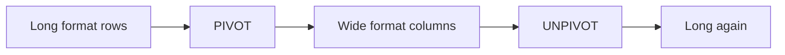

# :material-table-pivot: Pivot

Rotate long-format rows into wide-format columns and back using PIVOT and UNPIVOT.

---

## :material-sitemap: Overview



---

## :material-pin: Quick Reference

| Technique | Use Case | Key Function |
|-----------|----------|-------------|
| PIVOT years | Rotate time periods into wide columns | `PIVOT (agg FOR col IN (val1, val2))` |
| COALESCE nulls | Zero-fill missing pivot cells | `COALESCE(col, 0)` |
| Multi-aggregate PIVOT | Multiple value columns per pivot | Multi-agg in PIVOT clause |
| UNPIVOT | Return wide format back to long rows | `UNPIVOT (val FOR col IN (...))` |
| Multi-row-group PIVOT | Multiple group columns (make + model) | Multiple GROUP BY cols before PIVOT |

---

## :material-magnify: Examples

### Pivot Sales by Color

Rotate color values into columns with aggregated sale totals.

```sql
--8<-- "src/application/pivot/pivot_sales_by_color.sql"
```

---

### Pivot Color Count by Make and Model

Multi-row-group pivot with make and model as row dimensions.

```sql
--8<-- "src/application/pivot/pivot_color_count_by_make_model.sql"
```

---

## :material-brain: When to Use

| Scenario | Recommended Approach |
|----------|---------------------|
| Cross-tab / matrix report | `PIVOT` |
| Reverse a pivot to long format | `UNPIVOT` |
| Multiple aggregates per pivot column | Multi-agg `PIVOT` |
| Multiple group-by columns | Multi-row-group `PIVOT` |

!!! tip
    PIVOT column values must be known at query-write time. For dynamic pivots, generate the SQL string programmatically and use spark.sql().
