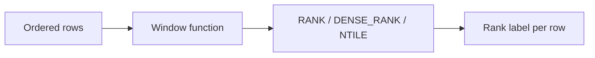

# :material-podium: Ranking

Rank rows, segment into equal buckets, and compute percentiles with window functions.

---

## :material-sitemap: Overview



---

## :material-pin: Quick Reference

| Technique | Use Case | Key Function |
|-----------|----------|-------------|
| RANK() | Ranking with gaps on ties | `RANK() OVER (ORDER BY col DESC)` |
| DENSE_RANK() | Ranking without gaps on ties | `DENSE_RANK() OVER (ORDER BY col DESC)` |
| NTILE(n) | Divide rows into equal-size buckets | `NTILE(4) OVER (ORDER BY col)` |
| PERCENTILE_CONT | Continuous (interpolated) percentile | `PERCENTILE_CONT(0.5) WITHIN GROUP (ORDER BY col)` |
| PERCENTILE_DISC | Discrete (actual value) percentile | `PERCENTILE_DISC(0.5) WITHIN GROUP (ORDER BY col)` |

---

## :material-magnify: Examples

### RANK and DENSE_RANK

Compare RANK and DENSE_RANK behaviour on tied values.

```sql
--8<-- "src/application/ranking/rank_dense_rank.sql"
```

---

### NTILE Segments

Divide the result set into equal-sized quantile buckets.

```sql
--8<-- "src/application/ranking/ntile_segments.sql"
```

---

### Percentile and Median

Compute continuous and discrete percentiles including the median.

```sql
--8<-- "src/application/ranking/percentile_median.sql"
```

---

## :material-brain: When to Use

| Scenario | Recommended Approach |
|----------|---------------------|
| Top-N per group | `RANK` / `DENSE_RANK` + filter on rank ≤ N |
| Divide into even segments | `NTILE(n)` |
| Median value | `PERCENTILE_CONT(0.5)` |
| Quartiles / deciles | `NTILE(4)` / `NTILE(10)` |

!!! tip
    Use DENSE_RANK when you need consecutive integers with no gap after ties. Use RANK when you need to see the true positional gap.
