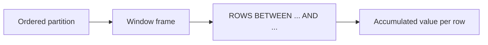

# :material-chart-bell-curve: Rolling Analysis

Compute running totals, moving averages, LAG/LEAD comparisons, and cumulative distributions with window functions.

---

## :material-sitemap: Overview



---

## :material-pin: Quick Reference

| Technique | Use Case | Key Function |
|-----------|----------|-------------|
| SUM OVER UNBOUNDED | Running total from first to current row | `SUM(...) OVER (ORDER BY col ROWS BETWEEN UNBOUNDED PRECEDING AND CURRENT ROW)` |
| ROW_NUMBER() | Assign a unique sequential ID per row | `ROW_NUMBER() OVER (PARTITION BY ... ORDER BY ...)` |
| SEQUENCE + LEFT JOIN | Fill in missing dates in a date range | `SEQUENCE(min_date, max_date, INTERVAL 1 DAY)` |
| LAG / LEAD | Access previous or next row value | `LAG(col, 1) OVER (ORDER BY date)` |
| FIRST_VALUE / LAST_VALUE | Boundary values within a partition | `FIRST_VALUE(col) OVER (...)` |
| Rolling AVG | N-row moving average | `AVG(...) OVER (ROWS BETWEEN n PRECEDING AND CURRENT ROW)` |
| CUME_DIST / PERCENT_RANK | Cumulative distribution and relative rank | `CUME_DIST() OVER (ORDER BY col)` |

---

## :material-magnify: Examples

### Running Totals

Cumulative sum from the first row to the current row within a partition.

```sql
--8<-- "src/application/rolling/01_running_totals.sql"
```

---

### Window in Aggregation

Combine standard aggregation with window functions in a single query.

```sql
--8<-- "src/application/rolling/02_window_in_aggregation.sql"
```

---

### ROW_NUMBER for Unique IDs

Generate a unique sequential identifier per row within a partition.

```sql
--8<-- "src/application/rolling/03_row_number_unique_ids.sql"
```

---

### Missing Data Date Range

Use SEQUENCE with a LEFT JOIN to expose missing dates in a sparse time series.

```sql
--8<-- "src/application/rolling/04_missing_data_date_range.sql"
```

---

### LAG and LEAD Comparison

Compare each row to the previous and next period.

```sql
--8<-- "src/application/rolling/05_lag_lead_comparison.sql"
```

---

### FIRST_VALUE and LAST_VALUE

Extract the boundary values within each ordered window partition.

```sql
--8<-- "src/application/rolling/06_first_last_value.sql"
```

---

### Rolling Averages

Compute a moving average over a fixed N-row window.

```sql
--8<-- "src/application/rolling/07_rolling_averages.sql"
```

---

### CUME_DIST and PERCENT_RANK

Calculate the cumulative distribution and relative rank of each row.

```sql
--8<-- "src/application/rolling/08_cume_dist_percent_rank.sql"
```

---

## :material-brain: When to Use

| Scenario | Recommended Approach |
|----------|---------------------|
| Cumulative totals | Running totals with `ROWS BETWEEN UNBOUNDED PRECEDING` |
| Moving average | Rolling avg over N preceding rows |
| Unique row identifiers | `ROW_NUMBER()` |
| Gap detection in time series | Date range + `LEFT JOIN` |
| Period-over-period comparison | `LAG` / `LEAD` |

!!! warning
    LAST_VALUE() requires ROWS BETWEEN UNBOUNDED PRECEDING AND UNBOUNDED FOLLOWING (or CURRENT ROW adjusted) — the default frame stops at CURRENT ROW.
