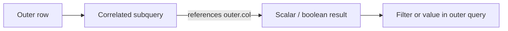

# :material-select-group: Subqueries

Use correlated subqueries, EXISTS anti-joins, and scalar subqueries to filter and enrich result sets.

---

## :material-sitemap: Overview



---

## :material-pin: Quick Reference

| Technique | Use Case | Key Function |
|-----------|----------|-------------|
| Correlated subquery | Per-row inner query referencing outer row | `WHERE col = (SELECT ... FROM t WHERE t.id = outer.id)` |
| EXISTS | Check for the presence of matching rows | `WHERE EXISTS (SELECT 1 FROM ...)` |
| NOT EXISTS | Anti-join pattern — rows with no match | `WHERE NOT EXISTS (SELECT 1 FROM ...)` |
| Subquery in WHERE | Filter outer result on inner aggregation | `WHERE col > (SELECT AVG(...) FROM ...)` |
| Aggregated subquery | Scalar value from inner aggregation | `(SELECT SUM(...) FROM ...)` |
| Percentage of total | Subquery in SELECT list for ratio | `col / (SELECT SUM(col) FROM ...)` |

---

## :material-magnify: Examples

### Correlated Basics

Simple correlated subquery referencing the outer query's current row.

```sql
--8<-- "src/application/subquery/correlated_basics.sql"
```

---

### Correlated Advanced

Advanced correlated patterns including EXISTS and NOT EXISTS.

```sql
--8<-- "src/application/subquery/correlated_advanced.sql"
```

---

### Subquery Filtering

Use subqueries in WHERE to filter rows based on inner aggregations.

```sql
--8<-- "src/application/subquery/subquery_filtering.sql"
```

---

### Subquery Aggregation

Scalar subqueries in the SELECT list for ratio and percentage calculations.

```sql
--8<-- "src/application/subquery/subquery_aggregation.sql"
```

---

## :material-brain: When to Use

| Scenario | Recommended Approach |
|----------|---------------------|
| Per-row aggregation against outer row | Correlated subquery |
| Anti-join (rows with no match) | `NOT EXISTS` |
| Scalar lookup in SELECT | Subquery in SELECT list |
| Filter on an aggregated value | Subquery in WHERE |

!!! tip
    For large datasets, prefer JOIN + aggregation or window functions over correlated subqueries — they typically have better query plans.
