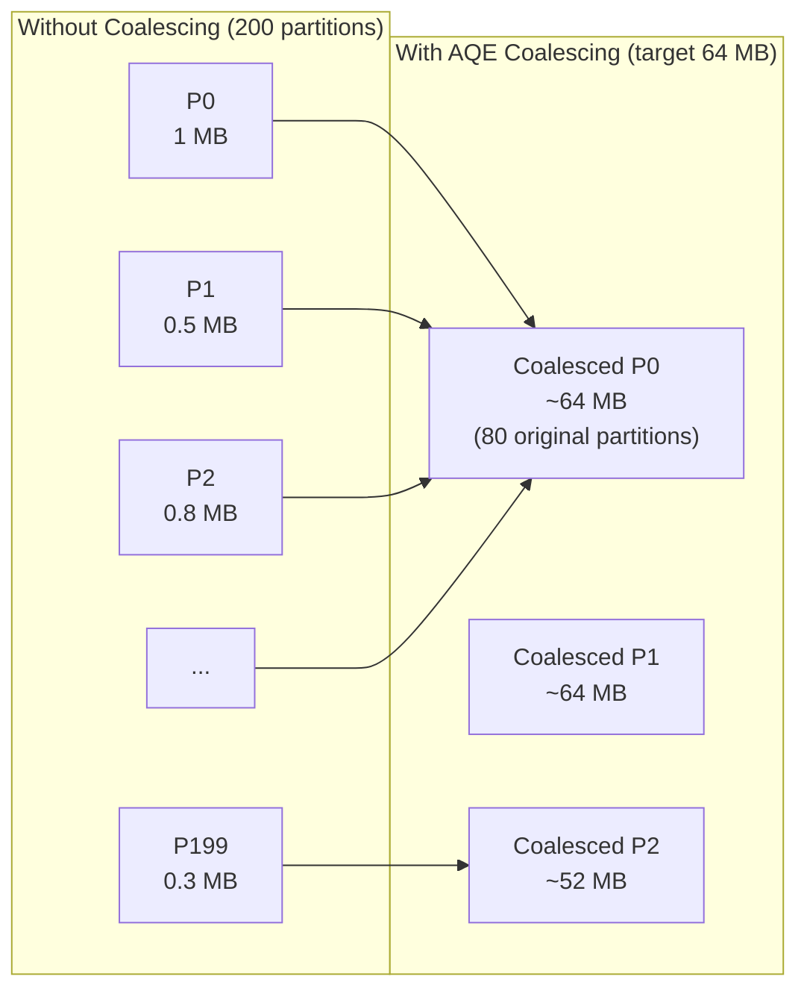

# :material-table-merge-cells: Coalescing Post-Shuffle Partitions

After a shuffle, Spark creates one output task per shuffle partition. With the
default `spark.sql.shuffle.partitions = 200`, small datasets produce 200 tiny
tasks and 200 tiny output files. **AQE partition coalescing** merges adjacent
small partitions into fewer, right-sized ones automatically.

---

## :material-sitemap: Before and After



---

## :material-cog: Configuration Reference

| Property | Default | Description |
|----------|---------|-------------|
| `spark.sql.adaptive.coalescePartitions.enabled` | `true` | Enable coalescing (requires AQE master switch) |
| `spark.sql.adaptive.advisoryPartitionSizeInBytes` | `64MB` | Target size for each coalesced partition |
| `spark.sql.adaptive.coalescePartitions.parallelismFirst` | `true` | When `true`, ignores advisory size and maximises task count |
| `spark.sql.adaptive.coalescePartitions.minPartitionSize` | `1MB` | Floor — no partition will be smaller than this after coalescing |
| `spark.sql.adaptive.coalescePartitions.initialPartitionNum` | `spark.sql.shuffle.partitions` | Starting partition count before coalescing |

---

## :material-flask-outline: Examples

### Recommended production settings

```sql
-- Enable AQE and tune for balanced output files
SET spark.sql.adaptive.enabled = true;
SET spark.sql.adaptive.coalescePartitions.enabled = true;

-- Disable parallelismFirst to honour the advisory size (recommended)
SET spark.sql.adaptive.coalescePartitions.parallelismFirst = false;

-- Target 128 MB output files (tune to your storage block size)
SET spark.sql.adaptive.advisoryPartitionSizeInBytes = 134217728;
```

### Large initial partition count (reduces skew risk)

```sql
-- Start with 2000 partitions; AQE coalesces down to ~64 MB each
SET spark.sql.shuffle.partitions = 2000;
SET spark.sql.adaptive.enabled = true;
SET spark.sql.adaptive.coalescePartitions.parallelismFirst = false;
SET spark.sql.adaptive.advisoryPartitionSizeInBytes = 67108864;  -- 64 MB

SELECT region, SUM(amount) AS revenue
FROM orders
GROUP BY region;
-- AQE may reduce 2000 partitions to ~20 depending on data size
```

### Verify coalescing in EXPLAIN

```sql
EXPLAIN FORMATTED
SELECT region, SUM(amount) FROM orders GROUP BY region;
-- Look for: CustomShuffleReaderExec coalesced
-- The isFinalPlan=true plan shows the reduced partition count
```

---

## :material-compare: `parallelismFirst = true` vs `false`

| Setting | Behaviour | Best for |
|---------|-----------|----------|
| `parallelismFirst = true` (default) | Keeps max parallelism; ignores advisory size | CPU-bound jobs, many small files acceptable |
| `parallelismFirst = false` | Merges to advisory size; fewer, larger files | Storage-efficient writes, Delta table compaction avoidance |

!!! tip "Set `parallelismFirst = false` for ETL writes"
    The default `parallelismFirst = true` was chosen to avoid performance
    regression for existing jobs. For ETL workloads that write to Delta or
    Parquet, setting it to `false` produces better-sized output files and
    reduces the need for `OPTIMIZE`.

---

## :material-magnify: Behavior Notes

1. **Contiguous merging only** — AQE merges adjacent shuffle partitions; it does not rebalance across all partitions.
2. **No data movement** — coalescing is a read-side operation; tasks read multiple consecutive map-output files without re-shuffling.
3. **Works with `REBALANCE` hint** — `SELECT /*+ REBALANCE */` uses the same advisory size for its output partitions.
4. **`initialPartitionNum` controls the ceiling** — set it high (1000–5000) for large datasets so AQE has fine-grained partitions to merge from.

---

## :material-brain: When to Tune

| Symptom | Fix |
|---------|-----|
| Too many small output files | Set `parallelismFirst = false`, raise advisory size |
| Jobs slower after enabling AQE | Set `parallelismFirst = true` (default) to restore parallelism |
| Coalescing not reducing partitions enough | Raise `initialPartitionNum` so more merge candidates exist |
| Coalescing producing uneven partitions | Lower advisory size; increase initial partition count |
