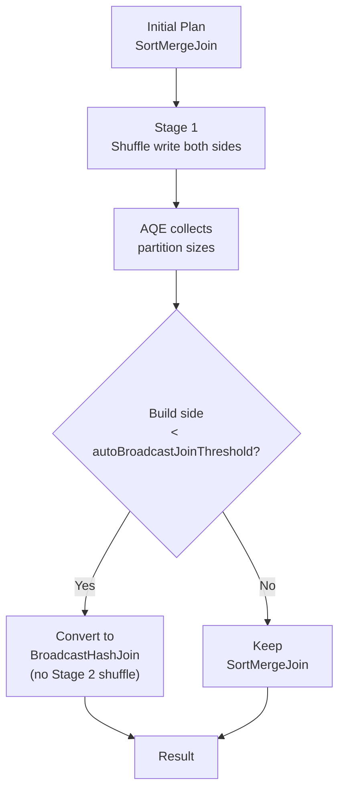

# :material-broadcast: AQE: Sort-Merge Join → Broadcast Hash Join

At plan time, Spark may not know a table is small enough to broadcast — for
example, after aggressive filtering. AQE detects this at runtime and
**converts the planned Sort-Merge Join (SMJ) to a Broadcast Hash Join (BHJ)**,
eliminating the shuffle entirely.

---

## :material-sitemap: Conversion Flow



---

## :material-cog: Configuration

| Property | Default | Description |
|----------|---------|-------------|
| `spark.sql.adaptive.enabled` | `true` | Master AQE switch |
| `spark.sql.autoBroadcastJoinThreshold` | `10MB` | Max build-side bytes for broadcast |
| `spark.sql.adaptive.localShuffleReader.enabled` | `true` | Use local shuffle reader after conversion (avoids extra network read) |

---

## :material-flask-outline: Examples

### Enable and raise broadcast threshold

```sql
SET spark.sql.adaptive.enabled = true;

-- Raise threshold to allow larger tables to be broadcast at runtime
SET spark.sql.autoBroadcastJoinThreshold = 104857600;  -- 100 MB

-- AQE will broadcast dim_date if its actual shuffled size < 100 MB
SELECT f.order_id, d.quarter, SUM(f.amount) AS revenue
FROM fact_orders f
JOIN dim_date d ON f.order_date = d.date_key
WHERE d.year = 2024
GROUP BY f.order_id, d.quarter;
```

### Force broadcast conversion via hint (override AQE)

```sql
-- BROADCAST hint bypasses AQE threshold — use when you know the table is small
SELECT /*+ BROADCAST(d) */
    f.order_id, d.quarter
FROM fact_orders f
JOIN dim_date d ON f.order_date = d.date_key;
```

### Verify conversion in EXPLAIN

```sql
EXPLAIN FORMATTED
SELECT f.order_id, d.quarter
FROM fact_orders f
JOIN dim_date d ON f.order_date = d.date_key
WHERE d.year = 2024;
```

Initial plan (before AQE fires):
```
AdaptiveSparkPlan isFinalPlan=false
+- SortMergeJoin
```

Final plan (after AQE detects dim_date is small):
```
AdaptiveSparkPlan isFinalPlan=true
+- BroadcastHashJoin [order_date], [date_key], BuildRight
   :- FileScan fact_orders
   +- BroadcastExchange HashedRelationBroadcastMode
      +- Filter (year = 2024)
         +- FileScan dim_date
```

---

## :material-compare: Sort-Merge Join vs Broadcast Hash Join

| Aspect | Sort-Merge Join | Broadcast Hash Join |
|--------|:---------------:|:-------------------:|
| Shuffle required | Both sides | Neither side (after broadcast) |
| Sort required | Yes (both sides) | No |
| Memory | Low (streaming) | Build side held in executor memory |
| Best for | Large × large | Large × small |
| AQE converts when | Build side < threshold at runtime | ← this page |

---

## :material-magnify: Behavior Notes

1. **Local shuffle reader** — after conversion, Spark uses a local shuffle reader to avoid re-fetching already-written map outputs; this is transparent but shows as `LocalShuffleReaderExec` in the plan.
2. **Memory requirement** — the broadcast build side is replicated to all executors; ensure `spark.executor.memory` can accommodate it.
3. **Conversion is one-directional** — AQE can downgrade from SMJ to BHJ but not the reverse.
4. **`-1` disables broadcast** — set `spark.sql.autoBroadcastJoinThreshold = -1` to prevent any broadcast joins (useful for debugging).

---

## :material-brain: When to Tune

| Symptom | Fix |
|---------|-----|
| SMJ not converting despite small dimension table | Raise `autoBroadcastJoinThreshold` |
| OOM after broadcast conversion | Lower threshold or use `/*+ MERGE */` hint to force SMJ |
| AQE not activating broadcast on filtered join | Ensure `adaptive.enabled = true`; check stats post-filter |
