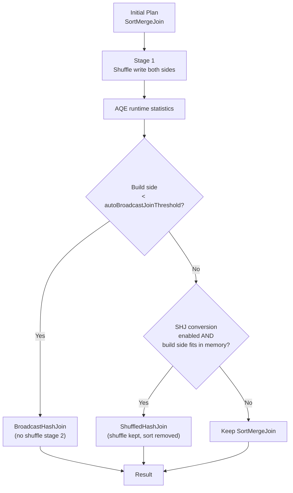

# :material-shuffle-variant: AQE: Sort-Merge Join → Shuffled Hash Join

When runtime statistics show that the build side is **small but not small
enough to broadcast**, AQE can convert the Sort-Merge Join (SMJ) to a
**Shuffled Hash Join (SHJ)** — keeping the shuffle but eliminating the
expensive sort phase.

---

## :material-sitemap: Conversion Flow



---

## :material-cog: Configuration

| Property | Default | Description |
|----------|---------|-------------|
| `spark.sql.adaptive.enabled` | `true` | Master AQE switch |
| `spark.sql.adaptive.maxShuffledHashJoinLocalMapThreshold` | `0` | Max map output size per partition for SHJ conversion (bytes); `0` = disabled |
| `spark.sql.autoBroadcastJoinThreshold` | `10MB` | Tables below this are broadcast instead |

!!! note "SHJ conversion is opt-in"
    By default `maxShuffledHashJoinLocalMapThreshold = 0` disables SHJ conversion.
    Set it to a value like `67108864` (64 MB) to allow conversion when a
    build-side partition fits in that threshold.

---

## :material-flask-outline: Examples

### Enable SHJ conversion

```sql
SET spark.sql.adaptive.enabled = true;

-- Allow SHJ conversion when build-side partition < 64 MB per task
SET spark.sql.adaptive.maxShuffledHashJoinLocalMapThreshold = 67108864;

SELECT c.region, SUM(o.amount) AS revenue
FROM orders o
JOIN customers c ON o.customer_id = c.id
GROUP BY c.region;
```

### Force SHJ via hint (bypass AQE)

```sql
SELECT /*+ SHUFFLE_HASH(customers) */
    c.region, SUM(o.amount)
FROM orders o
JOIN customers c ON o.customer_id = c.id
GROUP BY c.region;
```

### Verify in EXPLAIN

```sql
EXPLAIN FORMATTED
SELECT c.region, SUM(o.amount)
FROM orders o JOIN customers c ON o.customer_id = c.id
GROUP BY c.region;
-- Final plan shows: ShuffledHashJoin instead of SortMergeJoin
```

---

## :material-compare: SMJ vs SHJ vs BHJ

| Feature | Sort-Merge Join | Shuffled Hash Join | Broadcast Hash Join |
|---------|:---------------:|:-----------------:|:-------------------:|
| Shuffle both sides | Yes | Yes | No (build broadcasted) |
| Sort required | Yes (both sides) | No | No |
| Memory (build side) | Low | Medium (hash table) | High (all executors) |
| Best for | Large × large | Medium × large | Small × large |
| AQE converts when | — | `maxShuffledHashJoinLocalMapThreshold` | `autoBroadcastJoinThreshold` |

---

## :material-magnify: Behavior Notes

1. **SHJ builds a hash table in memory** — if the build side is too large for executor memory, the task will OOM; set the threshold conservatively.
2. **SHJ avoids sort** — for queries where sort is the bottleneck (many columns, large rows), SHJ can be significantly faster than SMJ.
3. **No skew protection** — SHJ does not handle skew; if the build side has a hot key, the hash table for that partition will be oversized.
4. **SHJ cannot be used with full outer joins** — only inner, left, and right joins support SHJ.

---

## :material-brain: When to Use

| Scenario | Recommendation |
|----------|----------------|
| Build side too large to broadcast but sorting is costly | Enable SHJ via threshold config |
| Build side fits in per-task memory (~64–256 MB) | Good candidate for SHJ |
| Skewed join keys | Use SMJ + skew join instead |
| Full outer join | SHJ not supported — keep SMJ |
