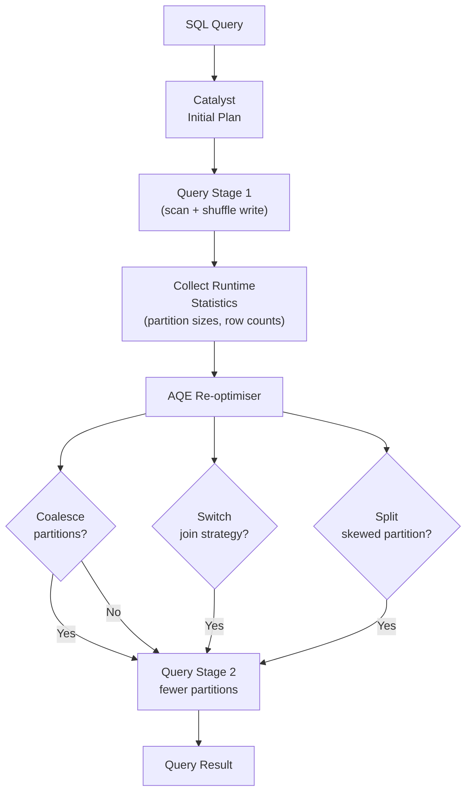

# :material-lightning-bolt: Adaptive Query Execution (AQE)

**Adaptive Query Execution (AQE)** is Spark 3.x's runtime query re-optimisation
framework. Instead of committing to a single fixed plan at compile time, AQE
collects real statistics at each shuffle barrier and re-plans subsequent stages —
automatically fixing the most common performance problems.

!!! note "Default in Spark 3.2+"
    `spark.sql.adaptive.enabled = true` is the default from Spark 3.2 onwards.
    For Spark 3.0–3.1 you must enable it explicitly.

---

## :material-sitemap: AQE Lifecycle



---

## :material-compare: AQE Optimisations at a Glance

| Optimisation | Trigger | Benefit |
|--------------|---------|---------|
| [Partition coalescing](coalescing_post_shuffle_partitions.md) | Post-shuffle partitions too small | Fewer tasks, larger files, less overhead |
| [SMJ → Broadcast](converting_sort_merge_join_broadcast_join.md) | Build side fits in memory at runtime | Eliminates shuffle entirely |
| [SMJ → Shuffled Hash](converting_sort_merge_join_to_shuffled_hash_join.md) | Build side small but not broadcastable | Avoids sort cost |
| [Skew join](optimizing_skew_join.md) | One partition >> others | Splits hot partition, parallelises |
| [Skew partition split](splitting_skewed_shuffle_partitions.md) | Shuffle partition >> advisory size | Reduces stragglers |

---

## :material-cog: Configuration Reference

| Property | Default | Description |
|----------|---------|-------------|
| `spark.sql.adaptive.enabled` | `true` (3.2+) | Master switch — enables AQE |
| `spark.sql.adaptive.coalescePartitions.enabled` | `true` | Enable post-shuffle partition coalescing |
| `spark.sql.adaptive.coalescePartitions.parallelismFirst` | `true` | Favour parallelism over advisory size (set `false` for better file sizes) |
| `spark.sql.adaptive.coalescePartitions.minPartitionSize` | `1MB` | Floor for coalesced partition size |
| `spark.sql.adaptive.coalescePartitions.initialPartitionNum` | `spark.sql.shuffle.partitions` | Starting partition count before coalescing |
| `spark.sql.adaptive.advisoryPartitionSizeInBytes` | `64MB` | Target partition size for coalescing and skew-split |
| `spark.sql.adaptive.skewJoin.enabled` | `true` | Enable skew join handling |
| `spark.sql.adaptive.skewJoin.skewedPartitionFactor` | `5` | Partition is skewed if size > factor × median |
| `spark.sql.adaptive.skewJoin.skewedPartitionThresholdInBytes` | `256MB` | Partition is skewed if size > this AND > factor × median |
| `spark.sql.adaptive.localShuffleReader.enabled` | `true` | Local shuffle read after broadcast conversion |
| `spark.sql.autoBroadcastJoinThreshold` | `10MB` | Max build-side size for broadcast join |

---

## :material-flash: Quick-Start

```sql
-- Enable AQE (already on by default in Spark 3.2+)
SET spark.sql.adaptive.enabled = true;

-- Recommended settings for balanced file sizes
SET spark.sql.adaptive.coalescePartitions.parallelismFirst = false;
SET spark.sql.adaptive.advisoryPartitionSizeInBytes = 134217728;  -- 128 MB

-- Raise broadcast threshold to allow more SMJ → BHJ conversions
SET spark.sql.autoBroadcastJoinThreshold = 104857600;  -- 100 MB

-- Verify AQE is active in the query plan
EXPLAIN FORMATTED
SELECT /*+ SHUFFLE_HASH(orders) */
    c.region, SUM(o.amount)
FROM customers c
JOIN orders o ON c.id = o.customer_id
GROUP BY c.region;
-- Look for "AdaptiveSparkPlan isFinalPlan=false" in the plan output
```

---

## :material-magnify: How to Verify AQE is Working

| What to check | How |
|---------------|-----|
| AQE is active | `EXPLAIN` → look for `AdaptiveSparkPlan isFinalPlan=false` |
| Partition coalescing fired | Spark UI → Stage tab → fewer tasks than `shuffle.partitions` |
| Broadcast conversion fired | Spark UI → SQL tab → BroadcastHashJoin in final plan |
| Skew handling fired | Spark UI → Stage tab → some tasks processing smaller splits |
| Final plan after re-optimisation | `EXPLAIN` → `AdaptiveSparkPlan isFinalPlan=true` |

---

## :material-brain: When to Tune AQE

| Symptom | Likely cause | AQE setting to change |
|---------|--------------|-----------------------|
| Thousands of tiny output files | `parallelismFirst=true` keeping many partitions | Set `parallelismFirst=false`, raise advisory size |
| Long tail tasks in a join | Skewed join keys | Enable `skewJoin.enabled`, lower skew threshold |
| Broadcast not firing for mid-size tables | `autoBroadcastJoinThreshold` too low | Raise to 100–200 MB |
| Sort-merge join slower than expected | Opportunity to use shuffle hash | Enable SHJ conversion |

---

## :material-book-open-variant: In This Section

| Page | Contents |
|------|----------|
| [Overview](spark-sql-aqe.md) | Query stage model, statistics collection, plan graph |
| [Partition Coalescing](coalescing_post_shuffle_partitions.md) | Config, before/after, tuning tips |
| [SMJ → Broadcast](converting_sort_merge_join_broadcast_join.md) | Broadcast conversion, thresholds, EXPLAIN |
| [SMJ → Shuffled Hash](converting_sort_merge_join_to_shuffled_hash_join.md) | SHJ conversion, memory trade-offs |
| [Skew Join](optimizing_skew_join.md) | Detection, splitting, salting comparison |
| [Skew Partition Split](splitting_skewed_shuffle_partitions.md) | Partition-level splitting mechanics |
