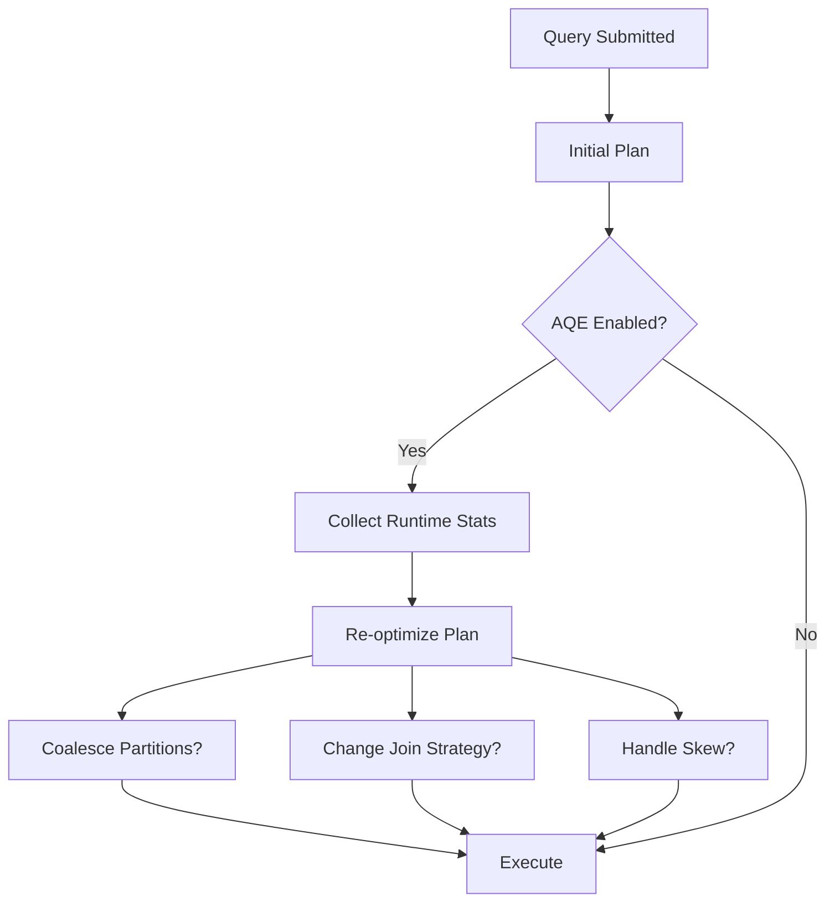

# :material-lightning-bolt: Adaptive Query Execution (AQE)

AQE adjusts query plans at runtime based on actual data statistics.
It can optimize join strategies, shuffle partitions, and skew handling.

### :material-sitemap: Overview



---

## :material-pin: Key Features

| Feature | Benefit |
|---------|---------|
| Join strategy changes | Switch to broadcast if smaller than expected |
| Shuffle coalescing | Reduce small partitions |
| Skew handling | Split skewed partitions |

---

## :material-flask-outline: Example

```sql
SET spark.sql.adaptive.enabled = true;
SELECT * FROM big_table JOIN small_dim USING (id);
```

---

## :material-brain: When to Use

| Scenario | Recommendation |
|----------|----------------|
| Variable data sizes | Enable AQE |
| Skewed joins | AQE skew handling |
| Too many small partitions | AQE coalescing |
