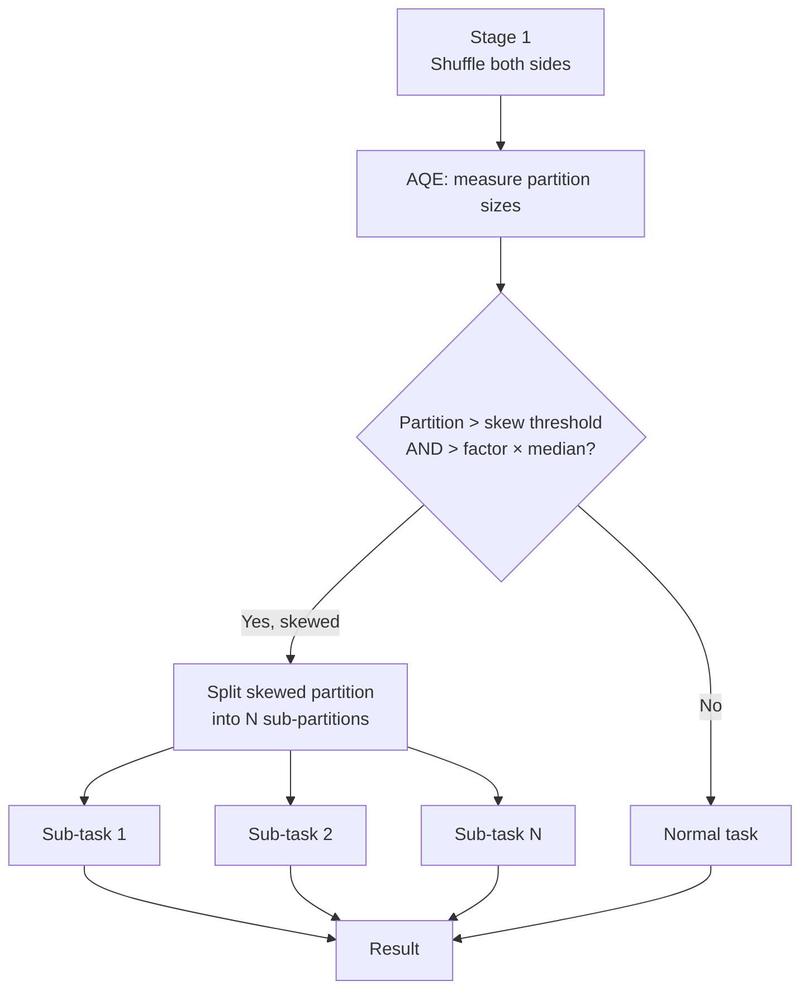

# :material-scale-unbalanced: AQE Skew Join Optimisation

Data skew in a join occurs when a small number of join-key values have
disproportionately many rows. Without handling, a single task processes a hot
partition while others finish quickly — creating a "straggler" that blocks the
entire stage.

AQE detects skewed partitions at runtime and **splits them** into smaller
sub-tasks that run in parallel.

---

## :material-sitemap: How Skew Join Works



---

## :material-cog: Configuration Reference

| Property | Default | Description |
|----------|---------|-------------|
| `spark.sql.adaptive.skewJoin.enabled` | `true` | Enable skew join handling |
| `spark.sql.adaptive.skewJoin.skewedPartitionFactor` | `5` | Partition is skewed if size > `factor × median partition size` |
| `spark.sql.adaptive.skewJoin.skewedPartitionThresholdInBytes` | `256MB` | Partition is skewed only if **both** conditions are met (size > threshold AND > factor × median) |
| `spark.sql.adaptive.advisoryPartitionSizeInBytes` | `64MB` | Target size for split sub-partitions |

!!! note "Both conditions must be true"
    A partition is considered skewed only when its size exceeds **both** the
    `skewedPartitionFactor × median` condition **and** the
    `skewedPartitionThresholdInBytes` absolute threshold. This prevents
    false positives on small datasets where all partitions are tiny.

---

## :material-flask-outline: Examples

### Basic skew join enablement

```sql
SET spark.sql.adaptive.enabled = true;
SET spark.sql.adaptive.skewJoin.enabled = true;

-- Skewed join: most orders belong to a handful of customers
SELECT c.name, SUM(o.amount) AS total_spend
FROM customers c
JOIN orders o ON c.id = o.customer_id
GROUP BY c.name;
-- AQE splits partitions for customer IDs with millions of orders
```

### Lower thresholds for smaller datasets

```sql
-- For datasets where typical partition is ~10 MB, lower the absolute threshold
SET spark.sql.adaptive.skewJoin.skewedPartitionThresholdInBytes = 67108864;  -- 64 MB
SET spark.sql.adaptive.skewJoin.skewedPartitionFactor = 3;
```

### Verify skew handling in Spark UI

After the query runs:

1. Open **Spark UI → Stages**
2. Find the join stage — look for tasks with widely varying **Duration** or **Shuffle Read** sizes
3. With AQE skew handling, you should see many short tasks instead of one long straggler

```sql
-- See the final plan — skew-split tasks appear as CustomShuffleReaderExec
EXPLAIN FORMATTED
SELECT c.name, SUM(o.amount)
FROM customers c JOIN orders o ON c.id = o.customer_id
GROUP BY c.name;
-- Look for: CustomShuffleReaderExec (skewed)
```

---

## :material-compare: AQE Skew Handling vs Manual Key Salting

| Aspect | AQE Skew Join | Manual Key Salting |
|--------|:-------------:|:-----------------:|
| Setup required | None — automatic | Significant SQL rewriting |
| Works on all keys | Yes | Yes (but one key at a time) |
| Requires schema changes | No | Sometimes (add salt column) |
| Suitable for ad-hoc queries | Yes | No |
| Deterministic output | Yes | Yes (with deduplication) |
| Works with all join types | Sort-merge joins | All join types |

!!! tip "AQE first, then salting"
    Enable AQE skew join first — it handles most cases automatically.
    Fall back to manual key salting only when AQE cannot resolve the skew
    (e.g., a single key with billions of rows that exceeds the advisory partition size).

---

## :material-magnify: Behavior Notes

1. **Works with Sort-Merge Joins** — AQE skew join operates at the shuffle boundary of SMJ; it does not apply to broadcast joins.
2. **Both sides checked** — AQE checks both the probe and build sides for skew; whichever side is skewed gets split.
3. **Non-skewed partitions are unaffected** — only partitions exceeding both thresholds are split; all others run normally.
4. **Sub-tasks read overlapping map outputs** — each sub-task reads a subset of the original skewed partition's map files; this is safe and correct.

---

## :material-brain: When to Tune

| Symptom | Fix |
|---------|-----|
| One task much slower than others in a join stage | Lower `skewedPartitionThresholdInBytes` and `skewedPartitionFactor` |
| Skew not detected (threshold too high) | Reduce `skewedPartitionThresholdInBytes` to ~50–100 MB |
| Too many false-positive splits on small data | Raise `skewedPartitionFactor` |
| Single key dominates (billions of rows) | Combine AQE + manual salt for that specific key |
