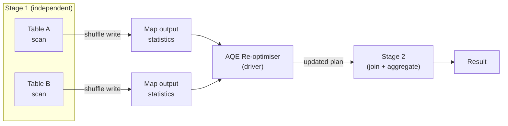

# :material-auto-fix: AQE Deep Dive

This page covers the internals of how AQE collects runtime statistics,
builds re-optimisation checkpoints, and applies plan changes between
query stages.

---

## :material-layers: Query Stage Model

AQE divides a query into **query stages** at shuffle boundaries. Each stage:

1. Executes as a set of tasks (scan or shuffle read → shuffle write)
2. Writes map output files
3. Reports **runtime statistics** (partition sizes, row counts) to the driver
4. Allows the driver to re-plan subsequent stages before they start



---

## :material-chart-bar: Runtime Statistics Collected

| Statistic | Collected after | Used for |
|-----------|:---------------:|----------|
| Shuffle partition sizes (bytes) | Shuffle write | Partition coalescing, skew detection |
| Number of output rows per partition | Shuffle write | Join strategy selection |
| Build-side total size | Shuffle write | SMJ → Broadcast conversion |
| Median / max partition size | Shuffle write | Skew factor calculation |

---

## :material-code-json: Reading AQE in EXPLAIN Output

```sql
EXPLAIN FORMATTED
SELECT c.region, SUM(o.amount) AS revenue
FROM customers c
JOIN orders o ON c.id = o.customer_id
GROUP BY c.region;
```

Before execution — initial plan:

```
== Physical Plan ==
AdaptiveSparkPlan isFinalPlan=false
+- SortMergeJoin [id], [customer_id], Inner
   :- Sort [id ASC]
   :  +- Exchange hashpartitioning(id, 200)
   :     +- FileScan customers
   +- Sort [customer_id ASC]
      +- Exchange hashpartitioning(customer_id, 200)
         +- FileScan orders
```

After AQE re-optimises (small customers table → broadcast):

```
== Physical Plan ==
AdaptiveSparkPlan isFinalPlan=true
+- BroadcastHashJoin [id], [customer_id], Inner, BuildLeft
   :- BroadcastExchange HashedRelationBroadcastMode
   :  +- FileScan customers
   +- FileScan orders
```

Key markers:

| Marker | Meaning |
|--------|---------|
| `AdaptiveSparkPlan isFinalPlan=false` | Initial plan, AQE will re-optimise |
| `AdaptiveSparkPlan isFinalPlan=true` | Final plan after AQE applied |
| `CustomShuffleReaderExec` | AQE-coalesced or skew-split partition reader |
| `BroadcastHashJoin` (where SMJ was planned) | AQE converted the join |

---

## :material-toggle-switch: Enabling and Disabling Selective Features

You can enable the AQE master switch but disable individual sub-features:

```sql
SET spark.sql.adaptive.enabled = true;

-- Disable only partition coalescing (keep everything else)
SET spark.sql.adaptive.coalescePartitions.enabled = false;

-- Disable only skew join handling
SET spark.sql.adaptive.skewJoin.enabled = false;

-- Disable broadcast conversion via join hint
SELECT /*+ MERGE(orders) */ c.region, SUM(o.amount)
FROM customers c JOIN orders o ON c.id = o.customer_id
GROUP BY c.region;
-- MERGE hint forces sort-merge join regardless of AQE
```

---

## :material-compare: AQE vs Static Planning

| Aspect | Static (AQE off) | Adaptive (AQE on) |
|--------|:----------------:|:-----------------:|
| Join strategy | Fixed at plan time | Re-chosen at runtime |
| Shuffle partitions | Fixed (`shuffle.partitions`) | Coalesced to advisory size |
| Skew handling | Manual salting / hints | Automatic partition splitting |
| Small-table broadcast | Only if stats available at plan time | Even if stats are stale |
| Debugging | Single EXPLAIN output | Two plans (before + after) |

---

## :material-magnify: Behavior Notes

1. **Stage dependencies are respected** — AQE only re-plans stages whose inputs are fully materialised; it cannot change a stage mid-execution.
2. **Broadcast conversion requires local shuffle reader** — when SMJ is converted to BHJ, Spark uses a local shuffle reader to avoid a second round-trip, controlled by `spark.sql.adaptive.localShuffleReader.enabled`.
3. **AQE and `spark.sql.shuffle.partitions`** — the initial partition count is still driven by `spark.sql.shuffle.partitions`; AQE only coalesces downward from that starting point.
4. **AQE increases plan complexity** — two physical plans (initial and final) appear in the Spark UI; the final plan is the one actually executed.
