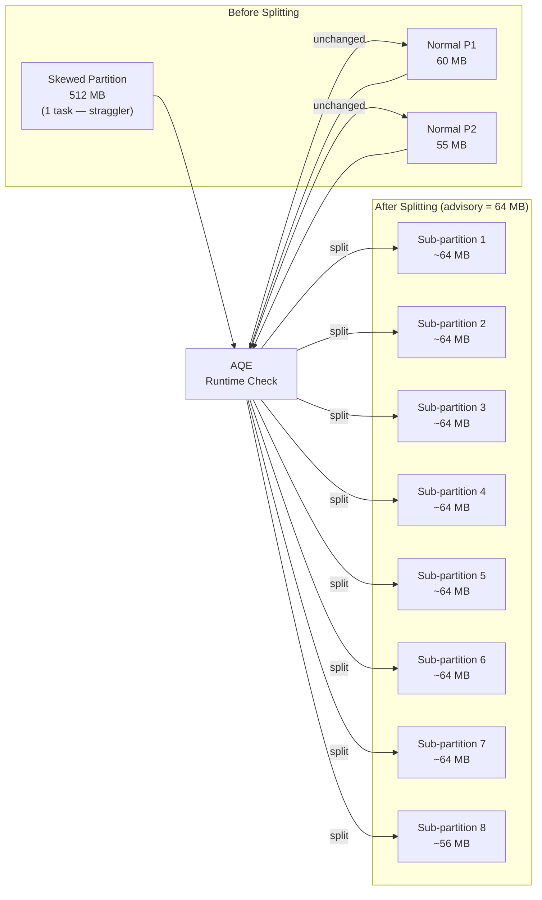

# :material-call-split: Splitting Skewed Shuffle Partitions

While [Skew Join Optimisation](optimizing_skew_join.md) handles skew within
a join, **Skew Partition Splitting** addresses partitions that are oversized
due to any cause — including aggregations and wide transformations — not just joins.

AQE detects partitions whose size exceeds the advisory threshold and
**splits them into multiple smaller sub-partitions** processed in parallel.

---

## :material-sitemap: Splitting Mechanics



---

## :material-cog: Configuration

| Property | Default | Description |
|----------|---------|-------------|
| `spark.sql.adaptive.enabled` | `true` | Master AQE switch |
| `spark.sql.adaptive.skewJoin.enabled` | `true` | Enables both skew join and partition splitting |
| `spark.sql.adaptive.skewJoin.skewedPartitionFactor` | `5` | Partition is skewed if size > `factor × median` |
| `spark.sql.adaptive.skewJoin.skewedPartitionThresholdInBytes` | `256MB` | Absolute minimum size to qualify as skewed |
| `spark.sql.adaptive.advisoryPartitionSizeInBytes` | `64MB` | Target size for each split sub-partition |

---

## :material-flask-outline: Examples

### Diagnose and fix a skewed aggregation

```sql
SET spark.sql.adaptive.enabled = true;
SET spark.sql.adaptive.skewJoin.enabled = true;

-- Tune for smaller advisory size to catch more splits
SET spark.sql.adaptive.advisoryPartitionSizeInBytes = 67108864;    -- 64 MB
SET spark.sql.adaptive.skewJoin.skewedPartitionThresholdInBytes = 134217728;  -- 128 MB
SET spark.sql.adaptive.skewJoin.skewedPartitionFactor = 3;

-- Skewed GROUP BY: one region has 90% of the data
SELECT region, product_id, SUM(amount) AS revenue
FROM sales
GROUP BY region, product_id;
```

### Observe splitting in EXPLAIN

```sql
EXPLAIN FORMATTED
SELECT region, SUM(amount) FROM sales GROUP BY region;
-- Final plan (isFinalPlan=true) contains:
-- CustomShuffleReaderExec partitionSpecs=[PartialReducerPartitionSpec(0,8)]
-- This indicates the oversized partition 0 was split into 8 sub-partitions
```

### Verify in Spark UI

1. Go to **Spark UI → Stages**
2. Open the aggregation or join stage
3. Check **Task Metrics** — with splitting, previously 1 long task becomes N shorter tasks of similar duration
4. Check **Shuffle Read Size / Records** — split tasks each show a fraction of the original partition's bytes

---

## :material-compare: Skew Join vs Skew Partition Split

| Aspect | Skew Join Optimisation | Skew Partition Split |
|--------|:---------------------:|:--------------------:|
| Applies to | Sort-merge joins | Any shuffle stage |
| Trigger | Skewed join key | Any oversized partition |
| Both sides checked | Yes | Yes |
| Requires join | Yes | No |
| Config | `skewJoin.enabled` | Same config |

!!! note "Same config, different scope"
    Both features share `skewJoin.enabled` and the same threshold settings.
    Disabling `skewJoin.enabled` turns off **both** skew join handling
    and skew partition splitting.

---

## :material-magnify: Behavior Notes

1. **Read-side operation** — splitting happens at the shuffle read phase; no data is re-written or re-shuffled.
2. **Sub-partition boundaries follow map output files** — Spark splits based on map output file boundaries; splits are approximate (within one file's granularity).
3. **Correct results guaranteed** — splitting a partition does not duplicate or lose rows; each byte is read exactly once across all sub-tasks.
4. **Advisory size is a target, not a guarantee** — actual sub-partition sizes vary depending on map file granularity.

---

## :material-brain: When to Tune

| Symptom | Fix |
|---------|-----|
| One task dominates stage duration | Lower `skewedPartitionThresholdInBytes` |
| Splitting not triggering on 200 MB partitions | Lower threshold to 128 MB and factor to 3 |
| Too many unnecessary splits | Raise factor or threshold |
| Advisory size too small (thousands of sub-tasks) | Raise `advisoryPartitionSizeInBytes` |
