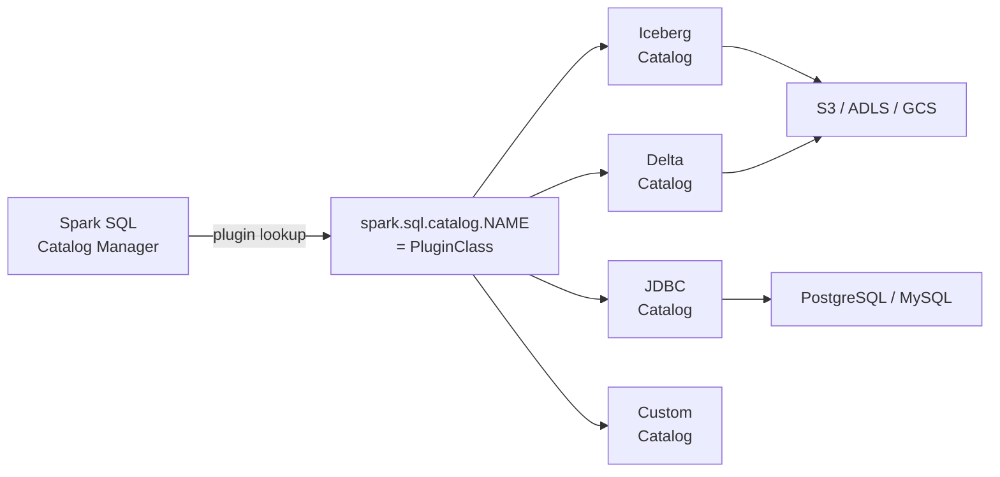

# :material-database-export: External Catalogs (V2 Plugins)

Spark 3.x introduced the **DataSource V2 catalog API** — a pluggable interface that lets
any storage system register as a first-class Spark catalog with full DDL and DML support.

---

## :material-sitemap: How V2 Catalogs Work



---

## :material-cog: Configuration

Register any number of named catalogs in `spark-defaults.conf` or via
`SparkSession` config. The catalog name becomes the first segment of the
three-level namespace.

### Delta Lake Catalog

```ini
spark.sql.catalog.my_delta        = org.apache.spark.sql.delta.catalog.DeltaCatalog
spark.sql.catalog.my_delta.type   = hadoop
spark.sql.catalog.my_delta.warehouse = /mnt/delta/warehouse
```

```sql
USE CATALOG my_delta;
CREATE DATABASE IF NOT EXISTS sales;
CREATE TABLE sales.orders (id BIGINT, amount DOUBLE) USING DELTA;
```

### Apache Iceberg Catalog

```ini
spark.sql.catalog.iceberg                  = org.apache.iceberg.spark.SparkCatalog
spark.sql.catalog.iceberg.type             = hive
spark.sql.catalog.iceberg.uri              = thrift://metastore:9083
spark.sql.catalog.iceberg.warehouse        = s3://my-bucket/iceberg/warehouse
```

```sql
USE CATALOG iceberg;
CREATE DATABASE IF NOT EXISTS events;

CREATE TABLE events.clicks (
    event_id BIGINT,
    user_id  BIGINT,
    ts       TIMESTAMP
) USING iceberg
PARTITIONED BY (days(ts));
```

### JDBC Catalog (read metadata from a relational DB)

```ini
spark.sql.catalog.pg                       = org.apache.spark.sql.jdbc.JdbcCatalog
spark.sql.catalog.pg.url                   = jdbc:postgresql://host:5432/mydb
spark.sql.catalog.pg.driver                = org.postgresql.Driver
spark.sql.catalog.pg.user                  = spark_user
spark.sql.catalog.pg.password              = secret
```

```sql
USE CATALOG pg;
SHOW DATABASES;       -- lists PostgreSQL schemas
SHOW TABLES IN public;
SELECT * FROM pg.public.customers LIMIT 10;
```

---

## :material-flask-outline: Common DDL Examples

```sql
-- Switch to an external catalog
USE CATALOG my_delta;

-- Three-level fully qualified reference
SELECT * FROM my_delta.sales.orders;

-- Create schema + table in one go
CREATE SCHEMA IF NOT EXISTS my_delta.marketing;

CREATE TABLE my_delta.marketing.campaigns (
    campaign_id   INT,
    name          STRING,
    start_date    DATE,
    budget        DOUBLE
) USING DELTA
PARTITIONED BY (start_date);

-- Register an external (unmanaged) table from an existing path
CREATE TABLE my_delta.raw.events
USING PARQUET
LOCATION 's3://my-bucket/raw/events';
```

---

## :material-compare: External V2 Catalog vs Hive Metastore

| Feature | External V2 Catalog | Hive Metastore |
|---------|:-------------------:|:--------------:|
| Three-level namespace | Yes | No (2-level) |
| Multi-engine support | Yes (Flink, Trino...) | Limited |
| Open table format | Iceberg, Delta, Hudi | Hive tables |
| ACID / time travel | Depends on format | Limited |
| Cloud-native storage | First-class | Via HDFS compat |
| Databricks native | Delta catalog | spark_catalog |

---

## :material-magnify: Behavior Notes

1. **Catalog isolation** — each V2 catalog is a separate namespace; tables from different catalogs cannot be joined without fully-qualified names.
2. **Default catalog** — `spark.sql.defaultCatalog` sets which catalog is active at startup (default: `spark_catalog` / Hive).
3. **Mixed namespaces** — you can query tables from different catalogs in the same SQL statement: `SELECT a.*, b.* FROM cat1.db.tbl a JOIN cat2.db.tbl b ON a.id = b.id`.
4. **DDL forwarded to plugin** — `CREATE TABLE`, `ALTER TABLE`, `DROP TABLE` are forwarded to the catalog plugin, which is responsible for persisting metadata.

---

## :material-brain: When to Use

| Scenario | Recommendation |
|----------|----------------|
| Multi-engine open lake (Spark + Trino + Flink) | Iceberg V2 catalog |
| Databricks Delta Lake with governance | Unity Catalog |
| Read PostgreSQL/MySQL tables from Spark SQL | JDBC catalog |
| On-prem Spark with HDFS + Delta | Delta V2 catalog with Hadoop warehouse |
| Single-engine, single-cluster | Hive Metastore may be sufficient |
