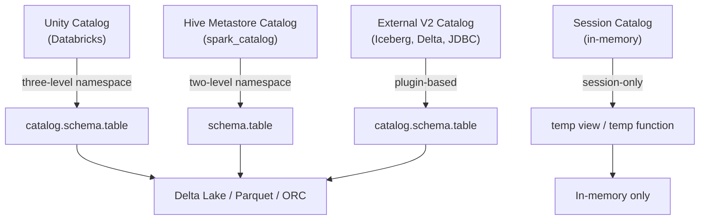
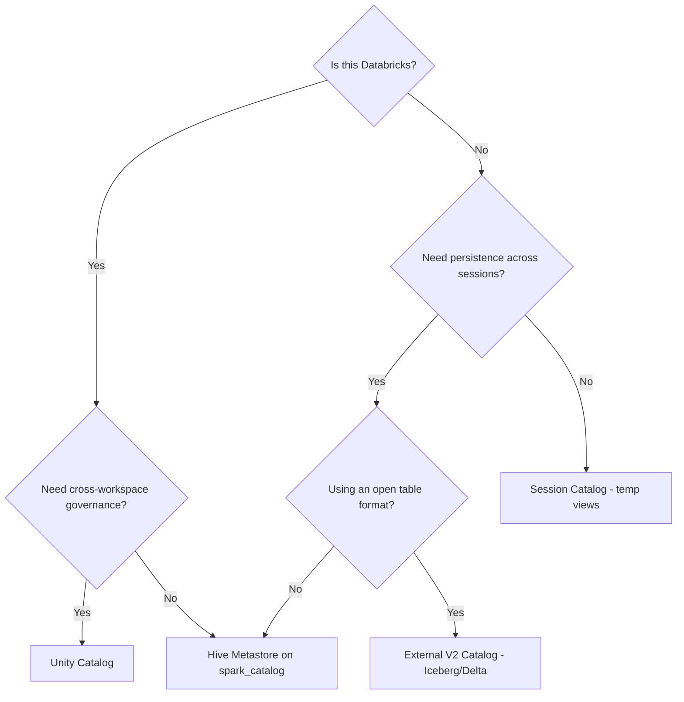

# :material-book-open-page-variant: Catalog

A **catalog** in Spark SQL is the top-level metadata registry that tracks databases,
tables, views, functions, and columns. Every Spark SQL statement resolves object names
against the active catalog.

---

## :material-sitemap: Architecture



---

## :material-compare: Catalog Types at a Glance

| Catalog | Persistence | Namespace levels | Use case |
|---------|:-----------:|:----------------:|----------|
| **Session** | Session-only | 1 (temp objects) | Ad-hoc work, notebooks |
| **Hive Metastore** (`spark_catalog`) | Persistent | 2 (schema.table) | Legacy Hive, on-prem clusters |
| **External V2** (Iceberg, Delta, JDBC) | Persistent | 2–3 | Open table formats, multi-engine |
| **Unity Catalog** (Databricks) | Persistent + governed | 3 (catalog.schema.table) | Multi-workspace governance |

---

## :material-console: Catalog SQL Commands Reference

| Command | Description |
|---------|-------------|
| `SHOW CATALOGS` | List all registered catalogs (Spark 3.1+) |
| `USE CATALOG catalog_name` | Switch active catalog |
| `SHOW DATABASES` | List schemas in active catalog |
| `CREATE DATABASE db` | Create a new schema/database |
| `USE db` | Switch active schema |
| `SHOW TABLES IN db` | List tables in a schema |
| `DESCRIBE TABLE tbl` | Column metadata |
| `DESCRIBE EXTENDED tbl` | Full metadata including storage info |
| `SHOW FUNCTIONS` | List built-in and registered functions |
| `SHOW VIEWS IN db` | List views |
| `SHOW CATALOGS LIKE 'my_*'` | Filter by pattern (Spark 3.1+) |

---

## :material-lightning-bolt: Quick-Start Examples

```sql
-- List all catalogs (Spark 3.1+ / Databricks)
SHOW CATALOGS;

-- Switch to a named catalog
USE CATALOG my_delta_catalog;

-- List schemas inside it
SHOW DATABASES;

-- Create a schema with a comment
CREATE DATABASE IF NOT EXISTS analytics
COMMENT 'Analytics domain tables';

-- Make it the active schema
USE analytics;

-- See what tables exist
SHOW TABLES;
```

---

## :material-compare-horizontal: Managed vs External Tables

| Aspect | Managed Table | External Table |
|--------|:-------------:|:--------------:|
| Data location | Controlled by catalog | User-specified path |
| `DROP TABLE` behaviour | Deletes data + metadata | Deletes metadata only |
| Default storage | Warehouse directory | Any accessible path |
| Best for | ETL outputs, marts | Raw landing zones |

```sql
-- Managed table (data lives in catalog warehouse dir)
CREATE TABLE analytics.orders (
    order_id BIGINT,
    amount   DOUBLE,
    region   STRING
) USING DELTA;

-- External table (data lives at a user path)
CREATE TABLE analytics.raw_events
USING PARQUET
LOCATION '/mnt/raw/events';
```

---

## :material-arrow-decision: Which Catalog to Choose



---

## :material-book-open-variant: In This Section

| Page | Contents |
|------|----------|
| [Database](database.md) | CREATE/ALTER/DROP DATABASE, location, properties |
| [Session Catalog](session.md) | Temp views, global temp views, temp functions |
| [External Catalog](external.md) | V2 catalog plugins, Iceberg, Delta, JDBC |
| [Hive Catalog](hive.md) | Metastore config, managed/external, MSCK REPAIR |
| [Unity Catalog](unity.md) | 3-level namespace, GRANT/REVOKE, volumes, lineage |
