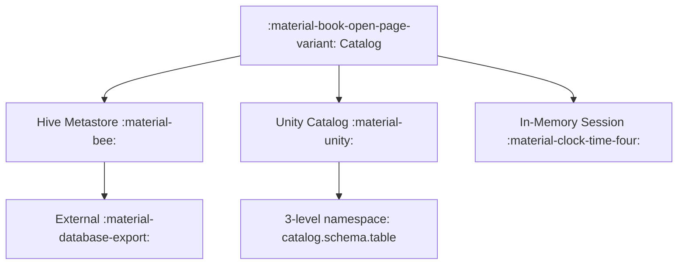

# :material-book-open-page-variant: Spark catalog

In Apache Spark, a catalog is a logical namespace or system that stores metadata about databases, tables, views, functions, and columns. It's like a directory of all available data objects in your Spark environment.

The highest level abstraction in Spark SQL is the Catalog.

The Catalog is an abstraction for the storage of metadata about the data stored in your tables as well as other helpful things like
databases, tables, functions, and views.

The catalog is available in the `org.apache.spark.sql.catalog.Catalog` package and contains a number of helpful functions
for doing things like listing tables, databases, and functions.

### :material-sitemap: Overview



## Types of Catalogs in Spark

### 1. Session Catalog (default)

1. Managed by Spark internally.
2. Includes temporary and permanent objects.
3. Supports Hive Metastore if configured.

```sql
SHOW DATABASES;
SHOW TABLES IN default;
DESCRIBE TABLE default.students;
```

### 2. Hive Catalog

1. Uses Hive Metastore for persistent storage.
2. Enables cross-session sharing of metadata.
3. Requires Hive support enabled in Spark (`spark.sql.catalogImplementation=hive`).

```ini
# spark-defaults.conf
spark.sql.catalogImplementation=hive
```

```sql
USE database_name;
SHOW TABLES;
```

## 3. External Catalogs (v2 - plugin based)

1. Introduced in Spark 3.x as DataSourceV2 Catalogs
2. Used for systems like Delta Lake, Iceberg, JDBC, etc.
3. Pluggable using custom catalog plugins.

```ini
# spark config
spark.sql.catalog.my_delta=org.apache.spark.sql.delta.catalog.DeltaCatalog
spark.sql.catalog.my_delta.type=hadoop
spark.sql.catalog.my_delta.warehouse=/mnt/delta
```

```sql
USE my_delta.db1;
SHOW TABLES;
```

## Catalog Commands (SQL)

Command                | Description
-----------------------|-----------------------------------
SHOW CATALOGS          | Lists all catalogs (Spark 3.1+)
SHOW DATABASES         | Lists databases in current catalog
SHOW TABLES IN db_name | Lists tables in a database
DESCRIBE TABLE table   | Column info
SHOW FUNCTIONS         | Lists functions
SHOW VIEWS             | Lists views

## Unity Catalog (Databricks-specific)

In Databricks, Unity Catalog is a governance layer on top of Spark catalogs. It organizes data as:

```sql
catalog.schema.table
```

Example:

```sql
SELECT * FROM my_catalog.sales.orders;
```
