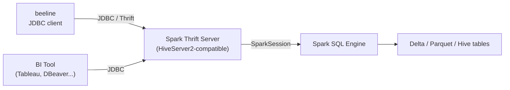

# :material-connection: Beeline

**Beeline** is the official JDBC client for Hive/Spark. It connects to a running
**HiveServer2** or **Spark Thrift Server** over JDBC/Thrift — enabling remote SQL
access from BI tools, scripts, and other JDBC clients without local Spark binaries.

---

## :material-sitemap: Architecture



---

## :material-server-network: Starting the Spark Thrift Server

The Spark Thrift Server exposes a HiveServer2-compatible endpoint.

```bash
# Start the Thrift Server (runs as a long-lived service)
$SPARK_HOME/sbin/start-thriftserver.sh \
  --master yarn \
  --executor-memory 8g \
  --num-executors 10 \
  --conf spark.sql.hive.thriftServer.singleSession=false \
  --hiveconf hive.server2.thrift.port=10000 \
  --hiveconf hive.server2.thrift.bind.host=0.0.0.0

# Stop
$SPARK_HOME/sbin/stop-thriftserver.sh

# Check it is running
$SPARK_HOME/sbin/spark-daemon.sh status org.apache.spark.sql.hive.thriftserver.HiveThriftServer2 1
```

---

## :material-lan-connect: Connecting with Beeline

```bash
# Basic connection (no auth)
beeline -u "jdbc:hive2://thrift-host:10000"

# With username / password
beeline -u "jdbc:hive2://thrift-host:10000/default" \
        -n spark_user -p secret

# Connect to a specific database
beeline -u "jdbc:hive2://thrift-host:10000/analytics" -n spark_user

# SSL-enabled
beeline -u "jdbc:hive2://thrift-host:10000/default;ssl=true;sslTrustStore=/path/truststore.jks"

# Kerberos
beeline -u "jdbc:hive2://thrift-host:10000/default;principal=hive/thrift-host@REALM.COM"
```

The Beeline prompt:

```
Beeline version 3.1.x by Apache Hive
beeline>
```

---

## :material-keyboard: Beeline Interactive Commands

| Command | Description |
|---------|-------------|
| `!connect <url>` | Connect to a JDBC URL |
| `!disconnect` | Close the current connection |
| `!quit` / `!exit` | Exit Beeline |
| `!help` | List all Beeline shell commands |
| `!history` | Show command history |
| `!run <file.sql>` | Execute a SQL file |
| `!outputformat table` | Set output format (`table`, `csv`, `tsv`, `json`) |
| `!set maxColumnWidth 60` | Limit column display width |
| `!set showHeader true` | Show/hide column headers |
| `!set silent true` | Suppress info messages |

---

## :material-flask-outline: Practical Examples

### Interactive Query

```bash
beeline -u "jdbc:hive2://thrift-host:10000/analytics" -n spark_user
```

```sql
-- inside Beeline
SHOW DATABASES;
USE analytics;
SHOW TABLES;

SELECT region, SUM(amount) AS total
FROM orders
GROUP BY region
ORDER BY total DESC;
```

### Non-Interactive Script Execution

```bash
# Run a file
beeline -u "jdbc:hive2://thrift-host:10000/analytics" -n spark_user \
        -f /path/to/daily_report.sql

# Inline SQL
beeline -u "jdbc:hive2://thrift-host:10000" -n spark_user \
        -e "SELECT COUNT(*) FROM analytics.orders"
```

### Export Output to CSV

```bash
beeline -u "jdbc:hive2://thrift-host:10000/analytics" -n spark_user \
  --outputformat=csv2 \
  --silent=true \
  -e "SELECT * FROM daily_revenue ORDER BY report_date DESC" \
  > /tmp/daily_revenue.csv
```

### JDBC Connection String Parameters

| Parameter | Example | Description |
|-----------|---------|-------------|
| `ssl` | `ssl=true` | Enable TLS/SSL |
| `sslTrustStore` | `/path/truststore.jks` | Trust store for SSL |
| `principal` | `hive/host@REALM` | Kerberos service principal |
| `hive.server2.proxy.user` | `target_user` | Impersonation (proxy auth) |
| `transportMode` | `http` | Use HTTP transport (default: `binary`) |
| `httpPath` | `cliservice` | HTTP endpoint path |

---

## :material-compare: `spark-sql` vs `beeline`

| Aspect | `spark-sql` | `beeline` |
|--------|:-----------:|:---------:|
| Requires local Spark install | Yes | No (only JDBC driver JAR) |
| Remote server | No | Yes (Thrift Server) |
| Multi-user concurrent sessions | No | Yes |
| BI tool integration | No | Yes (JDBC) |
| Kerberos support | Yes | Yes |
| Startup overhead | Medium (launches driver) | Low (connects to existing server) |
| Best for | Local dev / file queries | Shared cluster, BI, production |

---

## :material-magnify: Behavior Notes

1. **Thrift Server must be running** — Beeline only acts as a JDBC client; it cannot start a Spark session itself.
2. **Single SparkSession by default** — `spark.sql.hive.thriftServer.singleSession=true` shares one session across all connections (useful for shared temp views but limits isolation).
3. **Output formats** — `csv2` (RFC-4180 compliant) is recommended over `csv` for export; `tsv2` for tab-separated.
4. **Connection timeouts** — increase `hive.server2.idle.session.timeout` on the server for long-running BI sessions.

---

## :material-brain: When to Use

| Scenario | Recommendation |
|----------|----------------|
| BI tool (Tableau, Power BI, DBeaver) | Beeline / JDBC driver |
| Remote access without Spark installation | Beeline |
| Concurrent multi-user SQL workloads | Spark Thrift Server + Beeline |
| Local dev with direct file access | `spark-sql` |
| Databricks SQL Warehouse | Databricks JDBC driver (not Beeline) |
