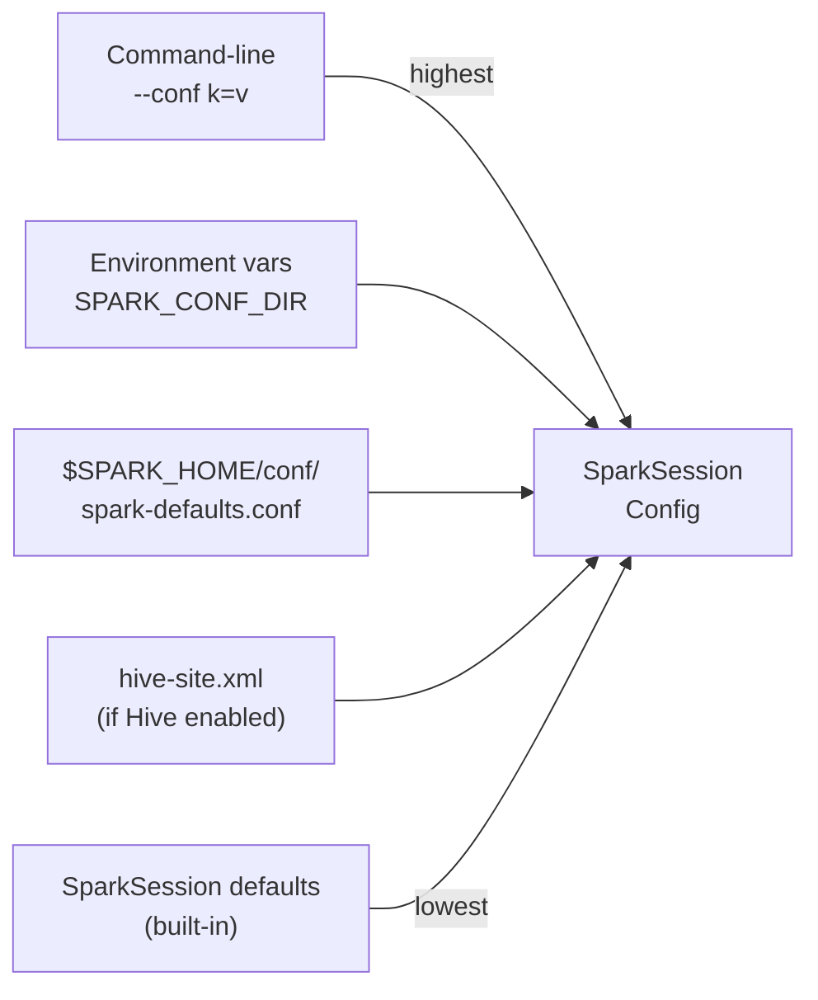

# :material-cog: Configuration

`spark-sql` resolves its configuration from multiple sources, merged in
priority order (highest first):



---

## :material-file-cog: `spark-defaults.conf`

Place in `$SPARK_HOME/conf/spark-defaults.conf`:

```ini
# spark-defaults.conf

# Master
spark.master                                    yarn

# Memory
spark.driver.memory                             4g
spark.executor.memory                           8g
spark.executor.cores                            4

# AQE
spark.sql.adaptive.enabled                      true
spark.sql.adaptive.coalescePartitions.enabled   true

# Warehouse
spark.sql.warehouse.dir                         hdfs:///user/hive/warehouse

# Hive Metastore
spark.sql.catalogImplementation                 hive
spark.hadoop.hive.metastore.uris                thrift://metastore:9083

# Column headers in CLI output
spark.hadoop.hive.cli.print.header              true

# Output format: table (default) or tsv
spark.sql.cli.execEagerEvalEnabled              true
```

---

## :material-set-all: Setting Config Inside the Session

```sql
-- View a single config value
SET spark.sql.shuffle.partitions;

-- View all SET properties
SET;

-- Change at runtime (most but not all configs are mutable)
SET spark.sql.shuffle.partitions = 50;
SET spark.sql.adaptive.enabled = true;
SET spark.hadoop.hive.cli.print.header = true;

-- Reset to default
RESET spark.sql.shuffle.partitions;
```

---

## :material-hive: Hive Metastore Configuration

```ini
# hive-site.xml  (place in $SPARK_HOME/conf/)
<configuration>
  <property>
    <name>hive.metastore.uris</name>
    <value>thrift://metastore-host:9083</value>
  </property>
  <property>
    <name>hive.metastore.warehouse.dir</name>
    <value>/user/hive/warehouse</value>
  </property>
  <property>
    <name>hive.exec.dynamic.partition.mode</name>
    <value>nonstrict</value>
  </property>
  <property>
    <name>hive.exec.max.dynamic.partitions</name>
    <value>10000</value>
  </property>
</configuration>
```

---

## :material-tune: Performance Tuning Configs

| Property | Recommended value | Why |
|----------|:-----------------:|-----|
| `spark.sql.adaptive.enabled` | `true` | Dynamic partition coalescing and skew join |
| `spark.sql.adaptive.coalescePartitions.enabled` | `true` | Avoids tiny output files |
| `spark.sql.adaptive.skewJoin.enabled` | `true` | Handles data skew automatically |
| `spark.sql.shuffle.partitions` | `200`–`2000` | Tune to data size (AQE adjusts down automatically) |
| `spark.sql.files.maxPartitionBytes` | `128m` | Max bytes per input partition |
| `spark.sql.broadcastTimeout` | `300` | Seconds before broadcast join timeout |
| `spark.sql.autoBroadcastJoinThreshold` | `10m` | Tables smaller than this are broadcast |
| `spark.serializer` | `org.apache.spark.serializer.KryoSerializer` | Faster serialisation |
| `spark.sql.parquet.filterPushdown` | `true` | Parquet row-group predicate pushdown |
| `spark.sql.parquet.mergeSchema` | `false` | Faster reads when schema is stable |
| `spark.dynamicAllocation.enabled` | `true` | Scale executors automatically (YARN/K8s) |

---

## :material-flask-outline: Environment Variable Reference

| Variable | Description |
|----------|-------------|
| `SPARK_HOME` | Root of the Spark installation |
| `SPARK_CONF_DIR` | Directory for `spark-defaults.conf` (default: `$SPARK_HOME/conf`) |
| `JAVA_HOME` | JDK 11 location |
| `HADOOP_HOME` | Hadoop installation (for HDFS access) |
| `HADOOP_CONF_DIR` | Hadoop cluster config directory |
| `HIVE_CONF_DIR` | Hive config directory (`hive-site.xml`) |
| `SPARK_DRIVER_MEMORY` | Override driver memory without `--driver-memory` |
| `SPARK_EXECUTOR_MEMORY` | Override executor memory |

---

## :material-magnify: Behavior Notes

1. **`--conf` overrides everything** — flags on the command line always win over file-based config.
2. **Immutable configs** — some configs (e.g. `spark.master`) cannot be changed once the session starts.
3. **`hive-site.xml` auto-loaded** — if `spark.sql.catalogImplementation=hive` and `$SPARK_HOME/conf/hive-site.xml` exists, it is loaded automatically.
4. **`SET` output format** — `SET` with no argument dumps all current session properties; pipe to `grep` in a script to inspect a specific key.
