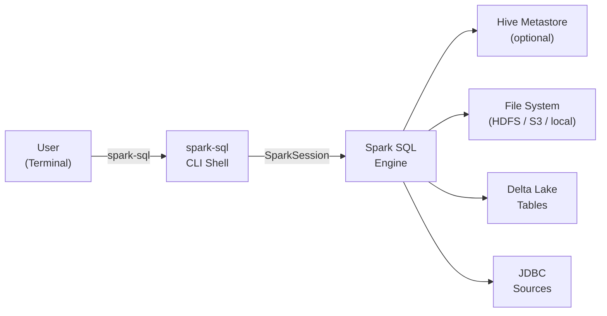

# :material-console: Spark SQL CLI

The **Spark SQL CLI** (`spark-sql`) is an interactive command-line shell for
running Spark SQL queries against local files, Hive Metastore tables, Delta Lake,
and any other data source registered in the Spark catalog — without writing
Scala, Java, or Python code.

---

## :material-sitemap: Architecture



---

## :material-compare: CLI Tools at a Glance

| Tool | Protocol | Best for |
|------|----------|----------|
| `spark-sql` | Spark driver (local) | Local dev, HDFS, file-based queries |
| `beeline` | JDBC / Thrift Server | Remote HiveServer2, BI tools |
| Databricks SQL CLI | REST API | Databricks SQL Warehouses |
| `pyspark` REPL | Spark driver | Mixed Python + SQL workflows |

---

## :material-rocket-launch: Quick Start

```bash
# Start interactive shell
spark-sql

# Run a single statement and exit
spark-sql -e "SHOW DATABASES"

# Run a SQL script file
spark-sql -f /path/to/queries.sql

# Connect to a specific master
spark-sql --master yarn
```

---

## :material-book-open-variant: In This Section

| Page | Contents |
|------|----------|
| [Getting Started](getting_started.md) | Installation, first queries, interactive mode |
| [Options Reference](options.md) | Full `spark-sql` flag reference |
| [Scripting](scripting.md) | Running `.sql` files, variables, multi-statement scripts |
| [Configuration](configuration.md) | `--conf`, `spark-defaults.conf`, Hive configs |
| [Beeline](beeline.md) | JDBC Thrift Server, remote connections, BI tools |
