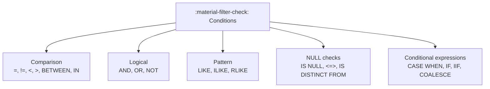
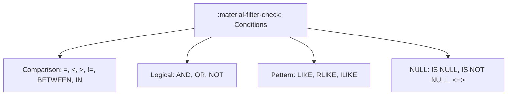

# :material-filter-check: Conditions and Predicates

Conditions (predicates) are boolean expressions used in `WHERE`, `HAVING`,
`JOIN … ON`, `CASE WHEN`, and `ON CONFLICT`. They control which rows are kept,
how records are classified, and how joins match.

---

## :material-play-circle: In This Section

| Page | What it covers |
|------|----------------|
| [Comparison](comparison.md) | `=`, `!=`, `<=>`, `BETWEEN`, `IN`, `IS DISTINCT FROM` |
| [Logical](logical.md) | `AND`, `OR`, `NOT`, three-valued logic truth tables |
| [Pattern Matching](pattern.md) | `LIKE`, `ILIKE`, `RLIKE`, escape sequences, performance |
| [CASE WHEN](case_when.md) | Searched CASE, simple CASE, inline classification |
| [IF / IIF](if_iif.md) | `IF`, `IIF`, `IFNULL`, `NULLIF`, `COALESCE` |

---

## :material-sitemap: Predicate Taxonomy



---

## :material-pin: Predicate Quick Reference

| Predicate Type | Example | Purpose |
|----------------|---------|---------|
| Equality | `amount = 100` | Exact match |
| Inequality | `status != 'cancelled'` | Exclude a value |
| Range | `date BETWEEN '2024-01-01' AND '2024-12-31'` | Inclusive range |
| Membership | `country IN ('US', 'CA', 'UK')` | Match from list |
| Pattern | `name LIKE 'A%'` | Wildcard string match |
| Regex | `id RLIKE '^[A-Z]{3}-\d{4}$'` | Full regex match |
| NULL check | `email IS NULL` | Missing value test |
| Null-safe equality | `col <=> other_col` | Safe equals; NULL = NULL → TRUE |
| Distinct | `a IS DISTINCT FROM b` | NULL-aware inequality |
| Conditional | `CASE WHEN score > 90 THEN 'A' END` | Branch logic |

---

## :material-magnify: Three-Valued Logic

Spark SQL uses **three-valued logic** (TRUE / FALSE / NULL/UNKNOWN). Any comparison with NULL yields NULL, which is treated as **FALSE** in filter predicates but propagates as NULL in expressions.

| A | B | A AND B | A OR B |
|---|---|---------|--------|
| TRUE | TRUE | TRUE | TRUE |
| TRUE | FALSE | FALSE | TRUE |
| TRUE | NULL | NULL | TRUE |
| FALSE | NULL | FALSE | NULL |
| NULL | NULL | NULL | NULL |

!!! warning "NOT IN with NULLs"
    If any value in a `NOT IN (subquery)` result is NULL, the entire predicate returns NULL → **zero rows returned**. Use `NOT EXISTS` or `LEFT ANTI JOIN` instead.

---

## :material-flask-outline: Common Patterns

### Combine conditions

```sql
SELECT * FROM orders
WHERE status = 'shipped'
  AND amount > 100
  AND order_date >= '2024-01-01';
```

### OR with parentheses

```sql
SELECT * FROM users
WHERE (country = 'US' OR country = 'CA')
  AND is_active = TRUE;
```

### NULL-safe equality

```sql
SELECT * FROM events
WHERE device_id <=> previous_device_id;  -- NULL <=> NULL → TRUE
```

### IS DISTINCT FROM

```sql
-- TRUE whenever values differ, including NULL vs non-NULL
SELECT * FROM orders
WHERE new_status IS DISTINCT FROM old_status;
```

---

## :material-tune: Predicate Pushdown

Simple comparisons are pushed down to the data source (Parquet, Delta, JDBC) — the storage layer filters before data reaches Spark, saving I/O. Complex expressions (`RLIKE`, UDFs, `OR` across partitions) cannot be pushed down.

```sql
-- Pushed down — file/row-group skipping at storage layer
SELECT * FROM events WHERE event_date = '2024-06-01';

-- NOT pushed down — full scan required
SELECT * FROM events WHERE year(event_date) = 2024;
-- Use: WHERE event_date >= '2024-01-01' AND event_date < '2025-01-01'
```

---

## :material-brain: When to Use

| Scenario | Recommended Pattern |
|----------|---------------------|
| Row-level filtering | `WHERE` with predicates |
| Group-level filtering | `HAVING` with aggregates |
| Join matching | `JOIN … ON` predicates |
| Defensive NULL handling | `IS NULL`, `<=>`, `COALESCE` |
| Branch logic in SELECT | `CASE WHEN` / `IF` |
| Null-aware inequality | `IS DISTINCT FROM` |

---

## :material-link: Related Guides

- [Filter](../filter/index.md) — WHERE, QUALIFY, LIMIT
- [NULL Handling](../nulls/index.md) — NULL in aggregates, joins, subqueries
- [HAVING Clause](../having/index.md) — post-aggregation filters
- [Subquery Filters](../filter/sub-query.md) — EXISTS, IN, correlated subqueries


Conditions (predicates) are boolean expressions used in `WHERE`, `HAVING`,
`JOIN ... ON`, and `CASE WHEN`. They control which rows are kept and how
records are classified.

### :material-sitemap: Overview



---

## :material-pin: Predicate Forms

| Predicate Type | Example | Purpose |
|----------------|---------|---------|
| Comparison | `amount >= 100` | Numeric/string comparisons |
| Logical | `A AND B` | Combine conditions |
| Set membership | `id IN (1,2,3)` | Match from a list |
| Range | `date BETWEEN '2024-01-01' AND '2024-01-31'` | Inclusive range |
| Pattern | `name LIKE 'A%'` | String patterns |
| NULL checks | `col IS NULL` | Handle missing values |
| Null-safe equality | `col <=> other_col` | Safe equals with NULLs |

---

## :material-magnify: Behavior Notes

1. **Three-valued logic** — Comparisons with NULL return NULL, which is treated
   as FALSE in filters.
2. **Precedence** — `NOT` > `AND` > `OR`. Use parentheses for clarity.
3. **Type coercion** — Spark will attempt to cast types in comparisons. Be
   explicit with `CAST()` when precision matters.
4. **Predicate pushdown** — Simple comparisons can be pushed down to the data
   source for better performance.

---

## :material-flask-outline: Practical Examples

### Combine Multiple Conditions

```sql
SELECT * FROM orders
WHERE status = 'shipped'
  AND amount > 100
  AND order_date >= '2024-01-01';
```

### Use Parentheses for Clarity

```sql
SELECT * FROM users
WHERE (country = 'US' OR country = 'CA')
  AND is_active = true;
```

### NULL-Safe Equality

```sql
SELECT * FROM events
WHERE device_id <=> previous_device_id;
```

---

## :material-brain: When to Use

| Scenario | Recommended Pattern |
|----------|---------------------|
| Row-level filtering | `WHERE` with predicates |
| Group-level filtering | `HAVING` with aggregates |
| Join matching | `JOIN ... ON` predicates |
| Defensive NULL handling | `IS NULL`, `<=>`, `COALESCE` |

---

### Related Guides

- [Filter](../filter/index.md)
- [NULL Handling](../nulls/index.md)
- [Subquery Filters](../filter/sub-query.md)
- [HAVING Clause](../having/index.md)
