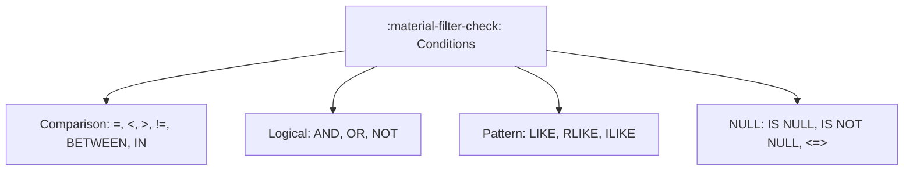

# :material-filter-check: Conditions and Predicates

Conditions (predicates) are boolean expressions used in `WHERE`, `HAVING`,
`JOIN ... ON`, and `CASE WHEN`. They control which rows are kept and how
records are classified.

### :material-sitemap: Overview



---

## 📌 Predicate Forms

| Predicate Type | Example | Purpose |
|----------------|---------|---------|
| Comparison | `amount >= 100` | Numeric/string comparisons |
| Logical | `A AND B` | Combine conditions |
| Set membership | `id IN (1,2,3)` | Match from a list |
| Range | `date BETWEEN '2024-01-01' AND '2024-01-31'` | Inclusive range |
| Pattern | `name LIKE 'A%'` | String patterns |
| NULL checks | `col IS NULL` | Handle missing values |
| Null-safe equality | `col <=> other_col` | Safe equals with NULLs |

---

## 🔍 Behavior Notes

1. **Three-valued logic** — Comparisons with NULL return NULL, which is treated
   as FALSE in filters.
2. **Precedence** — `NOT` > `AND` > `OR`. Use parentheses for clarity.
3. **Type coercion** — Spark will attempt to cast types in comparisons. Be
   explicit with `CAST()` when precision matters.
4. **Predicate pushdown** — Simple comparisons can be pushed down to the data
   source for better performance.

---

## 🧪 Practical Examples

### Combine Multiple Conditions

```sql
SELECT * FROM orders
WHERE status = 'shipped'
  AND amount > 100
  AND order_date >= '2024-01-01';
```

### Use Parentheses for Clarity

```sql
SELECT * FROM users
WHERE (country = 'US' OR country = 'CA')
  AND is_active = true;
```

### NULL-Safe Equality

```sql
SELECT * FROM events
WHERE device_id <=> previous_device_id;
```

---

## 🧠 When to Use

| Scenario | Recommended Pattern |
|----------|---------------------|
| Row-level filtering | `WHERE` with predicates |
| Group-level filtering | `HAVING` with aggregates |
| Join matching | `JOIN ... ON` predicates |
| Defensive NULL handling | `IS NULL`, `<=>`, `COALESCE` |

---

### Related Guides

- [Filter](../filter/index.md)
- [NULL Handling](../nulls/index.md)
- [Subquery Filters](../filter/sub-query.md)
- [HAVING Clause](../having/index.md)
