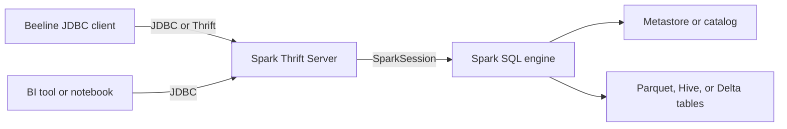

# :material-connection: Beeline

**Beeline** is the JDBC client for Hive-compatible SQL services such as the **Spark Thrift Server**. It does not start Spark locally; instead, it opens a remote session against a server that is already running and exposing a HiveServer2-compatible endpoint.

A Beeline JDBC URL is built from three practical pieces: the target `host:port`, an optional default database path, and semicolon-delimited parameters for transport, SSL, Kerberos, or proxy settings.

### :material-animation-play: Interactive Visualization — Beeline JDBC URL Builder

Toggle the URL components to see how the server address, default database, and connection parameters change the final JDBC string and the kind of remote session Beeline opens.

<div id="viz-cli-beeline" class="ts-viz"></div>

<script src="../../assets/js/configuration-cli-viz.js"></script>

______________________________________________________________________

## :material-sitemap: Architecture



______________________________________________________________________

## :material-server-network: Starting the Spark Thrift Server

The Spark Thrift Server exposes a HiveServer2-compatible endpoint that Beeline and JDBC tools can share.

```bash
$SPARK_HOME/sbin/start-thriftserver.sh   --master yarn   --executor-memory 8g   --num-executors 10   --conf spark.sql.hive.thriftServer.singleSession=false   --hiveconf hive.server2.thrift.port=10000   --hiveconf hive.server2.thrift.bind.host=0.0.0.0

# Stop the service
$SPARK_HOME/sbin/stop-thriftserver.sh
```

______________________________________________________________________

## :material-lan-connect: Connecting with Beeline

```bash
# Basic connection
beeline -u "jdbc:hive2://thrift-host:10000"

# Default database
beeline -u "jdbc:hive2://thrift-host:10000/analytics"

# Username and password from environment variables
beeline -u "jdbc:hive2://thrift-host:10000/default"   -n "$BEELINE_USER"   -p "$BEELINE_PASSWORD"

# HTTP transport with SSL
beeline -u "jdbc:hive2://thrift-host:10000/default;transportMode=http;httpPath=cliservice;ssl=true"

# Kerberos
beeline -u "jdbc:hive2://thrift-host:10000/default;principal=hive/thrift-host@REALM.COM"
```

The prompt looks like this:

```
Beeline version 3.x by Apache Hive
beeline>
```

______________________________________________________________________

## :material-table: JDBC URL Anatomy

| Piece            | Example                  | Meaning                                             |
| ---------------- | ------------------------ | --------------------------------------------------- |
| Protocol         | `jdbc:hive2://`          | HiveServer2-compatible JDBC endpoint                |
| Server           | `thrift-host:10000`      | Host and port of the Spark Thrift Server            |
| Default database | `/analytics`             | Database selected immediately after connect         |
| Parameters       | `;ssl=true;httpPath=...` | Transport, TLS, auth, proxy user, and similar flags |

______________________________________________________________________

## :material-keyboard: Beeline Interactive Commands

| Command                  | Description                                         |
| ------------------------ | --------------------------------------------------- |
| `!connect <url>`         | Connect to a JDBC URL                               |
| `!disconnect`            | Close the current connection                        |
| `!quit` / `!exit`        | Exit Beeline                                        |
| `!help`                  | List Beeline shell commands                         |
| `!history`               | Show command history                                |
| `!run <file.sql>`        | Execute a SQL file                                  |
| `!outputformat table`    | Set output format (`table`, `csv2`, `tsv2`, `json`) |
| `!set maxColumnWidth 60` | Limit column display width                          |
| `!set showHeader true`   | Show or hide column headers                         |
| `!set silent true`       | Suppress info messages                              |

______________________________________________________________________

## :material-flask-outline: Practical Examples

### Interactive Query Session

```bash
beeline -u "jdbc:hive2://thrift-host:10000/analytics" -n "$BEELINE_USER"
```

```sql
SHOW DATABASES;
USE analytics;
SHOW TABLES;

SELECT
    region,
    SUM(amount) AS total_amount
FROM orders
GROUP BY region
ORDER BY total_amount DESC;
```

### Non-Interactive Execution

```bash
# Run a file
beeline -u "jdbc:hive2://thrift-host:10000/analytics" -n "$BEELINE_USER"   -f ./sql/daily_report.sql

# Inline SQL
beeline -u "jdbc:hive2://thrift-host:10000" -n "$BEELINE_USER"   -e "SELECT COUNT(*) FROM analytics.orders"
```

### Export Output to CSV

```bash
mkdir -p ./exports
beeline -u "jdbc:hive2://thrift-host:10000/analytics" -n "$BEELINE_USER"   --outputformat=csv2   --silent=true   -e "SELECT * FROM daily_revenue ORDER BY report_date DESC"   > ./exports/daily_revenue.csv
```

### Connection String Parameters

| Parameter                 | Example                | Description                          |
| ------------------------- | ---------------------- | ------------------------------------ |
| `ssl`                     | `ssl=true`             | Enable TLS / SSL                     |
| `sslTrustStore`           | `/path/truststore.jks` | Trust store for SSL                  |
| `principal`               | `hive/host@REALM`      | Kerberos service principal           |
| `hive.server2.proxy.user` | `target_user`          | Proxy or impersonation user          |
| `transportMode`           | `http`                 | Use HTTP instead of binary transport |
| `httpPath`                | `cliservice`           | HTTP endpoint path on the server     |

______________________________________________________________________

## :material-compare: `spark-sql` vs `beeline`

| Aspect                         | `spark-sql`                   | `beeline`                        |
| ------------------------------ | ----------------------------- | -------------------------------- |
| Starts a Spark application     | Yes                           | No                               |
| Talks to a remote server       | No                            | Yes                              |
| Multi-user concurrent sessions | No                            | Yes                              |
| BI tool integration            | Limited                       | Yes                              |
| Best for                       | Local exploration and scripts | Shared clusters and JDBC clients |

______________________________________________________________________

## :material-magnify: Behavior Notes

1. **The Thrift Server must already be running** — Beeline is only the client side of the connection.
2. **Session isolation depends on server settings** — `spark.sql.hive.thriftServer.singleSession=false` gives each connection its own session state.
3. **`csv2` is the safer export format** — it handles quoting more predictably than the older `csv` mode.
4. **Long-lived BI sessions depend on server config** — idle timeouts, auth, and transport mode are enforced on the Thrift Server, not in Beeline itself.

______________________________________________________________________

## :material-brain: When to Use

| Scenario                               | Recommendation                |
| -------------------------------------- | ----------------------------- |
| BI tool or generic JDBC client         | Beeline or a JDBC driver      |
| Remote access without local Spark      | Beeline                       |
| Concurrent multi-user SQL workloads    | Spark Thrift Server + Beeline |
| Direct file exploration on one machine | `spark-sql`                   |
