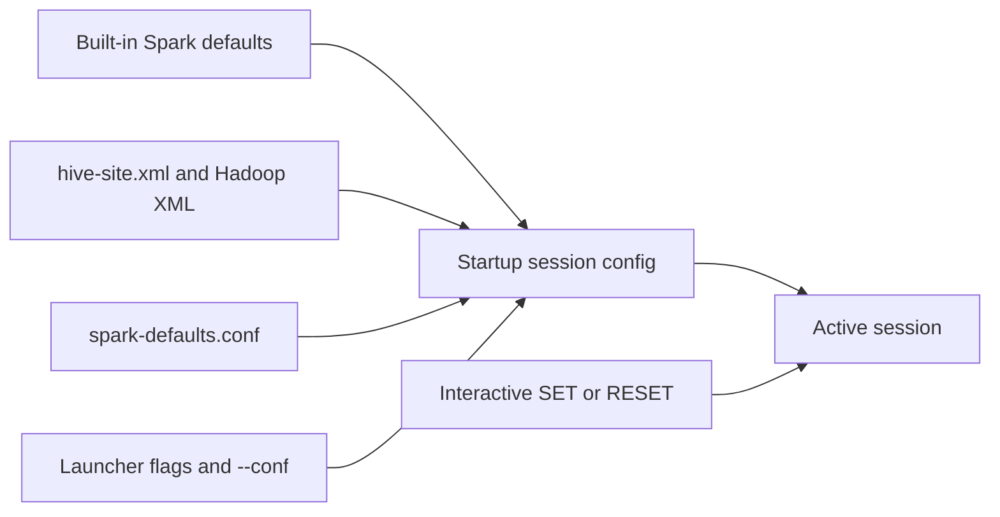

# :material-cog: Configuration

`spark-sql` configuration comes from both **startup-time sources** and **live session changes**. Files such as `spark-defaults.conf` and `hive-site.xml` shape the session before the prompt appears, while `SET` can still override many runtime SQL properties after startup.

The important distinction is mutability: a SQL setting like `spark.sql.shuffle.partitions` can be changed mid-session, but deployment settings such as `spark.master` or driver memory must be chosen before the JVM launches.

### :material-animation-play: Interactive Visualization — Configuration Precedence

Toggle the source of a single setting to see which value wins at startup and when an interactive `SET` can override earlier file-based or command-line values for the current session only.

<div id="viz-cli-configuration" class="ts-viz"></div>

<script src="../../assets/js/configuration-cli-viz.js"></script>

______________________________________________________________________

## :material-sitemap: Resolution Order



For mutable SQL properties, `SET` changes the active session after startup. For deploy-time settings, the highest startup source wins and later `SET` statements have no effect.

______________________________________________________________________

## :material-file-cog: `spark-defaults.conf`

Place this file in `$SPARK_HOME/conf/spark-defaults.conf` or point `SPARK_CONF_DIR` at a directory that contains it:

```ini
# spark-defaults.conf

# Cluster placement
spark.master                                    yarn
spark.app.name                                  spark-sql-analytics

# Resources
spark.driver.memory                             4g
spark.executor.memory                           8g
spark.executor.cores                            4

# Adaptive Query Execution
spark.sql.adaptive.enabled                      true
spark.sql.adaptive.coalescePartitions.enabled   true

# SQL execution defaults
spark.sql.shuffle.partitions                    256
spark.sql.session.timeZone                      UTC
spark.sql.cli.print.header                      true

# Catalog and warehouse
spark.sql.catalogImplementation                 hive
spark.sql.warehouse.dir                         hdfs:///user/hive/warehouse
spark.hadoop.hive.metastore.uris                thrift://metastore:9083
```

______________________________________________________________________

## :material-console-line: Command-Line Overrides

Use `--conf` for startup overrides that should beat `spark-defaults.conf` for a specific invocation:

```bash
spark-sql   --master yarn   --conf spark.sql.shuffle.partitions=64   --conf spark.sql.cli.print.header=true   --conf spark.sql.session.timeZone=UTC
```

This is the right place for per-run overrides and for deploy-related settings that cannot be changed reliably once the session is already running.

______________________________________________________________________

## :material-set-all: Setting Config Inside the Session

```sql
-- View one property
SET spark.sql.shuffle.partitions;

-- View all current properties
SET;

-- Change mutable runtime properties for this session only
SET spark.sql.shuffle.partitions = 50;
SET spark.sql.adaptive.enabled = true;
SET spark.sql.cli.print.header = true;

-- Reset one property to its startup value or built-in default
RESET spark.sql.shuffle.partitions;
```

A successful `SET` affects only the current shell session. Restarting `spark-sql` returns to the startup configuration unless the value also exists in files or command-line flags.

______________________________________________________________________

## :material-beehive-outline: Hive and Hadoop Configuration

Place `hive-site.xml`, `core-site.xml`, and `hdfs-site.xml` in the Spark configuration directory when the CLI needs a remote metastore or Hadoop filesystem settings.

```xml
<configuration>
  <property>
    <name>hive.metastore.uris</name>
    <value>thrift://metastore-host:9083</value>
  </property>
  <property>
    <name>hive.metastore.warehouse.dir</name>
    <value>/user/hive/warehouse</value>
  </property>
  <property>
    <name>hive.exec.dynamic.partition.mode</name>
    <value>nonstrict</value>
  </property>
  <property>
    <name>hive.exec.max.dynamic.partitions</name>
    <value>10000</value>
  </property>
</configuration>
```

Use XML configuration for cluster-wide catalog or filesystem connectivity; use `SET` for session tuning after the connection already exists.

______________________________________________________________________

## :material-tune: Frequently Tuned Properties

| Property                                        | Recommended value | Why                                                |
| ----------------------------------------------- | ----------------- | -------------------------------------------------- |
| `spark.sql.adaptive.enabled`                    | `true`            | Enable Adaptive Query Execution                    |
| `spark.sql.adaptive.coalescePartitions.enabled` | `true`            | Shrink tiny shuffle partitions                     |
| `spark.sql.adaptive.skewJoin.enabled`           | `true`            | Mitigate skew automatically                        |
| `spark.sql.shuffle.partitions`                  | `200`–`1000`      | Size post-shuffle parallelism to expected volume   |
| `spark.sql.files.maxPartitionBytes`             | `128m`            | Control input partition sizing                     |
| `spark.sql.broadcastTimeout`                    | `300`             | Prevent premature broadcast join timeout           |
| `spark.sql.autoBroadcastJoinThreshold`          | `10m`             | Broadcast small dimensions automatically           |
| `spark.serializer`                              | Kryo serializer   | Faster and smaller JVM serialization               |
| `spark.sql.parquet.filterPushdown`              | `true`            | Improve Parquet pruning                            |
| `spark.dynamicAllocation.enabled`               | `true`            | Let YARN or Kubernetes scale executors dynamically |

______________________________________________________________________

## :material-flask-outline: Environment Variable Reference

| Variable          | Description                                                     |
| ----------------- | --------------------------------------------------------------- |
| `SPARK_HOME`      | Root of the Spark installation                                  |
| `SPARK_CONF_DIR`  | Directory containing `spark-defaults.conf` and XML config files |
| `JAVA_HOME`       | JDK location                                                    |
| `HADOOP_HOME`     | Hadoop installation (when needed for local client utilities)    |
| `HADOOP_CONF_DIR` | Hadoop client configuration directory                           |
| `HIVE_CONF_DIR`   | Alternate Hive configuration directory                          |

______________________________________________________________________

## :material-magnify: Behavior Notes

1. **`--conf` beats file defaults at startup** — it overrides `spark-defaults.conf` for that invocation.
2. **`SET` beats the startup value only for mutable properties** — deployment settings such as `spark.master` or driver memory must be fixed before launch.
3. **`hive-site.xml` is auto-loaded when present** — that is how the CLI discovers remote metastore settings without extra SQL.
4. **You can verify effective settings in two places** — `SET key;` inside the shell and the Spark UI Environment tab for explicitly supplied startup properties.
