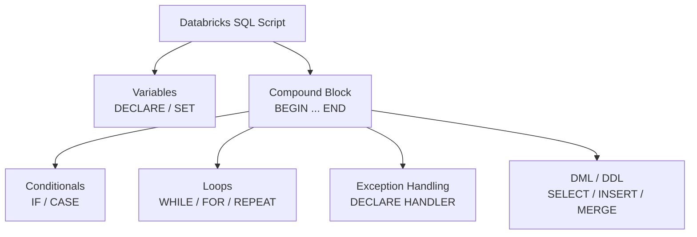

# :material-code-braces: Control Flow in Databricks SQL

Databricks SQL supports **procedural SQL scripting** — a superset of standard SQL
that adds statement-level control flow for building stored logic, multi-step pipelines,
and data quality routines directly in SQL.

!!! note "Expression vs Statement control flow"
    This section covers **statement-level** control (`IF … END IF`, `WHILE`, `FOR`).
    For **expression-level** conditionals inside `SELECT`/`WHERE`
    (`CASE WHEN`, `IF()`, `COALESCE`), see [Conditions & Predicates](../condition/index.md).

---

## :material-table-of-contents: In This Section

| Page | What it covers |
|------|----------------|
| [Compound Statements](control.md) | `BEGIN … END`, `IF … END IF`, `CASE … END CASE` |
| [Loops](loops.md) | `WHILE`, `FOR`, `REPEAT … UNTIL`, `LOOP`, `LEAVE`, `ITERATE` |
| [Variables](variables.md) | `DECLARE`, `SET`, scope, parameter passing |
| [Exception Handling](exceptions.md) | `DECLARE … HANDLER`, `SIGNAL`, `RESIGNAL` |

---

## :material-sitemap: Procedural SQL Building Blocks



---

## :material-flag: Where Procedural SQL Runs

| Context | Supported |
|---------|:---------:|
| Databricks SQL Warehouse | :material-check: (Runtime 11.3+) |
| Databricks Notebook (SQL) | :material-check: |
| Standard Apache Spark SQL | :material-close: |
| `spark.sql()` in PySpark | :material-close: |

!!! warning "Databricks-only feature"
    Procedural SQL scripting (loops, IF statements, DECLARE) is a **Databricks extension**.
    Use PySpark or Spark Scala for portable multi-step logic.

---

## :material-play-circle: Minimal Working Script

```sql
BEGIN
  DECLARE total_rows BIGINT DEFAULT 0;

  SET total_rows = (SELECT COUNT(*) FROM orders WHERE status = 'pending');

  IF total_rows > 0 THEN
    INSERT INTO audit_log (event, row_count, logged_at)
    VALUES ('pending_orders_found', total_rows, current_timestamp());
  END IF;
END;
```

---

## :material-compare: Procedural SQL vs PySpark

| Capability | Procedural SQL | PySpark |
|-----------|:--------------:|:-------:|
| Loops over SQL result sets | `FOR` loop | Python `for` |
| Conditional branching | `IF … END IF` | Python `if` |
| Variable state | `DECLARE` / `SET` | Python variables |
| Exception handling | `DECLARE HANDLER` | Python `try/except` |
| Portability across engines | Databricks-only | Any Spark |
| Debugging tooling | Limited | Full IDE support |
| Performance overhead | Low (SQL-native) | Low (JVM) |

---

## :material-brain: When to Use Procedural SQL

| Scenario | Use procedural SQL when… |
|----------|--------------------------|
| Multi-step ETL in one script | All steps are SQL; no Python/Scala needed |
| Conditional table refresh | Skip processing if no new data |
| Iterating over a small config set | `FOR` loop over parameter rows |
| Centralised error handling | `DECLARE … HANDLER` for SQLSTATE |
| Ad-hoc data patching | Quick conditional DML without a notebook |
