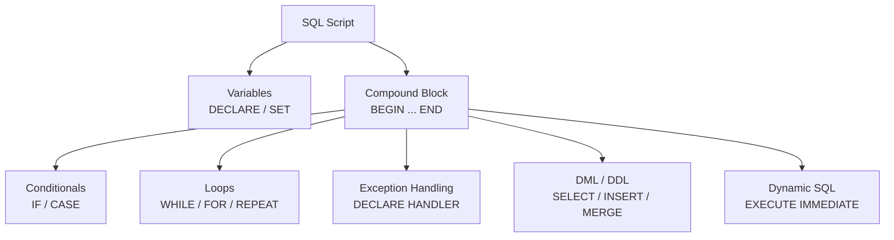

# :material-code-braces: SQL Scripting & Control Flow

!!! info "Spark 4.0"
    SQL scripting with `BEGIN...END` blocks is now a core Apache Spark 4.0 feature.
    Previously this was Databricks-only.

Spark 4.0 supports **procedural SQL scripting** — a superset of standard SQL
that adds statement-level control flow for building stored logic, multi-step pipelines,
and data quality routines directly in SQL.

!!! note "Expression vs Statement control flow"
    This section covers **statement-level** control (`IF … END IF`, `WHILE`, `FOR`).
    For **expression-level** conditionals inside `SELECT`/`WHERE`
    (`CASE WHEN`, `IF()`, `COALESCE`), see [Conditions & Predicates](../condition/index.md).

---

## :material-table-of-contents: In This Section

| Page | What it covers |
|------|----------------|
| [Compound Statements](control.md) | `BEGIN … END`, `IF … END IF`, `CASE … END CASE` |
| [Loops](loops.md) | `WHILE`, `FOR`, `REPEAT … UNTIL`, `LOOP`, `LEAVE`, `ITERATE` |
| [Variables](variables.md) | `DECLARE`, `SET`, scope, parameter passing |
| [Exception Handling](exceptions.md) | `DECLARE … HANDLER`, `SIGNAL`, `RESIGNAL` |

!!! tip "Session Variables"
    For session-scoped variables (`DECLARE` / `SET VAR` outside `BEGIN...END`),
    see [Session Variables](../variables/index.md).

---

## :material-sitemap: Procedural SQL Building Blocks



---

## :material-flag: Where SQL Scripting Runs

| Context | Supported |
|---------|:---------:|
| Apache Spark 4.0+ | :material-check: |
| Databricks SQL Warehouse | :material-check: (Runtime 11.3+) |
| Databricks Notebook (SQL) | :material-check: |
| `spark.sql()` in PySpark | :material-check: (Spark 4.0+) |

---

## :material-play-circle: Minimal Working Script

```sql
BEGIN
  DECLARE total_rows BIGINT DEFAULT 0;

  SET total_rows = (SELECT COUNT(*) FROM orders WHERE status = 'pending');

  IF total_rows > 0 THEN
    INSERT INTO audit_log (event, row_count, logged_at)
    VALUES ('pending_orders_found', total_rows, current_timestamp());
  END IF;
END;
```

---

## :material-code-tags: Cursor Processing (Spark 4.0)

```sql
BEGIN
  DECLARE x INT;
  DECLARE done BOOLEAN DEFAULT false;
  DECLARE total INT DEFAULT 0;
  DECLARE my_cursor CURSOR FOR SELECT id FROM range(5);
  DECLARE CONTINUE HANDLER FOR NOT FOUND SET done = true;

  OPEN my_cursor;
  REPEAT
    FETCH my_cursor INTO x;
    IF NOT done THEN
      SET total = total + x;
    END IF;
  UNTIL done END REPEAT;
  CLOSE my_cursor;

  VALUES (total);  -- 10
END;
```

---

## :material-compare: Procedural SQL vs PySpark

| Capability | Procedural SQL | PySpark |
|-----------|:--------------:|:-------:|
| Loops over SQL result sets | `FOR` loop | Python `for` |
| Conditional branching | `IF … END IF` | Python `if` |
| Variable state | `DECLARE` / `SET` | Python variables |
| Exception handling | `DECLARE HANDLER` | Python `try/except` |
| Dynamic SQL | `EXECUTE IMMEDIATE` | `spark.sql()` |
| Portability | Spark 4.0+ / Databricks | Any Spark |
| Debugging tooling | Limited | Full IDE support |
| Performance overhead | Low (SQL-native) | Low (JVM) |

---

## :material-brain: When to Use SQL Scripting

| Scenario | Use procedural SQL when… |
|----------|--------------------------|
| Multi-step ETL in one script | All steps are SQL; no Python/Scala needed |
| Conditional table refresh | Skip processing if no new data |
| Iterating over a small config set | `FOR` loop over parameter rows |
| Centralised error handling | `DECLARE … HANDLER` for SQLSTATE |
| Ad-hoc data patching | Quick conditional DML without a notebook |
| Dynamic queries | `EXECUTE IMMEDIATE` with parameters |
