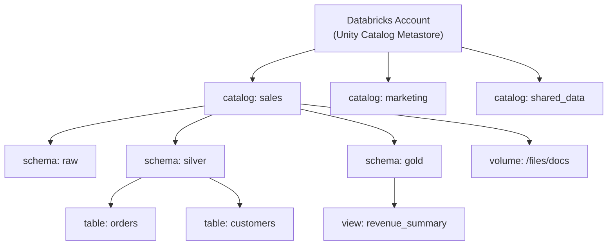

# :material-unity: Unity Catalog

!!! note "[Databricks] Databricks-Only Feature"

    Unity Catalog is exclusive to Databricks. Open-source Spark uses Hive Metastore
    or third-party catalogs (e.g., Apache Polaris).

**Unity Catalog** is Databricks's centralized governance layer that provides
fine-grained access control, data lineage, and auditing across all workspaces in a
Databricks account. It extends Spark SQL with a three-level namespace:
`catalog.schema.table`.

______________________________________________________________________

## :material-sitemap: Architecture



______________________________________________________________________

## :material-layers: Three-Level Namespace

```sql
-- Fully qualified: catalog.schema.table
SELECT * FROM sales.silver.orders;

-- Set active catalog and schema
USE CATALOG sales;
USE silver;

-- Now short form works
SELECT * FROM orders;
```

______________________________________________________________________

## :material-plus: Creating Catalog Objects

```sql
-- Catalog (account admin required)
CREATE CATALOG IF NOT EXISTS analytics
  COMMENT 'Analytics workspace catalog';

-- Schema
CREATE SCHEMA IF NOT EXISTS analytics.marts
  COMMENT 'Business-facing aggregated tables'
  MANAGED LOCATION 'abfss://container@storage.dfs.core.windows.net/marts';

-- Managed Delta table
CREATE TABLE IF NOT EXISTS analytics.marts.daily_revenue (
    report_date DATE,
    region      STRING,
    revenue     DOUBLE,
    order_count BIGINT
) USING DELTA
COMMENT 'Daily revenue aggregated by region'
TBLPROPERTIES ('delta.enableChangeDataFeed' = 'true');

-- External table
CREATE TABLE analytics.raw.events
USING PARQUET
LOCATION 'abfss://container@storage.dfs.core.windows.net/raw/events'
COMMENT 'Raw click events from the web';
```

______________________________________________________________________

## :material-shield-account: Access Control — GRANT / REVOKE

Unity Catalog uses privilege-based access at every level of the hierarchy.

### Privilege Reference

| Privilege        | Applies to   | Description                      |
| ---------------- | ------------ | -------------------------------- |
| `USE CATALOG`    | Catalog      | Can reference the catalog        |
| `USE SCHEMA`     | Schema       | Can reference the schema         |
| `CREATE TABLE`   | Schema       | Can create tables in schema      |
| `CREATE VIEW`    | Schema       | Can create views                 |
| `SELECT`         | Table / View | Can read data                    |
| `MODIFY`         | Table        | Can INSERT/UPDATE/DELETE         |
| `ALL PRIVILEGES` | Any          | Grants all applicable privileges |
| `EXECUTE`        | Function     | Can call function                |

```sql
-- Grant a role access to a catalog
GRANT USE CATALOG ON CATALOG analytics TO `data_analyst_role`;
GRANT USE SCHEMA  ON SCHEMA analytics.marts TO `data_analyst_role`;

-- Allow analysts to read the daily_revenue table
GRANT SELECT ON TABLE analytics.marts.daily_revenue TO `data_analyst_role`;

-- Allow engineers to write
GRANT MODIFY ON TABLE analytics.marts.daily_revenue TO `data_engineer_role`;

-- Grant all privileges on a schema to a team
GRANT ALL PRIVILEGES ON SCHEMA analytics.staging TO `data_engineer_role`;

-- Revoke a privilege
REVOKE SELECT ON TABLE analytics.marts.daily_revenue FROM `contractor_role`;

-- Show current grants on an object
SHOW GRANTS ON TABLE analytics.marts.daily_revenue;
```

______________________________________________________________________

## :material-folder-multiple: Volumes — Managed File Storage

Volumes are Unity Catalog-governed directories for non-tabular files
(documents, images, raw files).

```sql
-- Create a managed volume
CREATE VOLUME IF NOT EXISTS analytics.raw.documents;

-- Create an external volume (maps to a cloud storage path)
CREATE EXTERNAL VOLUME analytics.raw.landing
  LOCATION 'abfss://container@storage.dfs.core.windows.net/landing';

-- Access files via /Volumes path
LIST '/Volumes/analytics/raw/documents';

-- Copy a file into a volume
COPY INTO analytics.raw.events
FROM '/Volumes/analytics/raw/landing/events/'
FILEFORMAT = PARQUET;
```

______________________________________________________________________

## :material-tag: Table Tags and Column Tags

Tags are key-value metadata labels used for discovery, classification, and compliance.

```sql
-- Tag a table as PII
ALTER TABLE analytics.silver.customers
  SET TAGS ('pii' = 'true', 'domain' = 'customer');

-- Tag individual columns
ALTER TABLE analytics.silver.customers
  ALTER COLUMN email SET TAGS ('pii_type' = 'email');

ALTER TABLE analytics.silver.customers
  ALTER COLUMN ssn   SET TAGS ('pii_type' = 'ssn', 'classification' = 'restricted');

-- Find all PII-tagged tables in a catalog
SELECT table_catalog, table_schema, table_name
FROM system.information_schema.table_tags
WHERE tag_name = 'pii' AND tag_value = 'true';
```

______________________________________________________________________

## :material-eye-lock: Column-Level Security — Column Masks

```sql
-- Mask SSN for non-privileged users
CREATE OR REPLACE FUNCTION analytics.security.mask_ssn(ssn STRING)
RETURNS STRING
RETURN CASE
    WHEN is_account_group_member('pii_access_role') THEN ssn
    ELSE CONCAT('***-**-', RIGHT(ssn, 4))
END;

ALTER TABLE analytics.silver.customers
  ALTER COLUMN ssn SET MASK analytics.security.mask_ssn;
```

______________________________________________________________________

## :material-table-lock: Row-Level Security — Row Filters

```sql
-- Users only see rows for their assigned region
CREATE OR REPLACE FUNCTION analytics.security.region_filter(region STRING)
RETURNS BOOLEAN
RETURN is_account_group_member('global_data_access')
    OR region = current_user_region();   -- custom UDF returning the user's region

ALTER TABLE analytics.silver.orders
  ADD ROW FILTER analytics.security.region_filter ON (region);
```

______________________________________________________________________

## :material-history: Data Lineage

Unity Catalog automatically captures column-level lineage — no configuration needed.

```sql
-- View lineage in the Catalog Explorer UI, or query system tables:
SELECT *
FROM system.access.column_lineage
WHERE target_table_full_name = 'analytics.marts.daily_revenue'
ORDER BY event_time DESC
LIMIT 20;
```

______________________________________________________________________

## :material-information: system.information_schema — Catalog Introspection

```sql
-- All tables in a catalog
SELECT table_catalog, table_schema, table_name, table_type
FROM analytics.information_schema.tables
ORDER BY table_schema, table_name;

-- All columns with data types
SELECT table_name, column_name, data_type, is_nullable
FROM analytics.information_schema.columns
WHERE table_schema = 'marts'
ORDER BY table_name, ordinal_position;

-- All grants on a schema
SELECT *
FROM analytics.information_schema.schema_privileges
WHERE schema_name = 'marts';
```

______________________________________________________________________

## :material-database-search: Real-World System Catalog Queries

The `system` catalog is a Databricks-hosted analytical store of account-wide
operational data (cost, audit, lineage, query history). It requires Unity Catalog
and is populated automatically — no setup beyond `USE CATALOG`/`SELECT` grants.

### Cost monitoring — `system.billing.usage`

```sql
-- DBUs consumed per product this month
SELECT billing_origin_product,
       usage_date,
       SUM(usage_quantity) AS usage_quantity
FROM system.billing.usage
WHERE month(usage_date) = month(current_date())
  AND year(usage_date) = year(current_date())
GROUP BY billing_origin_product, usage_date
ORDER BY usage_date;

-- Which jobs consumed the most DBUs?
SELECT usage_metadata.job_id AS job_id,
       SUM(usage_quantity)   AS dbu_usage
FROM system.billing.usage
WHERE usage_metadata.job_id IS NOT NULL
GROUP BY usage_metadata.job_id
ORDER BY dbu_usage DESC
LIMIT 10;

-- Attribute cost to a team via a custom cluster/job tag
SELECT sku_name, usage_unit, SUM(usage_quantity) AS usage
FROM system.billing.usage
WHERE custom_tags['team'] = 'data-eng'
GROUP BY sku_name, usage_unit;
```

### Security & compliance auditing — `system.access.audit`

```sql
-- Who dropped tables in the analytics catalog this week?
SELECT event_time, user_identity.email AS actor, action_name, request_params
FROM system.access.audit
WHERE service_name = 'unityCatalog'
  AND action_name IN ('deleteTable', 'dropTable')
  AND request_params['full_name_arg'] LIKE 'analytics.%'
  AND event_time >= current_date() - INTERVAL 7 DAYS
ORDER BY event_time DESC;

-- Failed login attempts by source IP
SELECT source_ip_address, user_identity.email, COUNT(*) AS attempts
FROM system.access.audit
WHERE action_name = 'databricksAccountLogin'
  AND response.status_code != 200
GROUP BY source_ip_address, user_identity.email
ORDER BY attempts DESC;
```

### Query performance — `system.query.history`

```sql
-- Slowest queries in the last 24 hours on a given warehouse
SELECT statement_id, executed_by, total_duration_ms, statement_text
FROM system.query.history
WHERE warehouse_id = '0123-456789-abcdefg'
  AND start_time >= current_timestamp() - INTERVAL 1 DAY
ORDER BY total_duration_ms DESC
LIMIT 20;
```

### Data lineage across a table's lifecycle — `system.access.table_lineage`

```sql
-- Everything downstream of a raw ingestion table (impact analysis)
SELECT DISTINCT target_table_full_name
FROM system.access.table_lineage
WHERE source_table_full_name = 'analytics.raw.events'
ORDER BY target_table_full_name;
```

!!! tip "Combine system tables for richer answers"

    Join `system.billing.usage.usage_metadata.cluster_id` with
    `system.compute.clusters` to attribute DBU cost to a cluster's owner and
    node type, or join `system.access.audit` with `system.access.table_lineage`
    to see who read a table that later fed a downstream report.

______________________________________________________________________

## :material-magnify: Behavior Notes

1. **USE CATALOG is required** before `USE schema` when a non-default catalog is active.
2. **`spark_catalog`** is the legacy Hive Metastore catalog; Unity replaces it when enabled but both can coexist.
3. **Lineage is automatic** — Databricks captures it for all notebooks, jobs, and SQL warehouse queries.
4. **Managed tables** in Unity Catalog store data in the catalog's managed storage location — Databricks manages the lifecycle.
5. **External tables** in Unity require a storage credential and external location registered in the account.

______________________________________________________________________

## :material-brain: When to Use

| Scenario                           | Recommendation                      |
| ---------------------------------- | ----------------------------------- |
| Multi-workspace data sharing       | Unity Catalog with shared catalog   |
| GDPR / PII compliance              | Column masks + row filters          |
| Centralized RBAC                   | GRANT on catalog/schema/table level |
| Data discovery                     | Tags on tables and columns          |
| Audit who accessed what            | `system.access.audit` table         |
| File-based assets alongside tables | Volumes                             |
