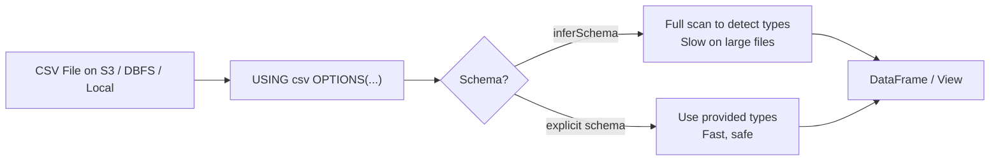

# :material-file-delimited: CSV Data Source

Spark SQL reads and writes CSV files via the built-in `csv` format.
Always provide an **explicit schema** — schema inference requires a full file scan
and produces fragile, often incorrect types.

---

## :material-sitemap: Read Flow



---

## :material-pin: Options Reference

| Option | Default | Description |
|--------|---------|-------------|
| `path` | — | File or directory path |
| `header` | `false` | First row contains column names |
| `delimiter` | `,` | Field separator character |
| `quote` | `"` | Quote character for fields containing delimiter |
| `escape` | `\` | Escape character inside quoted fields |
| `nullValue` | `` | String to treat as NULL |
| `emptyValue` | `` | String for empty fields |
| `inferSchema` | `false` | Infer column types (expensive) |
| `multiLine` | `false` | Records can span multiple lines |
| `encoding` | `UTF-8` | File character encoding |
| `dateFormat` | `yyyy-MM-dd` | Date parsing pattern |
| `timestampFormat` | `yyyy-MM-dd'T'HH:mm:ss[.SSS][XXX]` | Timestamp parsing pattern |
| `mode` | `PERMISSIVE` | Parse error mode: `PERMISSIVE`, `DROPMALFORMED`, `FAILFAST` |
| `columnNameOfCorruptRecord` | `_corrupt_record` | Column to store unparseable rows (PERMISSIVE mode) |
| `compression` | `none` | Write compression: `gzip`, `bzip2`, `lz4`, `snappy`, `deflate` |

---

## :material-flask-outline: Examples

### Read with explicit schema (recommended)

```sql
CREATE OR REPLACE TEMP VIEW sales_csv (
    order_id    INT,
    customer_id STRING,
    amount      DECIMAL(10,2),
    order_date  DATE
)
USING csv
OPTIONS (
    path      = 's3://my-bucket/raw/sales/',
    header    = 'true',
    delimiter = ',',
    dateFormat = 'yyyy-MM-dd'
);

SELECT * FROM sales_csv LIMIT 10;
```

### Read pipe-delimited file

```sql
CREATE OR REPLACE TEMP VIEW pipe_data
USING csv
OPTIONS (
    path      = '/mnt/data/exports/*.csv',
    header    = 'true',
    delimiter = '|',
    nullValue = 'NULL'
);
```

### Read with schema inference (exploratory use only)

```sql
CREATE OR REPLACE TEMP VIEW explore_csv
USING csv
OPTIONS (
    path        = '/mnt/data/sample.csv',
    header      = 'true',
    inferSchema = 'true'
);

DESCRIBE explore_csv;  -- inspect inferred types
```

### Handle malformed rows

```sql
-- PERMISSIVE (default): bad rows → NULL columns + _corrupt_record column
CREATE OR REPLACE TEMP VIEW safe_csv (
    id     INT,
    name   STRING,
    amount DOUBLE,
    _corrupt_record STRING
)
USING csv
OPTIONS (
    path   = '/mnt/data/messy.csv',
    header = 'true',
    mode   = 'PERMISSIVE'
);

-- Inspect bad rows
SELECT _corrupt_record FROM safe_csv WHERE _corrupt_record IS NOT NULL;
```

```sql
-- FAILFAST: throw an error on the first bad row
CREATE OR REPLACE TEMP VIEW strict_csv
USING csv
OPTIONS (
    path   = '/mnt/data/critical.csv',
    header = 'true',
    mode   = 'FAILFAST'
);
```

### Read gzipped CSV

```sql
CREATE OR REPLACE TEMP VIEW gzip_csv
USING csv
OPTIONS (
    path   = '/mnt/data/logs.csv.gz',
    header = 'true'
    -- Spark detects .gz extension automatically
);
```

### Write CSV

```sql
-- CTAS — write query result as CSV
CREATE TABLE exports.order_summary
USING csv
OPTIONS (
    header      = 'true',
    delimiter   = ',',
    compression = 'gzip'
)
AS
SELECT region, COUNT(*) AS orders, SUM(amount) AS revenue
FROM orders
GROUP BY region;
```

### Write with INSERT OVERWRITE

```sql
INSERT OVERWRITE DIRECTORY '/mnt/exports/orders/'
USING csv
OPTIONS (header = 'true', delimiter = '|')
SELECT order_id, customer_id, amount, order_date
FROM orders
WHERE order_date >= '2024-01-01';
```

### Land CSV then convert to Delta (recommended pattern)

```sql
-- Step 1: read raw CSV
CREATE OR REPLACE TEMP VIEW raw_csv
USING csv
OPTIONS (
    path        = 's3://landing/orders/',
    header      = 'true',
    inferSchema = 'false'
)
AS SELECT
    CAST(order_id   AS INT)           AS order_id,
    CAST(amount     AS DECIMAL(10,2)) AS amount,
    CAST(order_date AS DATE)          AS order_date;

-- Step 2: write as Delta for analytics
CREATE TABLE IF NOT EXISTS analytics.orders
USING delta
PARTITIONED BY (order_date)
AS SELECT * FROM raw_csv;
```

---

## :material-alert-circle: Common Mistakes

| Mistake | Problem | Fix |
|---------|---------|-----|
| `inferSchema = 'true'` in production | Full file scan; fragile types | Provide explicit schema |
| No `header = 'true'` | First data row becomes column names | Always set `header` explicitly |
| Date/timestamp without `dateFormat` | Parse failures or wrong type | Match format string to actual data |
| Writing CSV to a partitioned path | Each partition creates a separate header | Use Parquet/Delta for partitioned writes |
| Reading directory with mixed schemas | Columns mis-aligned | Ensure all files share the same schema |

---

## :material-brain: When to Use CSV

| Scenario | Recommendation |
|----------|----------------|
| Receiving data from external systems | CSV for landing; convert to Delta |
| Exporting for Excel / non-technical users | CSV |
| Production analytics queries | Use Parquet or Delta instead |
| Large datasets (>1 GB) | Avoid — no columnar optimization |
