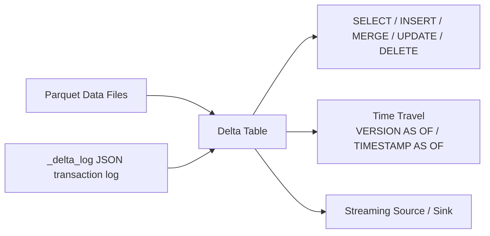

# :material-delta: Delta Lake Data Source

!!! note "[Databricks] Primary Format"

    Delta Lake is Databricks' default table format. Open-source Spark supports Delta
    via the `delta-spark` connector, but some features (liquid clustering, predictive I/O)
    are Databricks-only.

Delta Lake is the **recommended production format** on Databricks.
It layers an **ACID transaction log** on top of Parquet files, enabling
`MERGE`, `UPDATE`, `DELETE`, time travel, schema enforcement, and streaming upserts.

______________________________________________________________________

## :material-sitemap: Delta Architecture



______________________________________________________________________

## :material-pin: Key Capabilities

| Capability          | Command                                |
| ------------------- | -------------------------------------- |
| ACID writes         | `INSERT`, `UPDATE`, `DELETE`, `MERGE`  |
| Time travel         | `SELECT … VERSION AS OF n`             |
| Schema evolution    | `ALTER TABLE … ADD COLUMNS`            |
| Schema enforcement  | Rejects writes that violate the schema |
| Compaction          | `OPTIMIZE`                             |
| Clustering          | `OPTIMIZE … ZORDER BY`                 |
| Vacuuming old files | `VACUUM`                               |
| Audit log           | `DESCRIBE HISTORY`                     |

______________________________________________________________________

## :material-flask-outline: Examples

### Create a Delta table

```sql
CREATE TABLE IF NOT EXISTS analytics.orders (
    order_id    INT       NOT NULL,
    customer_id STRING,
    amount      DECIMAL(10,2),
    status      STRING,
    order_date  DATE
)
USING delta
PARTITIONED BY (order_date)
LOCATION 's3://my-bucket/analytics/orders/';
```

### CTAS from staging

```sql
CREATE TABLE analytics.customers
USING delta
PARTITIONED BY (country)
AS SELECT * FROM staging.customers;
```

### INSERT (append)

```sql
INSERT INTO analytics.orders
SELECT * FROM staging.orders WHERE load_date = current_date();
```

### INSERT OVERWRITE (replace partition)

```sql
INSERT OVERWRITE analytics.orders
SELECT * FROM staging.orders WHERE order_date = '2024-06-01';
```

### UPDATE rows

```sql
UPDATE analytics.orders
SET status = 'cancelled'
WHERE order_id IN (SELECT order_id FROM cancellations);
```

### DELETE rows

```sql
DELETE FROM analytics.orders
WHERE status = 'test' AND order_date < '2024-01-01';
```

### MERGE (upsert)

```sql
MERGE INTO analytics.customers AS tgt
USING staging.customers AS src
ON tgt.customer_id = src.customer_id

WHEN MATCHED AND tgt.row_hash <> src.row_hash THEN
    UPDATE SET *

WHEN NOT MATCHED THEN
    INSERT *;
```

### Time travel — query historical snapshot

```sql
-- By version number
SELECT * FROM analytics.orders VERSION AS OF 5;

-- By timestamp
SELECT * FROM analytics.orders
TIMESTAMP AS OF '2024-06-01 00:00:00';

-- Restore a table to a previous version
RESTORE TABLE analytics.orders TO VERSION AS OF 3;
```

### DESCRIBE HISTORY — audit log

```sql
DESCRIBE HISTORY analytics.orders;
-- Shows: version, timestamp, operation, operationParameters, userName
```

### OPTIMIZE — compact small files

```sql
-- [Databricks] Compact all files
OPTIMIZE analytics.orders;

-- [Databricks] Compact and Z-order for fast customer_id + order_date filters
OPTIMIZE analytics.orders
ZORDER BY (customer_id, order_date);
```

### Optimized Writes — prevent small files at write time

`OPTIMIZE` fixes small files **after** they exist; **optimized writes** stop them from
being created in the first place by having Spark shuffle data through an extra stage
that sizes output files to a target before committing the write — most useful for
high-partition-count `INSERT`/`MERGE`/streaming jobs that would otherwise emit one small
file per task per partition.

```sql
-- [Databricks] Enable for a single table
ALTER TABLE analytics.orders
SET TBLPROPERTIES ('delta.autoOptimize.optimizeWrite' = 'true');

-- [Databricks] Enable automatic compaction too (merges small files after each write)
ALTER TABLE analytics.orders
SET TBLPROPERTIES (
    'delta.autoOptimize.optimizeWrite' = 'true',
    'delta.autoOptimize.autoCompact'   = 'true'
);

-- [Databricks] Or enable per-session for all writes
SET spark.databricks.delta.optimizeWrite.enabled = true;
```

!!! note "Optimized writes vs. OPTIMIZE — use both"

    - **Optimized writes** (`optimizeWrite`) — runs at write time; keeps file counts
        reasonable on *every* write, at the cost of an extra shuffle stage per write.
    - **Auto compaction** (`autoCompact`) — runs a lightweight `OPTIMIZE` automatically
        after a write finishes, only on partitions that were just written.
    - **Manual `OPTIMIZE`** — still worth scheduling periodically (e.g. nightly) for a
        full compaction pass and `ZORDER`, since auto-compaction only looks at
        recently-written partitions.

### VACUUM — remove old file versions

```sql
-- Default: retain 7 days of history
VACUUM analytics.orders;

-- Retain only 2 days (reduces storage cost)
VACUUM analytics.orders RETAIN 48 HOURS;
```

### Schema evolution — add a column

```sql
ALTER TABLE analytics.orders ADD COLUMNS (
    promo_code STRING COMMENT 'Applied promotional code'
);

-- Enable auto-merge for streaming or MERGE writes
ALTER TABLE analytics.orders
SET TBLPROPERTIES ('delta.schema.autoMerge.enabled' = 'true');
```

### Read as a streaming source

```sql
-- In a streaming notebook / Structured Streaming job
CREATE STREAMING TABLE streaming_orders
AS SELECT * FROM STREAM(analytics.orders);
```

### Convert Parquet table to Delta

```sql
CONVERT TO DELTA parquet.`s3://my-bucket/parquet/orders/`
PARTITIONED BY (order_date DATE);
```

______________________________________________________________________

## :material-tune: Important Configuration

```sql
SET spark.databricks.delta.retentionDurationCheck.enabled = false;  -- allow VACUUM < 7d
SET spark.sql.extensions = 'io.delta.sql.DeltaSparkSessionExtension';
SET spark.sql.catalog.spark_catalog = 'org.apache.spark.sql.delta.catalog.DeltaCatalog';
```

______________________________________________________________________

## :material-alert-circle: Common Mistakes

| Mistake                                 | Problem                                         | Fix                                                                          |
| --------------------------------------- | ----------------------------------------------- | ---------------------------------------------------------------------------- |
| `VACUUM` with `RETAIN 0 HOURS`          | Deletes all history — time travel broken        | Keep at least 168 hours (7 days)                                             |
| Single MERGE for SCD Type 2             | Cannot expire and insert same key in one pass   | Use two-step MERGE (see [SCD Type 2](../patterns/scd/full_history/index.md)) |
| Writing to Delta without `OPTIMIZE`     | Thousands of tiny files degrade reads           | Schedule `OPTIMIZE` after bulk loads, or enable optimized writes             |
| High-frequency `MERGE`/streaming writes | One small file per task per micro-batch adds up | Enable `delta.autoOptimize.optimizeWrite` + `autoCompact`                    |
| Reading stale cache                     | `REFRESH TABLE` needed after external writes    | `REFRESH TABLE table_name`                                                   |
| Dropping `_delta_log/` manually         | Breaks the table — Spark can't recover          | Use `DROP TABLE` or `VACUUM`                                                 |

______________________________________________________________________

## :material-brain: When to Use Delta

| Scenario                           | Use Delta                 |
| ---------------------------------- | ------------------------- |
| Incremental loads / upserts        | `MERGE`                   |
| Delete by GDPR / right-to-erasure  | `DELETE`                  |
| Streaming ingestion                | Delta as sink             |
| Audit / time-travel queries        | `VERSION AS OF`           |
| Schema evolution with enforcement  | `ALTER TABLE + autoMerge` |
| High-throughput append-only tables | Parquet may be simpler    |
