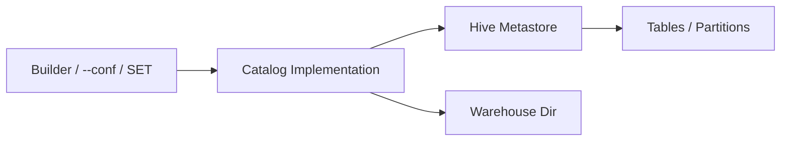

# :material-bee: Hive Configuration

Hive behavior in Spark is driven by a handful of Spark and Hive settings that control
metastore connectivity, the warehouse location, and partition semantics. These can be set
on the builder, via `spark-submit --conf`, or at runtime with `SET`.

## :material-sitemap: Overview



______________________________________________________________________

## :material-pin: Common Settings

| Setting                                    | Default           | Description                                  |
| ------------------------------------------ | ----------------- | -------------------------------------------- |
| `spark.sql.catalogImplementation`          | `in-memory`       | Set to `hive` to use the Hive Metastore      |
| `spark.sql.warehouse.dir`                  | `spark-warehouse` | Default location for managed tables          |
| `hive.metastore.uris`                      | *(none)*          | Thrift URI(s) of a remote metastore          |
| `spark.sql.hive.metastore.version`         | built-in          | Version of the HMS client jars               |
| `spark.sql.hive.metastore.jars`            | `builtin`         | `builtin`, `maven`, or a jar path            |
| `spark.sql.sources.partitionOverwriteMode` | `STATIC`          | `DYNAMIC` overwrites only touched partitions |

!!! note "Verified defaults (Spark 4)"

    A fresh `SparkSession` reports `spark.sql.catalogImplementation = in-memory` and
    `spark.sql.sources.partitionOverwriteMode = STATIC`. Enable Hive explicitly to switch
    to the persistent catalog.

______________________________________________________________________

## :material-flask-outline: Setting Configuration

=== "Builder"

    ```python
    spark = (
        SparkSession.builder
        .config("spark.sql.catalogImplementation", "hive")
        .config("spark.sql.warehouse.dir", "/user/hive/warehouse")
        .config("hive.metastore.uris", "thrift://metastore:9083")
        .enableHiveSupport()
        .getOrCreate()
    )
    ```

=== "spark-submit"

    ```bash
    spark-submit \
      --conf spark.sql.catalogImplementation=hive \
      --conf spark.sql.warehouse.dir=/user/hive/warehouse \
      --conf hive.metastore.uris=thrift://metastore:9083 \
      my_app.py
    ```

=== "Runtime SET"

    ```sql
    SET spark.sql.sources.partitionOverwriteMode = DYNAMIC;
    SET spark.sql.warehouse.dir;   -- read current value
    ```

______________________________________________________________________

## :material-brain: When to Use

| Scenario                         | Setting                                                         |
| -------------------------------- | --------------------------------------------------------------- |
| Enable the Hive catalog          | `spark.sql.catalogImplementation=hive` + `.enableHiveSupport()` |
| Connect to an external metastore | `hive.metastore.uris`                                           |
| Relocate managed data            | `spark.sql.warehouse.dir`                                       |
| Partial partition overwrites     | `spark.sql.sources.partitionOverwriteMode=DYNAMIC`              |
| Pin an older metastore           | `spark.sql.hive.metastore.version` + `.jars`                    |

!!! warning "Set catalog before first use"

    `spark.sql.warehouse.dir` and `catalogImplementation` are read at session
    initialization — set them on the builder, not after tables are already resolved.
