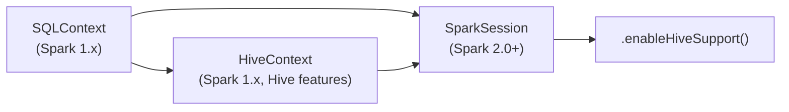

# :material-bee: Hive Context

`HiveContext` was the legacy Spark SQL entry point that added Hive features — the Hive
Metastore, HiveQL, Hive UDFs, and SerDes — on top of the base `SQLContext`. Since Spark
2.0 it is **deprecated**; `SparkSession` with `.enableHiveSupport()` is the modern
replacement and provides a superset of its capabilities.

### :material-sitemap: Evolution of Entry Points



---

## :material-pin: Legacy vs Modern

=== "Legacy (deprecated)"

    ```python
    from pyspark import SparkContext
    from pyspark.sql import HiveContext

    sc = SparkContext(appName="legacy")
    hc = HiveContext(sc)
    hc.sql("SELECT * FROM default.orders").show()
    ```

=== "Modern (recommended)"

    ```python
    from pyspark.sql import SparkSession

    spark = (
        SparkSession.builder
        .appName("modern")
        .enableHiveSupport()
        .getOrCreate()
    )
    spark.sql("SELECT * FROM default.orders").show()
    ```

---

## :material-swap-horizontal: Migration Map

| `HiveContext` | `SparkSession` equivalent |
|---------------|---------------------------|
| `HiveContext(sc)` | `SparkSession.builder.enableHiveSupport().getOrCreate()` |
| `hc.sql(...)` | `spark.sql(...)` |
| `hc.table("t")` | `spark.table("t")` |
| `hc.udf.register(...)` | `spark.udf.register(...)` |
| `hc.setConf(k, v)` | `spark.conf.set(k, v)` |

---

## :material-magnify: Behavior Notes

1. `HiveContext` still resolves at runtime for backward compatibility but emits a
   deprecation warning.
2. All Hive features (metastore access, HiveQL, UDFs, SerDes) are available through
   `SparkSession` once `.enableHiveSupport()` is called.
3. A `SparkSession` created **without** Hive support uses the `in-memory` catalog — table
   metadata is not persisted across sessions.

---

## :material-brain: When to Use

| Scenario | Recommendation |
|----------|----------------|
| New code on Spark 2.x+ | `SparkSession` with `.enableHiveSupport()` |
| Maintaining legacy Spark 1.x code | `HiveContext` still works, but plan to migrate |
| No Hive Metastore required | Plain `SparkSession` (`in-memory` catalog) |

!!! warning "Deprecated API"
    `HiveContext` is retained only for compatibility. Prefer `SparkSession` — see the
    [Hive Integration overview](index.md) for enabling Hive support.
