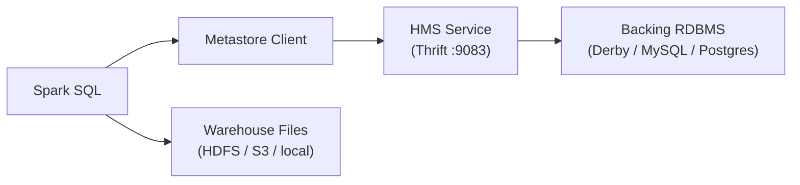

# :material-bee: Hive Metastore

The **Hive Metastore (HMS)** is a relational database plus a service layer that stores
metadata for databases, tables, partitions, columns, storage formats, and locations.
When Hive support is enabled, Spark SQL uses it as the persistent catalog so table
definitions survive across sessions and are shareable between engines (Spark, Hive, Trino,
Presto).

## :material-sitemap: Architecture



The metastore holds **metadata only**; the actual data lives in the warehouse/storage
layer that the table `LOCATION` points to.

______________________________________________________________________

## :material-pin: What It Stores

| Concept             | Description                                                          |
| ------------------- | -------------------------------------------------------------------- |
| Database            | Logical namespace grouping tables                                    |
| Table               | Schema, owner, storage format, `LOCATION`, `MANAGED`/`EXTERNAL` type |
| Partition           | A subdirectory mapped to partition-column values                     |
| Column stats        | Optional stats used by the cost-based optimizer                      |
| SerDe / InputFormat | How rows are (de)serialized on read/write                            |

______________________________________________________________________

## :material-cog: Deployment Modes

| Mode         | Backing DB                           | Use case                          |
| ------------ | ------------------------------------ | --------------------------------- |
| **Embedded** | Local Apache Derby                   | Single-process dev/test (default) |
| **Local**    | Shared RDBMS, in-process client      | Single node, persistent           |
| **Remote**   | Shared RDBMS behind a Thrift service | Production, multi-client sharing  |

Point Spark at a remote metastore with `hive.metastore.uris`:

```sql
SET hive.metastore.uris = thrift://metastore-host:9083;
```

______________________________________________________________________

## :material-flask-outline: Inspecting Metadata

```sql
SHOW DATABASES;
SHOW TABLES IN default;
DESCRIBE FORMATTED default.orders;   -- Type, Location, Provider, SerDe
SHOW PARTITIONS default.orders;
```

______________________________________________________________________

## :material-brain: When to Use

| Scenario                              | Recommendation                                   |
| ------------------------------------- | ------------------------------------------------ |
| Metadata must persist across sessions | Use the Hive Metastore                           |
| Multiple engines share tables         | Remote HMS as the common catalog                 |
| Spark-only, throwaway workloads       | `in-memory` catalog is enough                    |
| Modern lakehouse governance           | Prefer Unity Catalog / Iceberg REST if available |

!!! note "Metadata, not data"

    Dropping a **managed** table deletes both metadata and data; dropping an **external**
    table removes only the metastore entry. See [Managed](table/managed.md) and
    [External](table/external.md) tables.
