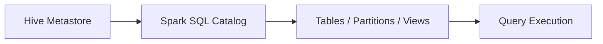

# :material-bee: Hive Metastore

The Hive Metastore stores metadata for databases, tables, and partitions.
Spark SQL can use it as the default catalog when Hive support is enabled.

### :material-sitemap: Overview



---

## :material-pin: Key Concepts

| Concept | Description |
|---------|-------------|
| Database | Logical namespace |
| Table | Schema + location |
| Partition | Physical subdirectory |

---

## :material-flask-outline: Example

```sql
SHOW DATABASES;
SHOW TABLES IN default;
```

---

## :material-brain: When to Use

| Scenario | Recommendation |
|----------|----------------|
| Persistent metadata | Use Hive Metastore |
| Shared catalog | Hive for legacy stacks |
