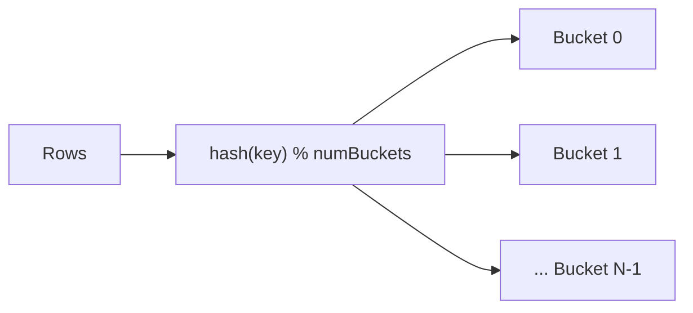

# :material-bee: Bucketing in Hive Tables

**Bucketing** hash-partitions a table's rows into a fixed number of files (buckets) by one
or more columns. When two tables are bucketed on the same key into the same number of
buckets, a join on that key can avoid the shuffle/exchange — a **bucketed (shuffle-free)
join**.

### :material-sitemap: Overview



---

## :material-pin: Syntax

```sql
CREATE TABLE bucketed_sales (
  id     BIGINT,
  amount DOUBLE
) USING PARQUET
CLUSTERED BY (id) INTO 32 BUCKETS;
```

Optionally sort within each bucket for sort-merge-friendly layout:

```sql
CREATE TABLE bucketed_sorted (
  id BIGINT, amount DOUBLE
) USING PARQUET
CLUSTERED BY (id) SORTED BY (id) INTO 32 BUCKETS;
```

---

## :material-magnify: Behavior

1. Each bucket is a physical file; row placement is `hash(key) % numBuckets`.
2. `DESCRIBE FORMATTED` reports **`Num Buckets`** and **`Bucket Columns`**
   (verified in Spark 4).
3. Joins between identically-bucketed tables can skip the shuffle exchange.
4. The bucket count is fixed at create time — changing it requires rewriting the table.

```sql
DESCRIBE FORMATTED bucketed_sales;   -- Num Buckets -> 32, Bucket Columns -> [`id`]
```

---

## :material-compare: Bucketing vs Partitioning

| Aspect | Bucketing | Partitioning |
|--------|-----------|--------------|
| Layout | Fixed # of hash files | Directory per value |
| Cardinality fit | High-cardinality keys | Low-cardinality columns |
| Skew handling | Even hash distribution | Can skew per value |
| Main benefit | Shuffle-free joins | Partition pruning |

---

## :material-brain: When to Use

| Scenario | Recommendation |
|----------|----------------|
| Repeated joins on a large key | Bucket both sides on the join key |
| High-cardinality join column | Bucketing (partitioning would explode dirs) |
| Small tables | Not needed — broadcast join instead |
| Low-cardinality filter column | Prefer [partitioning](partition/ddl.md) |

!!! note "Match on both sides"
    A shuffle-free bucketed join requires the **same bucket count and key** on both tables.
    Mismatched bucketing falls back to a normal shuffle join.
