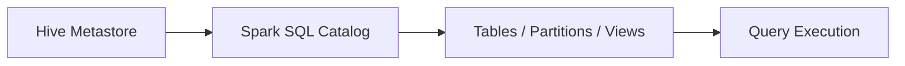

# :material-bee: Hive Table Data Sources

Hive tables can use different storage formats such as Parquet, ORC, or text.
The choice impacts performance and compatibility.

### :material-sitemap: Overview



---

## :material-pin: Common Formats

| Format | Benefits |
|--------|----------|
| Parquet | Columnar, efficient scans |
| ORC | Columnar, predicate pushdown |
| Text | Simple, but slower |

---

## :material-flask-outline: Example

```sql
CREATE TABLE hive_sales (
  id BIGINT,
  amount DOUBLE
) USING ORC;
```

---

## :material-brain: When to Use

| Scenario | Recommendation |
|----------|----------------|
| Analytics queries | Parquet or ORC |
| Interop with legacy tools | Text or CSV |
| Compression | Prefer Parquet/ORC |
