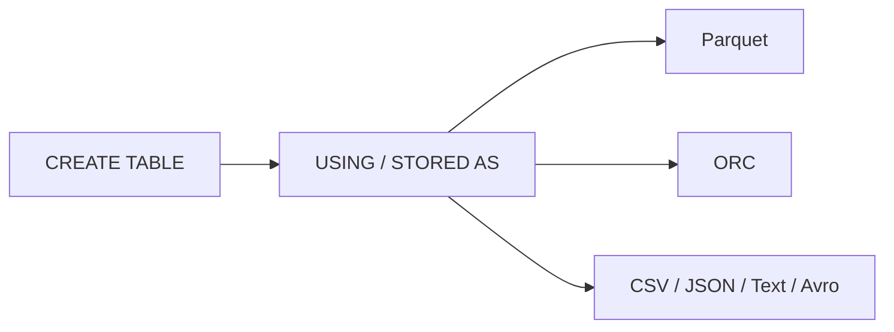

# :material-bee: Hive Table Data Sources

A Hive table's **storage format** (the data source) determines how rows are encoded on
disk, which in turn drives scan speed, compression, and predicate pushdown. Spark supports
the modern `USING <format>` syntax as well as the classic Hive `STORED AS <format>` clause.

### :material-sitemap: Overview



---

## :material-pin: Format Comparison

| Format | Columnar | Pushdown | Compression | Best for |
|--------|----------|----------|-------------|----------|
| **Parquet** | :material-check: | :material-check: | Snappy/Zstd | Default analytics format |
| **ORC** | :material-check: | :material-check: | Zlib/Zstd | Hive-heavy stacks, ACID |
| **Avro** | :material-close: (row) | Limited | Deflate | Schema evolution, streaming |
| **CSV / Text** | :material-close: | :material-close: | Optional | Interop, ingestion staging |
| **JSON** | :material-close: | :material-close: | Optional | Semi-structured ingestion |

---

## :material-flask-outline: Examples

=== "USING (Spark)"

    ```sql
    CREATE TABLE hive_sales (
      id     BIGINT,
      amount DOUBLE
    ) USING ORC;
    ```

=== "STORED AS (HiveQL)"

    ```sql
    CREATE TABLE hive_sales (
      id     BIGINT,
      amount DOUBLE
    ) STORED AS ORC;
    ```

=== "With options"

    ```sql
    CREATE TABLE hive_csv (
      id     BIGINT,
      amount DOUBLE
    ) USING CSV
    OPTIONS (header 'true', delimiter ',');
    ```

---

## :material-brain: When to Use

| Scenario | Format |
|----------|--------|
| General analytics on Spark | Parquet |
| Hive/ACID interoperability | ORC |
| Schema evolution / row streams | Avro |
| Human-readable interchange | CSV / JSON |
| Compression + fast scans | Parquet or ORC |

!!! tip "Prefer columnar"
    For analytical workloads choose Parquet or ORC — column pruning and predicate pushdown
    dramatically cut I/O versus row formats like CSV/JSON.
