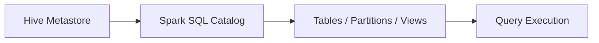

# :material-bee: External Hive Tables

External tables store data in a user-managed location.
Dropping the table removes metadata but leaves the data files intact.

### :material-sitemap: Overview



---

## :material-pin: Syntax

```sql
CREATE TABLE ext_sales (
  id BIGINT,
  amount DOUBLE
)
USING PARQUET
LOCATION 's3://data/sales/';
```

---

## :material-magnify: Behavior

1. Data files are not deleted when the table is dropped.
2. Useful for shared data lake locations.
3. Requires explicit `LOCATION`.

---

## :material-brain: When to Use

| Scenario | Recommendation |
|----------|----------------|
| Data managed outside Spark | Use external tables |
| Shared storage | External tables |
| Full lifecycle control | Managed tables |
