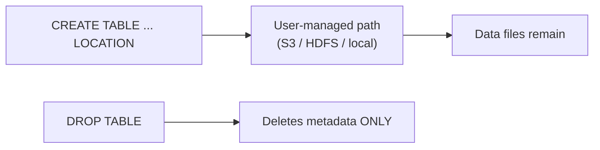

# :material-bee: External Hive Tables

An **external table** stores its data at a user-managed `LOCATION`. The catalog tracks only
the metadata, so **`DROP TABLE` removes the table definition but leaves the data files
intact** — ideal for data lake paths shared across engines and teams.

### :material-sitemap: Overview



---

## :material-pin: Syntax

```sql
CREATE TABLE ext_sales (
  id     BIGINT,
  amount DOUBLE
)
USING PARQUET
LOCATION 's3://data/sales/';
```

The presence of `LOCATION` makes the table external.

---

## :material-magnify: Behavior

1. `DESCRIBE FORMATTED` reports **`Type: EXTERNAL`** with the given `Location`
   (verified in Spark 4).
2. `DROP TABLE` deletes only the metastore entry — the files at `LOCATION` remain.
3. Pointing a new table at the same path re-exposes the existing data.
4. `TRUNCATE` is **not** allowed on external tables in some configurations.

```sql
DESCRIBE FORMATTED ext_sales;   -- Type -> EXTERNAL, Location -> s3://data/sales/
```

---

## :material-compare: External vs Managed

| Aspect | External | Managed |
|--------|----------|---------|
| `LOCATION` clause | Required | Omitted |
| `DROP TABLE` deletes data | :material-close: No | :material-check: Yes |
| Data ownership | User / shared | Catalog |
| Best for | Shared lake data | Spark-owned data |

---

## :material-brain: When to Use

| Scenario | Recommendation |
|----------|----------------|
| Data managed outside Spark | External table |
| Shared data lake location | External table |
| Data must survive `DROP TABLE` | External table |
| Spark owns the full lifecycle | [Managed table](managed.md) |

!!! tip "Safe by default for shared data"
    External tables decouple metadata from storage, so accidental drops don't destroy data.
    See [Managed tables](managed.md) for the Spark-owned alternative.
