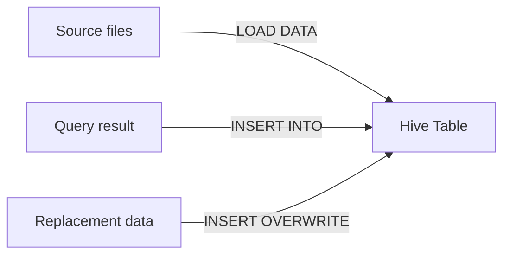

# :material-bee: Loading Hive Tables

Data enters a Hive table either by registering existing files (`LOAD DATA`) or by writing
query results (`INSERT INTO` / `INSERT OVERWRITE`). The right method depends on whether you
are moving raw files or transforming rows.

### :material-sitemap: Overview



---

## :material-pin: Loading Methods

| Method | Effect |
|--------|--------|
| `LOAD DATA [LOCAL] INPATH` | Moves/copies files into the table location (no transform) |
| `INSERT INTO` | Appends rows produced by a query |
| `INSERT OVERWRITE` | Replaces existing data (whole table or matched partitions) |

---

## :material-flask-outline: Examples

=== "LOAD DATA"

    ```sql
    -- From the cluster filesystem
    LOAD DATA INPATH 's3://data/sales/' INTO TABLE hive_sales;

    -- From the local driver filesystem
    LOAD DATA LOCAL INPATH '/tmp/sales.csv' INTO TABLE hive_sales;
    ```

=== "INSERT INTO"

    ```sql
    INSERT INTO hive_sales
    SELECT id, amount FROM staging_sales WHERE amount > 0;
    ```

=== "INSERT OVERWRITE"

    ```sql
    -- Replace all rows
    INSERT OVERWRITE TABLE hive_sales
    SELECT id, amount FROM staging_sales;

    -- Replace a single partition
    INSERT OVERWRITE TABLE hive_sales PARTITION (state = 'CA')
    SELECT id, amount FROM staging_sales WHERE state = 'CA';
    ```

---

## :material-magnify: Behavior

1. `LOAD DATA` performs no schema validation or transformation — it relocates files.
2. `INSERT OVERWRITE` on a partitioned table replaces only the targeted partitions when
   `spark.sql.sources.partitionOverwriteMode = DYNAMIC`.
3. `INSERT INTO ... SELECT` runs the full Catalyst pipeline, so casts and expressions apply.

---

## :material-brain: When to Use

| Scenario | Method |
|----------|--------|
| Register raw files as-is | `LOAD DATA` |
| Transform then persist | `INSERT INTO ... SELECT` |
| Full table refresh | `INSERT OVERWRITE TABLE` |
| Replace specific partitions | `INSERT OVERWRITE ... PARTITION` (+ DYNAMIC mode) |

!!! tip "Dynamic partition overwrite"
    To replace only the partitions present in your data, set
    `spark.sql.sources.partitionOverwriteMode=DYNAMIC` — see
    [Dynamic Partition Insert](partition/dynamic.md).
