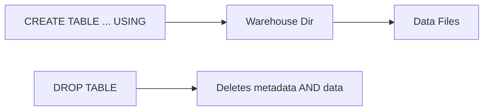

# :material-bee: Managed Hive Tables

A **managed table** (a.k.a. internal table) is one whose data *and* metadata lifecycle are
owned by the catalog. Spark stores the files under the warehouse directory
(`spark.sql.warehouse.dir`) and — critically — **`DROP TABLE` deletes the underlying data**.

## :material-sitemap: Overview



______________________________________________________________________

## :material-pin: Syntax

```sql
CREATE TABLE managed_sales (
  id     BIGINT,
  amount DOUBLE
) USING PARQUET;
```

No `LOCATION` clause is given — that is what makes the table managed.

______________________________________________________________________

## :material-magnify: Behavior

1. Data is written under `spark.sql.warehouse.dir/<db>.db/<table>/`.
2. `DESCRIBE FORMATTED` reports **`Type: MANAGED`** (verified in Spark 4).
3. `DROP TABLE` removes both the metastore entry **and** the data files.
4. `TRUNCATE TABLE` clears rows while keeping the schema.

```sql
DESCRIBE FORMATTED managed_sales;   -- Type -> MANAGED, Location under warehouse dir
```

______________________________________________________________________

## :material-compare: Managed vs External

| Aspect                    | Managed               | External                   |
| ------------------------- | --------------------- | -------------------------- |
| `LOCATION` clause         | Omitted               | Required                   |
| Data location             | Warehouse dir         | User-specified path        |
| `DROP TABLE` deletes data | :material-check: Yes  | :material-close: No        |
| Best for                  | Spark-owned lifecycle | Shared / pre-existing data |

______________________________________________________________________

## :material-brain: When to Use

| Scenario                      | Recommendation                |
| ----------------------------- | ----------------------------- |
| Spark fully owns the dataset  | Managed table                 |
| Intermediate / derived tables | Managed table                 |
| Data shared with other tools  | [External table](external.md) |
| Files must survive a drop     | [External table](external.md) |

!!! warning "DROP deletes data"

    Dropping a managed table is destructive — the data files go with it. Use an
    [external table](external.md) when the files must outlive the table definition.
