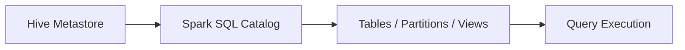

# :material-bee: Managed Hive Tables

Managed tables are stored in the Spark/Hive warehouse directory and are fully
managed by the catalog.

### :material-sitemap: Overview



---

## :material-pin: Behavior

1. Spark manages data files and metadata.
2. Dropping the table removes both data and metadata.
3. Best for datasets whose lifecycle is managed by Spark.

---

## :material-flask-outline: Example

```sql
CREATE TABLE managed_sales (
  id BIGINT,
  amount DOUBLE
) USING PARQUET;
```

---

## :material-brain: When to Use

| Scenario | Recommendation |
|----------|----------------|
| Managed lifecycle | Use managed tables |
| External storage control | Use external tables |
