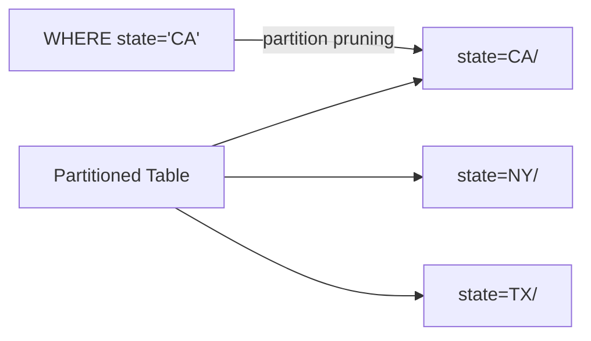

# :material-bee: Partition DDL

**Partitioning** splits a table into subdirectories by the distinct values of one or more
partition columns (for example `state=CA/`, `state=NY/`). Spark can then **prune** whole
directories at query time, reading only the partitions a filter touches.

## :material-sitemap: Overview



______________________________________________________________________

## :material-pin: Create a Partitioned Table

=== "Managed"

    ```sql
    CREATE TABLE IF NOT EXISTS partition_db.zipcodes_internal (
        RecordNumber INT,
        Country      STRING,
        City         STRING,
        Zipcode      INT,
        state        STRING
    )
    USING CSV
    OPTIONS (delimiter ',')
    PARTITIONED BY (state);
    ```

=== "External"

    ```sql
    CREATE EXTERNAL TABLE IF NOT EXISTS partition_db.zipcodes (
        RecordNumber INT,
        Country      STRING,
        City         STRING,
        Zipcode      INT
    )
    PARTITIONED BY (state STRING)
    ROW FORMAT DELIMITED
    FIELDS TERMINATED BY ','
    LOCATION 's3://data/zipcodes/';
    ```

!!! note "Partition column position"

    With `USING`, the partition column is part of the schema list; with the HiveQL
    `CREATE EXTERNAL TABLE` form it is declared **only** in `PARTITIONED BY`, not the
    column list.

______________________________________________________________________

## :material-cog: Managing Partitions

```sql
-- Add a partition with an explicit location
ALTER TABLE partition_db.zipcodes
  ADD PARTITION (state = 'CA') LOCATION '/user/data/zipcodes_ca';

-- Drop a partition (external: metadata only; managed: also data)
ALTER TABLE partition_db.zipcodes DROP PARTITION (state = 'CA');

-- Rename a partition value
ALTER TABLE partition_db.zipcodes
  PARTITION (state = 'CA') RENAME TO PARTITION (state = 'CAL');

-- List partitions
SHOW PARTITIONS partition_db.zipcodes;

-- Re-scan storage and register partitions found on disk
MSCK REPAIR TABLE partition_db.zipcodes;
```

______________________________________________________________________

## :material-magnify: Behavior

1. Each partition maps to a physical subdirectory named `col=value`.
2. Filters on partition columns enable **partition pruning** — unmatched directories are
    never read.
3. `MSCK REPAIR TABLE` (or `ALTER TABLE ... RECOVER PARTITIONS`) syncs the metastore with
    directories added out of band.
4. Choose **low-cardinality** partition columns; high-cardinality keys create too many tiny
    directories.

______________________________________________________________________

## :material-brain: When to Use

| Scenario                                     | Recommendation                         |
| -------------------------------------------- | -------------------------------------- |
| Frequent filters on a low-cardinality column | Partition on it                        |
| Time-series data                             | Partition by date (e.g. `dt`)          |
| High-cardinality key (e.g. `id`)             | Use [bucketing](../bucket.md) instead  |
| Loading many values at once                  | [Dynamic partition insert](dynamic.md) |

!!! tip "Prune, don't scan"

    Partitioning pays off only when queries filter on the partition column. Verify pruning
    in `EXPLAIN` (`PartitionFilters`) and keep partition counts reasonable.
