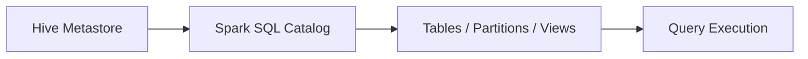

# :material-bee: Partition

### :material-sitemap: Overview



## Creating partition table

```sql

CREATE TABLE if not exists partition_db.zipcodes_internal(
    RecordNumber int,
    Country string,
    City string,
    Zipcode int,
    state string)
using csv
    OPTIONS (delimiter "," )
    PARTITIONED BY(state)
```

```sql
CREATE EXTERNAL TABLE if not exists partition_db.zipcodes(
   RecordNumber int,
   Country string,
   City string,
   Zipcode int)
PARTITIONED BY(state string)
ROW FORMAT DELIMITED
FIELDS TERMINATED BY ','
LOCATION "<location>"
```

## Altering partition

```sql
ALTER TABLE zipcodes ADD PARTITION (state='CA') LOCATION '/user/data/zipcodes_ca'
```

## dynamic partition

```sql

CREATE TABLE if not exists partition_db.zipcodes_internal(
   RecordNumber int,
   Country string,
   City string,
   Zipcode int,
   state string)
using csv
   OPTIONS (delimiter "," )
   PARTITIONED BY(state)
```
