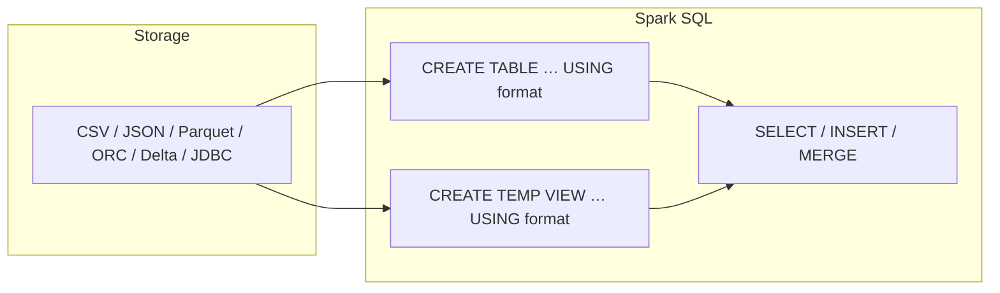

# :material-file-table: Data Sources

Spark SQL reads and writes data through a unified **Data Source API** —
the same `USING format` clause works for files, Delta tables, and JDBC connections.
The format determines how Spark reads bytes from storage and maps them to columns.

---

## :material-table-of-contents: In This Section

| Page | Format | Best for |
|------|--------|---------|
| [CSV](csv.md) | `:material-file-delimited: csv` | Tabular flat files, interop with non-technical consumers |
| [JSON](json.md) | `:material-code-json: json` | Semi-structured / nested event data |
| [Parquet](parquet.md) | `:material-archive: parquet` | Columnar analytics — default production format |
| [Delta](delta.md) | `:material-delta: delta` | ACID transactions, time-travel, streaming upserts |
| [ORC](orc.md) | `:material-table: orc` | Hive-native columnar workloads |
| [JDBC](jdbc.md) | `:material-database-outline: jdbc` | Relational databases (PostgreSQL, MySQL, SQL Server) |

---

## :material-sitemap: Data Source Flow



---

## :material-compare: Format Comparison

| Feature | CSV | JSON | Parquet | Delta | ORC | JDBC |
|---------|:---:|:----:|:-------:|:-----:|:---:|:----:|
| Columnar | :material-close: | :material-close: | :material-check: | :material-check: | :material-check: | :material-close: |
| Splittable | :material-check: | Partial | :material-check: | :material-check: | :material-check: | Via partition |
| Schema evolution | Manual | Manual | Limited | :material-check: | Limited | Via DDL |
| ACID / transactions | :material-close: | :material-close: | :material-close: | :material-check: | :material-close: | :material-check: |
| Time travel | :material-close: | :material-close: | :material-close: | :material-check: | :material-close: | :material-close: |
| Compression | Optional | Optional | Built-in | Built-in | Built-in | N/A |
| Human readable | :material-check: | :material-check: | :material-close: | :material-close: | :material-close: | N/A |
| Predicate pushdown | Partial | :material-close: | :material-check: | :material-check: | :material-check: | :material-check: |
| Recommended for prod | :material-close: | :material-close: | :material-check: | :material-check: | Hive only | Ingestion |

---

## :material-code-tags: CREATE TABLE Syntax

```sql
CREATE TABLE [IF NOT EXISTS] table_identifier
    [ ( col_name col_type [COMMENT '…'], … ) ]
    USING { csv | json | parquet | delta | orc | jdbc }
    [ OPTIONS ( key = 'value', … ) ]
    [ PARTITIONED BY ( col_name, … ) ]
    [ CLUSTERED BY ( col_name, … )
        [SORTED BY ( col_name [ASC | DESC], … )]
        INTO num_buckets BUCKETS ]
    [ LOCATION 'path' ]
    [ COMMENT 'table comment' ]
    [ TBLPROPERTIES ( key = 'value', … ) ]
    [ AS select_statement ]
```

---

## :material-lightbulb: Quick-Pick Guide

!!! success "Use Parquet or Delta for production analytics"
    Columnar storage + predicate pushdown = 10–100× faster queries vs CSV on the same data.

!!! tip "Use Delta when you need ACID or upserts"
    Delta Lake is Parquet + a transaction log. If you already use Parquet and need
    `MERGE`, `UPDATE`, `DELETE`, or time-travel, switch to Delta.

!!! warning "CSV / JSON for ingestion only"
    These formats lack column pruning and row-group skipping.
    Land raw files as CSV/JSON, then convert to Parquet/Delta for analytics.

!!! note "JDBC for live relational data"
    Use the JDBC source for initial ingestion or federation queries.
    Never use it as the primary analytics store — push aggregations to Spark, not the DB.
