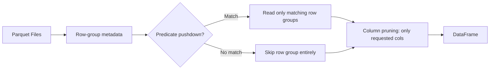

# :material-archive: Parquet Data Source

Apache Parquet is the **default production format** for Spark SQL.
Its columnar, compressed layout enables column pruning and predicate pushdown —
often 10–100× faster than scanning equivalent CSV.

---

## :material-sitemap: Parquet Read Flow



---

## :material-pin: Options Reference

| Option | Default | Description |
|--------|---------|-------------|
| `path` | — | File or directory path |
| `mergeSchema` | `false` | Union schemas from all files (schema evolution) |
| `compression` | `snappy` | Codec: `none`, `snappy`, `gzip`, `lz4`, `zstd` |
| `parquet.block.size` | 128 MB | Row-group size in bytes |
| `parquet.page.size` | 1 MB | Page size within a row group |
| `recursiveFileLookup` | `false` | Search subdirectories recursively |
| `pathGlobFilter` | — | Glob pattern to filter files, e.g. `*.parquet` |
| `modifiedBefore` / `modifiedAfter` | — | Filter files by modification time |

---

## :material-flask-outline: Examples

### Create a managed Parquet table

```sql
CREATE TABLE IF NOT EXISTS analytics.orders (
    order_id    INT       NOT NULL,
    customer_id STRING,
    amount      DECIMAL(10,2),
    status      STRING,
    order_date  DATE
)
USING parquet
PARTITIONED BY (order_date)
LOCATION 's3://my-bucket/analytics/orders/';
```

### CTAS from CSV landing

```sql
CREATE TABLE analytics.customers
USING parquet
PARTITIONED BY (country)
AS
SELECT
    customer_id,
    name,
    email,
    country,
    CAST(created_at AS TIMESTAMP) AS created_at
FROM raw.customers_csv;
```

### Read external Parquet files as a view

```sql
CREATE OR REPLACE TEMP VIEW parquet_sales
USING parquet
OPTIONS (
    path        = 's3://data/sales/year=2024/',
    mergeSchema = 'true'    -- union schemas if files differ slightly
);

SELECT region, SUM(amount) FROM parquet_sales GROUP BY region;
```

### Schema evolution with mergeSchema

```sql
-- Files from different batches may have different columns
CREATE OR REPLACE TEMP VIEW merged_view
USING parquet
OPTIONS (
    path        = '/mnt/data/events/',
    mergeSchema = 'true'
);

-- Missing columns from older files appear as NULL
SELECT event_id, new_column FROM merged_view;
```

### Partition pruning — only reads matching partitions

```sql
-- Parquet partitioned by order_date; Spark reads only 2024-06 files
SELECT order_id, amount
FROM analytics.orders
WHERE order_date BETWEEN DATE '2024-06-01' AND DATE '2024-06-30';
```

### Compact small Parquet files

```sql
-- Re-write a partition with fewer, larger files
INSERT OVERWRITE analytics.orders PARTITION (order_date = '2024-06-01')
SELECT order_id, customer_id, amount, status
FROM analytics.orders
WHERE order_date = '2024-06-01';
```

### Configure compression

```sql
CREATE TABLE analytics.events_zstd
USING parquet
TBLPROPERTIES ('parquet.compression' = 'zstd')
AS SELECT * FROM staging.events;
```

### Write with Spark SQL config

```sql
-- Set before writing — applies to the current session
SET spark.sql.parquet.compression.codec = 'zstd';
SET spark.sql.parquet.mergeSchema       = 'false';
SET spark.sql.parquet.filterPushdown    = 'true';
```

---

## :material-speedometer: Performance Tips

| Tip | Why |
|-----|-----|
| Partition by a low-cardinality date/region column | Enables partition pruning |
| Use `zstd` compression | Better ratio than `snappy` with similar speed |
| Keep row groups 128 MB–512 MB | Matches HDFS/S3 block sizes |
| Avoid `SELECT *` on wide tables | Read only needed columns for column pruning |
| Co-locate related data with `ZORDER BY` (Delta) | Row-group skipping for high-cardinality filters |
| Avoid too many small files | Causes metadata overhead — compact periodically |

---

## :material-compare: Parquet vs Delta

| Feature | Parquet | Delta |
|---------|:-------:|:-----:|
| Columnar | :material-check: | :material-check: |
| ACID transactions | :material-close: | :material-check: |
| `MERGE` / `UPDATE` / `DELETE` | :material-close: | :material-check: |
| Time travel | :material-close: | :material-check: |
| Schema enforcement | :material-close: | :material-check: |
| Streaming upserts | :material-close: | :material-check: |
| Portability (non-Databricks) | :material-check: | Limited |

!!! tip
    Start with Parquet. Upgrade to Delta when you need `MERGE`, `UPDATE`, streaming ingestion,
    or need to query historical snapshots.

---

## :material-brain: When to Use Parquet

| Scenario | Recommendation |
|----------|----------------|
| Read-heavy analytics | Parquet — columnar + compression |
| Immutable historical archives | Parquet (no update needed) |
| Cross-platform / non-Databricks | Parquet (universally supported) |
| Upserts / incremental loads | Switch to Delta |
| Streaming targets | Switch to Delta |
